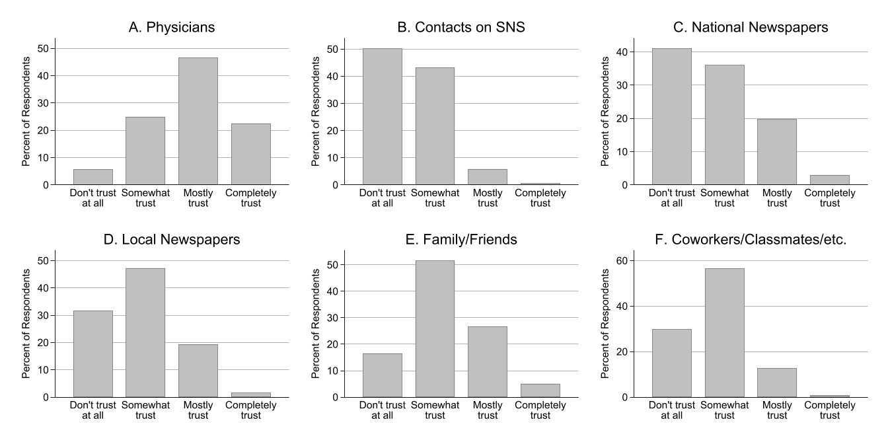
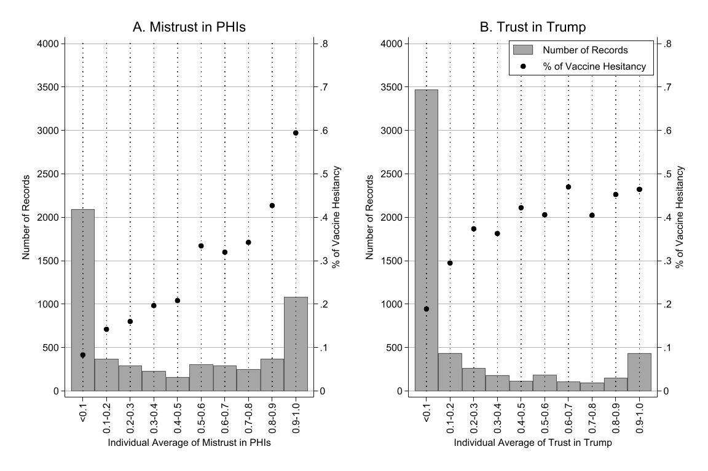
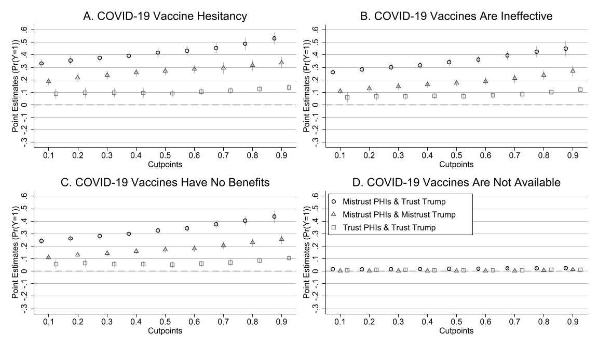
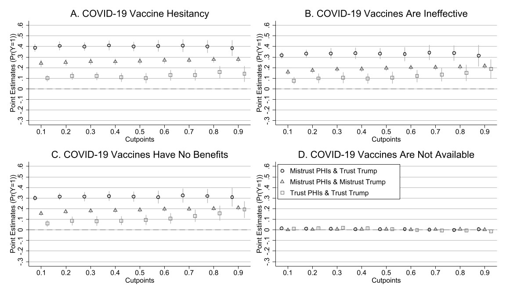
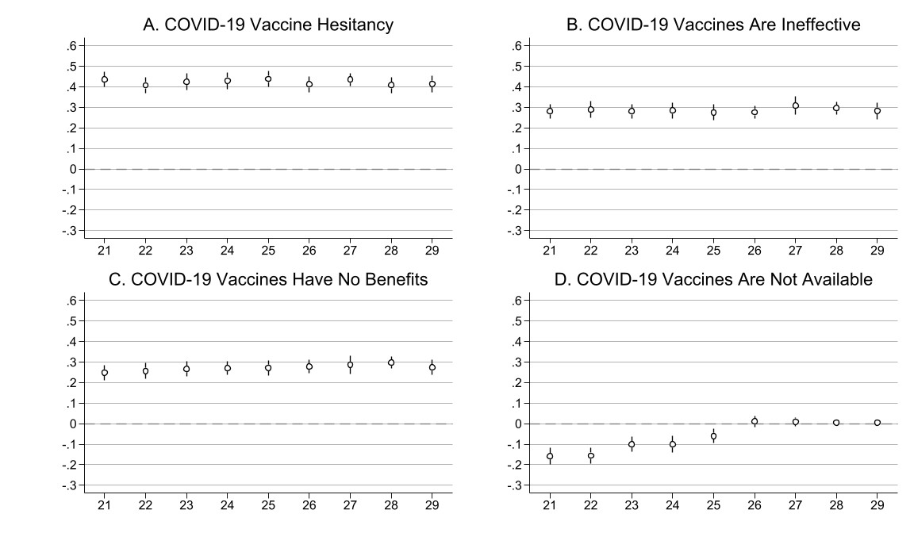
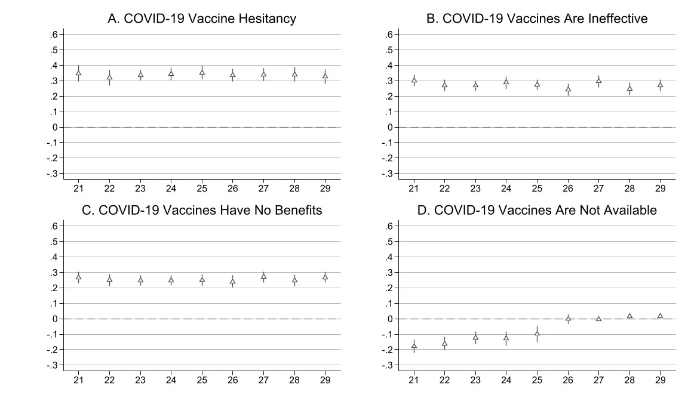
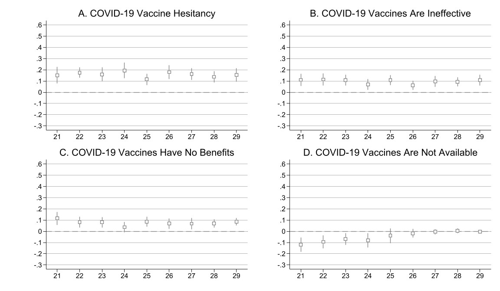
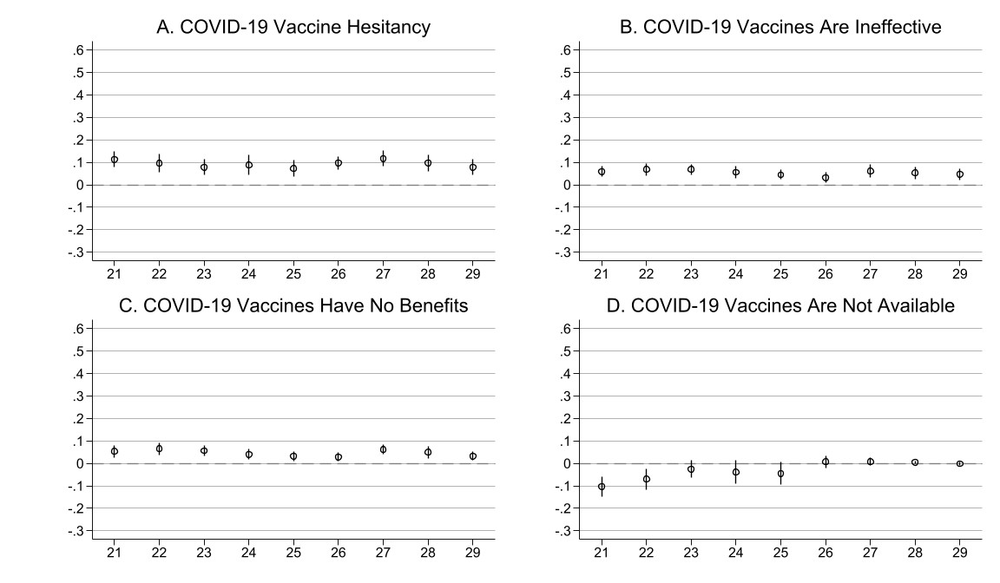
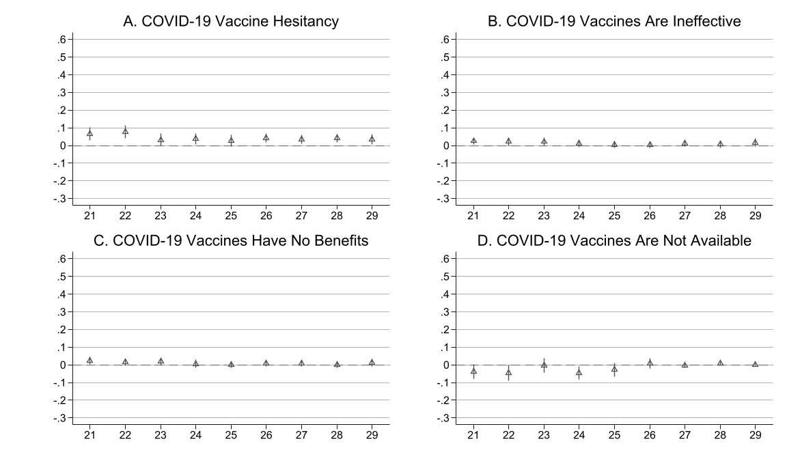
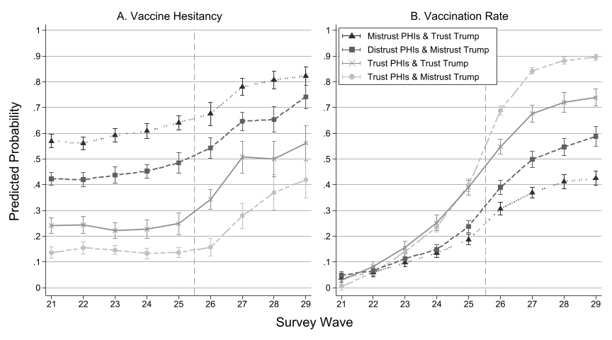

# Mistrust in Public Health Institutions is a Stronger Predictor of Vaccine Hesitancy and Uptake than Trust in Trump

*Paper Authors: Yongjin Choi and Ashley M. Fox* </br> *Script Author: Yongjin Choi* </br> *Last updated: Oct. 29. 2022*

* What's Included
  * [Part I. Basic Setting](#part-i-basic-setting)
  * [Part II. Data Prep](#part-ii-data-prep)
    - Merging
      - COVID-19 Panel
      - Politics Panel
    - Initial Records
    - Variables
    - Appendix 3. Missing Records Before Data Cleaning by Wave
    - Flagging records to drop
    - Appendix 3. Data Exclusion Chart
  * [Part III. Data Review](#part-iii-data-review)
    - Appendix 4
    - Appendix 5
    - Appendix 6
    - Appendix 7
    - Table 1. Descriptive Statistics
  * [Part IV. Estimation](#part-iv-estimations)
    - Figure 2 & Appendices 10-13
    - Appendix 14. Sensitivity Analysis: Mistrust in PHIs
    - Appendix 15. Sensitivity Analysis: Trust in Trump
    - Appendix 16. Sensitivity Analysis with Each Mistrust Measure of the Three Public Health Institutions
    - Appendix 17. Test with Party Affiliation
    - Figure 3 & Appendix 18: Predictive probability
    - Figure 4 & Appendix 19: Two-way fixed effects

## Part I. Basic Setting


```stata
********************************************************************************
/*----- Part I. Basic Setting -----*/
********************************************************************************

/*----- Essentials -----*/
#delimit ;
clear all;
qui global localpath "C:\OneDrive\OneDrive - Vaccine Confidence\01_Research\999_Completed\304_Vaccine Hesitancy\02_Analysis";
qui cd "$localpath";
cap mkdir "$localpath\outputs";
cap mkdir "$localpath\models";
qui global rawdata "C:\OneDrive\OneDrive - University at Albany - SUNY\02_Data\Understanding America Study\NationalSurvey";
qui global UAS_Politics "C:\OneDrive\OneDrive - University at Albany - SUNY\02_Data\Understanding America Study\Politics";
qui global outputs "$localpath\outputs";
qui global models "$localpath\models";
set more off;

// Output width
set linesize 240;
display "{hline}";

// Color scheme for plots
colorpalette #176d90 #841618 #f18821 #3d7337 #a039b7 #009999 #cc6699 #ff6633 #cccc33 #9e6eac, globals;
qui grstyle clear;
qui set scheme s2color;
qui grstyle init;
qui grstyle set plain, horizontal grid;
qui grstyle color background white;
qui grstyle yesno draw_major_hgrid yes;
qui grstyle yesno draw_major_ygrid yes;
qui grstyle color major_grid gs4;
qui grstyle linepattern major_grid solid;
qui grstyle linewidth major_grid vvthin;
qui grstyle set legend 4, box inside;
qui grstyle color ci_area gs12%50;
```

    
    
    
    
    
    
    
    
    
    
    
    
    ------------------------------------------------------------------------------------------------------------------------------------------------------------------------------------------------------------------------------------------------
    
    
    globals:
                        p1 : "23 109 144"
                        p2 : "132 22 24"
                        p3 : "241 136 33"
                        p4 : "61 115 55"
                        p5 : "160 57 183"
                        p6 : "0 153 153"
                        p7 : "204 102 153"
                        p8 : "255 102 51"
                        p9 : "204 204 51"
                       p10 : "158 110 172"
    
    
    
    
    
    
    
    
    
    
    
    
    delimiter now ;


```stata
/*----- Installing Packages (optional) -----*/
//ssc install estout, replace;
//ssc install catplot, replace;
//ssc install coefplot, replace;
//ssc install tabout, replace;
//ssc install grstyle, replace;
//ssc install palettes, replace;
//ssc install mdesc, replace;
```

# Part II. Data Prep

## Merging

### COVID-19 Panel

* Data: [Understanding America Study (UAS)](https://uasdata.usc.edu/index.php)
  * UAS 274: Wave 20 – long form of the UAS Covid Survey Final Release (December 9, 2020 - January 6, 2021)
  * UAS 276: Wave 21 – long form of the UAS Covid Survey Final Release (December 23, 2020 - January 20, 2021)
  * UAS 278: Wave 22 – long form of the UAS Covid Survey Final Release (January 6, 2021 - February 3, 2021)
  * UAS 280: Wave 23 – long form of the UAS Covid Survey Final Release (January 20, 2021 - February 17, 2021)
  * UAS 282: Wave 24 – long form of the UAS Covid Survey Final Release February 2, 2021 - March 3, 2021)
  * UAS 340: Wave 25 – long form of the UAS Covid Survey Final Release February 17, 2021 - March 30, 2021)
  * UAS 342: Wave 26 – long form of the UAS Covid Survey Final Release March 17, 2021 - April 27, 2021)
  * UAS 344: Wave 27 – long form of the UAS Covid Survey Final Release April 14, 2021 - May 25, 2021)
  * UAS 346: Wave 28 – long form of the UAS Covid Survey Final Release May 12, 2021 - June 22, 2021)
  * UAS 348: Wave 29 – long form of the UAS Covid Survey Final Release June 9, 2021 - July 21, 2021)


```stata
********************************************************************************
/*----- Data Prep -----*/
********************************************************************************

/*----- Merging -----*/
clear all;
use "$rawdata\uas230_march_31_2020", clear;
drop cr009;
gen WAVE = 1;
qui append using "$rawdata\uas235_april_29_2020";
replace WAVE = 2 if WAVE == .;
qui append using "$rawdata\uas240_may_14_2020";
replace WAVE = 3 if WAVE == .;
qui append using "$rawdata\uas242_may_27_2020";
replace WAVE = 4 if WAVE == .;
qui append using "$rawdata\uas244_june_10_2020";
replace WAVE = 5 if WAVE == .;
qui append using "$rawdata\uas246_june_23_2020";
replace WAVE = 6 if WAVE == .;
qui append using "$rawdata\uas248_july_8_2020";
replace WAVE = 7 if WAVE == .;
qui append using "$rawdata\uas250_july_22_2020";
replace WAVE = 8 if WAVE == .;
qui append using "$rawdata\uas252_august_5_2020";
replace WAVE = 9 if WAVE == .;
qui append using "$rawdata\uas254_august_19_2020";
replace WAVE = 10 if WAVE == .;
qui append using "$rawdata\uas256_september_2_2020";
replace WAVE = 11 if WAVE == .;
qui append using "$rawdata\uas258_september_16_2020";
replace WAVE = 12 if WAVE == .;
qui append using "$rawdata\uas260_september_30_2020";
replace WAVE = 13 if WAVE == .;
qui append using "$rawdata\uas262_october_14_2020";
replace WAVE = 14 if WAVE == .;
qui append using "$rawdata\uas264_october_28_2020";
replace WAVE = 15 if WAVE == .;
qui append using "$rawdata\uas266_november_11_2020";
replace WAVE = 16 if WAVE == .;
qui append using "$rawdata\uas268_november_25_2020";
replace WAVE = 17 if WAVE == .;
qui append using "$rawdata\uas270_december_9_2020";
replace WAVE = 18 if WAVE == .;
qui append using "$rawdata\uas272_december_23_2020";
replace WAVE = 19 if WAVE == .;
qui append using "$rawdata\uas274_january_6_2021";
replace WAVE = 20 if WAVE == .;
qui append using "$rawdata\uas276_january_20_2021";
replace WAVE = 21 if WAVE == .;
qui append using "$rawdata\uas278_february_3_2021";
replace WAVE = 22 if WAVE == .;
qui append using "$rawdata\uas280_february_17_2021";
replace WAVE = 23 if WAVE == .;
qui append using "$rawdata\uas282_march_3_2021";
replace WAVE = 24 if WAVE == .;
qui append using "$rawdata\uas340_march_31_2021";
replace WAVE = 25 if WAVE == .;
qui append using "$rawdata\uas342_april_28_2021";
replace WAVE = 26 if WAVE == .;
qui append using "$rawdata\uas344_may_26_2021";
replace WAVE = 27 if WAVE == .;
qui append using "$rawdata\uas346_june_23_2021";
replace WAVE = 28 if WAVE == .;
qui append using "$rawdata\uas348_july_21_2021";
replace WAVE = 29 if WAVE == .;
save "UAS_1_29", replace;
```

    
    
    
    
    
    (5,478 real changes made)
    
    
    (6,287 real changes made)
    
    
    (6,403 real changes made)
    
    
    (6,407 real changes made)
    
    
    (6,408 real changes made)
    
    
    (6,346 real changes made)
    
    
    (6,077 real changes made)
    
    
    (6,289 real changes made)
    
    
    (6,371 real changes made)
    
    
    (6,238 real changes made)
    
    
    (6,262 real changes made)
    
    
    (6,284 real changes made)
    
    
    (6,129 real changes made)
    
    
    (6,095 real changes made)
    
    
    (6,181 real changes made)
    
    
    (6,276 real changes made)
    
    
    (6,084 real changes made)
    
    
    (6,060 real changes made)
    
    
    (6,078 real changes made)
    
    
    (6,066 real changes made)
    
    
    (6,179 real changes made)
    
    
    (6,231 real changes made)
    
    
    (6,344 real changes made)
    
    
    (6,210 real changes made)
    
    
    (6,092 real changes made)
    
    
    (6,052 real changes made)
    
    
    (5,964 real changes made)
    
    
    (5,839 real changes made)
    
    file UAS_1_29.dta saved
    

### Politics Panel


```stata
/*----- Merging the COVID-19 survey -----*/
clear all;
use "$UAS_Politics\uas212", clear;
gen WAVE = 1;
qui append using "$UAS_Politics\uas221";
replace WAVE = 2 if WAVE == .;
qui append using "$UAS_Politics\uas331";
replace WAVE = 3 if WAVE == .;
qui append using "$UAS_Politics\uas335";
replace WAVE = 4 if WAVE == .;
save "UAS_Politics_212_335", replace;

keep uasid pol_03 party_affil WAVE;
reshape wide pol_03 party_affil, i(uasid) j(WAVE);
rename pol_031 PARTYID212;
rename pol_032 PARTYID221;
rename party_affil3 PARTYID331;
rename party_affil4 PARTYID335;
keep uasid PARTYID212 PARTYID221 PARTYID331 PARTYID335;
save "UAS_Politics_212_335", replace;
```

    
    
    
    
    
    (6,154 real changes made)
    
    
    (7,354 real changes made)
    
    
    (7,640 real changes made)
    
    (file UAS_Politics_212_335_raw.dta not found)
    file UAS_Politics_212_335_raw.dta saved
    
    
    (j = 1 2 3 4)
    
    Data                               Long   ->   Wide
    -----------------------------------------------------------------------------
    Number of observations           27,936   ->   8,791       
    Number of variables                   4   ->   9           
    j variable (4 values)              WAVE   ->   (dropped)
    xij variables:
                                     pol_03   ->   pol_031 pol_032 ... pol_034
                                party_affil   ->   party_affil1 party_affil2 ... party_affil4
    -----------------------------------------------------------------------------
    
    
    
    
    
    
    file UAS_Politics_212_335.dta saved
    

## Initial Records


```stata
/*----- Initial Records -----*/
use "UAS_1_29", clear;
drop if WAVE < 21;
keep if sampletype == 1;
encode uasid, gen(UASID);
xtset UASID WAVE;
xttab WAVE;
```

    
    
    (124,685 observations deleted)
    
    (15,456 observations deleted)
    
    
    
    Panel variable: UASID (unbalanced)
     Time variable: WAVE, 21 to 29, but with gaps
             Delta: 1 unit
    
    
                      Overall             Between            Within
         WAVE |    Freq.  Percent      Freq.  Percent        Percent
    ----------+-----------------------------------------------------
           21 |    4388     11.10      4388     78.65          14.39
           22 |    4478     11.33      4478     80.27          14.43
           23 |    4504     11.40      4504     80.73          14.26
           24 |    4604     11.65      4604     82.52          14.66
           25 |    4416     11.17      4416     79.15          13.52
           26 |    4350     11.01      4350     77.97          13.63
           27 |    4314     10.92      4314     77.33          13.65
           28 |    4262     10.78      4262     76.39          13.82
           29 |    4205     10.64      4205     75.37          14.66
    ----------+-----------------------------------------------------
        Total |   39521    100.00     39521    708.39          14.12
                                  (n = 5579)
    

## Variables


```stata
use "UAS_1_29", clear;
drop if WAVE < 21;
keep if sampletype == 1;
encode uasid, gen(UASID);
xtset UASID WAVE;

/*----- Vaccine questions -----*/
gen FULLVAX = .;
replace FULLVAX = 1 if cr075 == 1 & cr076 >= 2;
label var FULLVAX "Fully vaccinated for the Coronavirus";

gen VAX = .;
replace VAX = 0 if cr075 >= 2;
replace VAX = 1 if cr075 == 1;
label var VAX "Vaccinated for the Coronavirus";

gen VXHST_ATALL = .;
replace VXHST_ATALL = 0 if cr030 >= 2 & cr030 <= 5;
replace VXHST_ATALL = 0 if cr075 == 1;
replace VXHST_ATALL = 1 if cr030 == 1 & cr075 == 2;
label var VXHST_ATALL "Vax Hesitancy at All";

gen VXHST = .;
replace VXHST = 0 if cr030>=3 & cr030<=5;
replace VXHST = 0 if cr075==1;
replace VXHST = 1 if (cr030 == 1 | cr030 == 2) & (cr075==2 | cr075==3);
label var VXHST "Vax Hesitancy";

gen COVIDVAX_CONF = cond(cr072d==1 | cr072d==2, 1,
                    cond(cr072d==3 | cr072d==4, 0, .));
label var COVIDVAX_CONF "COVID-19 vaccines are not useful and ineffective";
gen COVIDVAX_COMP = cond(cr072b==1 | cr072b==2, 1,
                    cond(cr072b==3 | cr072b==4, 0, .));
label var COVIDVAX_COMP "COVID-19 vaccines do not provide important benefits to society";
gen COVIDVAX_CONV = .;
replace COVIDVAX_CONV = 0 if cr078==1 | cr078==3 | cr078==.a;
replace COVIDVAX_CONV = 1 if cr078==2;
label var COVIDVAX_CONV "COVID-19 vaccines are not available";

/*----- Trust in PHIs -----*/
gen TRST_PHYS = cr066h;
gen TRST_SNS = cr066e;
gen TRST_NATLMEDIA = cr066r;
gen TRST_LOCALMEDIA = cr066p;
gen TRST_FAMILY = cr066f;
gen TRST_ACQNT = cr066g;
gen CR066A = cr066a;
gen CR066B = cr066b;
gen CR066C = cr066c;
local vars TRST_PHYS TRST_SNS TRST_NATLMEDIA TRST_LOCALMEDIA TRST_FAMILY TRST_ACQNT;

foreach x in `vars' {;
    replace `x' = 0 if `x'==1 | `x'==2;
    replace `x' = 1 if `x'==3 | `x'==4;
};
label var TRST_PHYS "Trust Physicians";
label var TRST_SNS "Trust Contacts in SNS";
label var TRST_NATLMEDIA "Trust National Media";
label var TRST_LOCALMEDIA "Trust Local Media";
label var TRST_FAMILY "Trust Family/Friends";
label var TRST_ACQNT "Trust Coworkers/Classmates";

local vars CR066A CR066B CR066C;
foreach x in `vars' {;    
    replace `x' = 1 if `x' <= 2;
    replace `x' = 0 if `x' >= 3;
};
foreach x in `vars' {;
    gen `x'_ATALL = .;
    replace `x'_ATALL = 1 if `x' == 1;
    replace `x'_ATALL = 0 if `x' >= 2;
};

gen MST_GOV = .;
replace MST_GOV = 1 if CR066A + CR066B + CR066C == 3;
replace MST_GOV = 0 if CR066A + CR066B + CR066C < 3;
label var MST_GOV "Mistrust PHIs Somewhat";
label define MST_GOV 0 "No" 1 "Yes";
label values MST_GOV MST_GOV;

gen MST_GOV_ATALL = .;
replace MST_GOV_ATALL = 1 if CR066A_ATALL + CR066B_ATALL + CR066C_ATALL == 3;
replace MST_GOV_ATALL = 0 if CR066A_ATALL + CR066B_ATALL + CR066C_ATALL < 3;
label var MST_GOV_ATALL "Mistrust PHIs at All";
label define MST_GOV_ATALL 0 "No" 1 "Yes";
label values MST_GOV_ATALL MST_GOV_ATALL;

gen MST_GOV_LOC = .;
replace MST_GOV_LOC = 1 if CR066A==1;
replace MST_GOV_LOC = 0 if CR066A==0;
label var MST_GOV_LOC "Mistrust PHIs, Local Public Health Officials";
label define MST_GOV_LOC 0 "No" 1 "Yes";
label values MST_GOV_LOC MST_GOV_LOC;

gen MST_GOV_DHHS = .;
replace MST_GOV_DHHS = 1 if CR066B==1;
replace MST_GOV_DHHS = 0 if CR066B==0;
label var MST_GOV_DHHS "Mistrust PHIs, DHHS";
label define MST_GOV_DHHS 0 "No" 1 "Yes";
label values MST_GOV_DHHS MST_GOV_DHHS;

gen MST_GOV_CDC = .;
replace MST_GOV_CDC = 1 if CR066C==1;
replace MST_GOV_CDC = 0 if CR066C==0;
label var MST_GOV_CDC "Mistrust PHIs, CDC";
label define MST_GOV_CDC 0 "No" 1 "Yes";
label values MST_GOV_CDC MST_GOV_CDC;

/*----- Trust in Trump -----*/
gen TRST_TRUMP = cond(cr066t>=3, 1,
                 cond(cr066t<=2, 0, .));
gen TRST_TRUMP_ATALL = cond(cr066t>=2, 1,
                       cond(cr066t==1, 0, .));
label var TRST_TRUMP "Trust Trump";
label define TRST_TRUMP 0 "No" 1 "Yes";
label values TRST_TRUMP TRST_TRUMP;

/*----- Comparison categories -----*/
bysort UASID: egen MST_GOV_AVG = mean(MST_GOV);
bysort UASID: egen MST_GOV_LOC_AVG = mean(MST_GOV_LOC);
bysort UASID: egen MST_GOV_DHHS_AVG = mean(MST_GOV_DHHS);
bysort UASID: egen MST_GOV_CDC_AVG = mean(MST_GOV_CDC);

gen MST_GOV1 = MST_GOV;
replace MST_GOV1 = 1 if MST_GOV_AVG >= 0.5;
replace MST_GOV1 = 0 if MST_GOV_AVG < 0.5;
gen MST_GOV_LOC1 = MST_GOV_LOC;
replace MST_GOV_LOC1 = 1 if MST_GOV_LOC_AVG >= 0.5;
replace MST_GOV_LOC1 = 0 if MST_GOV_LOC_AVG < 0.5;
gen MST_GOV_DHHS1 = MST_GOV_DHHS;
replace MST_GOV_DHHS1 = 1 if MST_GOV_DHHS_AVG >= 0.5;
replace MST_GOV_DHHS1 = 0 if MST_GOV_DHHS_AVG < 0.5;
gen MST_GOV_CDC1 = MST_GOV_CDC;
replace MST_GOV_CDC1 = 1 if MST_GOV_CDC_AVG >= 0.5;
replace MST_GOV_CDC1 = 0 if MST_GOV_CDC_AVG < 0.5;

bysort UASID: egen MST_GOV_ATALL_AVG = mean(MST_GOV_ATALL);
gen MST_GOV_ATALL1 = MST_GOV_ATALL;
replace MST_GOV_ATALL1 = 1 if MST_GOV_ATALL_AVG >= 0.5;
replace MST_GOV_ATALL1 = 0 if MST_GOV_ATALL_AVG < 0.5;

bysort UASID: egen TRST_TRUMP_AVG = mean(TRST_TRUMP);
gen TRST_TRUMP1 = TRST_TRUMP;
replace TRST_TRUMP1 = 1 if TRST_TRUMP_AVG >= 0.1;
replace TRST_TRUMP1 = 0 if TRST_TRUMP_AVG < 0.1;

gen MCAT = .;
replace MCAT = 0 if MST_GOV1 == 0 & TRST_TRUMP1 == 0;
replace MCAT = 1 if MST_GOV1 == 1 & TRST_TRUMP1 == 1;
replace MCAT = 2 if MST_GOV1 == 1 & TRST_TRUMP1 == 0;
replace MCAT = 3 if MST_GOV1 == 0 & TRST_TRUMP1 == 1;
label var MCAT "Major Category: Average";
label define MCAT 0 "Trust PHIs & Mistrust Trump" 1 "Mistrust PHIs & Trust Trump" 2 "Mistrust PHIs & Mistrust Trump"  3 "Trust PHIs & Trust Trump";
label values MCAT MCAT;

gen MCAT_LOC = .;
replace MCAT_LOC = 0 if MST_GOV_LOC1 == 0 & TRST_TRUMP1 == 0;
replace MCAT_LOC = 1 if MST_GOV_LOC1 == 1 & TRST_TRUMP1 == 1;
replace MCAT_LOC = 2 if MST_GOV_LOC1 == 1 & TRST_TRUMP1 == 0;
replace MCAT_LOC = 3 if MST_GOV_LOC1 == 0 & TRST_TRUMP1 == 1;
label var MCAT_LOC "Major Category: Average";
label define MCAT_LOC 0 "Trust PHIs & Mistrust Trump" 1 "Mistrust PHIs & Trust Trump" 2 "Mistrust PHIs & Mistrust Trump"  3 "Trust PHIs & Trust Trump";
label values MCAT_LOC MCAT_LOC;

gen MCAT_DHHS = .;
replace MCAT_DHHS = 0 if MST_GOV_DHHS1 == 0 & TRST_TRUMP1 == 0;
replace MCAT_DHHS = 1 if MST_GOV_DHHS1 == 1 & TRST_TRUMP1 == 1;
replace MCAT_DHHS = 2 if MST_GOV_DHHS1 == 1 & TRST_TRUMP1 == 0;
replace MCAT_DHHS = 3 if MST_GOV_DHHS1 == 0 & TRST_TRUMP1 == 1;
label var MCAT_DHHS "Major Category: Average";
label define MCAT_DHHS 0 "Trust PHIs & Mistrust Trump" 1 "Mistrust PHIs & Trust Trump" 2 "Mistrust PHIs & Mistrust Trump"  3 "Trust PHIs & Trust Trump";
label values MCAT_DHHS MCAT_DHHS;

gen MCAT_CDC = .;
replace MCAT_CDC = 0 if MST_GOV_CDC1 == 0 & TRST_TRUMP1 == 0;
replace MCAT_CDC = 1 if MST_GOV_CDC1 == 1 & TRST_TRUMP1 == 1;
replace MCAT_CDC = 2 if MST_GOV_CDC1 == 1 & TRST_TRUMP1 == 0;
replace MCAT_CDC = 3 if MST_GOV_CDC1 == 0 & TRST_TRUMP1 == 1;
label var MCAT_CDC "Major Category: Average";
label define MCAT_CDC 0 "Trust PHIs & Mistrust Trump" 1 "Mistrust PHIs & Trust Trump" 2 "Mistrust PHIs & Mistrust Trump"  3 "Trust PHIs & Trust Trump";
label values MCAT_CDC MCAT_CDC;

/*----- Control Variables -----*/
// Party affiliation
merge m:1 uasid using "UAS_Politics_212_335";
drop if _merge == 2;
gen PARTYID = PARTYID335;
count if PARTYID == . | PARTYID == .a | PARTYID == .e;
replace PARTYID = PARTYID331 if PARTYID == . | PARTYID == .a | PARTYID == .e;
count if PARTYID == . | PARTYID == .a | PARTYID == .e;
replace PARTYID = PARTYID221 if PARTYID == . | PARTYID == .a | PARTYID == .e;
count if PARTYID == . | PARTYID == .a | PARTYID == .e;
replace PARTYID = PARTYID212 if PARTYID == . | PARTYID == .a | PARTYID == .e;
count if PARTYID == . | PARTYID == .a | PARTYID == .e;
label var PARTYID "Party Affiliation, 7 groups";
label define PARTYID 1 "Democrats" 2 "Republicans" 3 "Independents (no political party)" 4 "Libertarians" 5 "Green party" 6 " Some other party" 7 "Not aligned with any political party";
label values PARTYID PARTYID;

gen INFECTED = .;
replace INFECTED = 0 if cr002 != 1;
replace INFECTED = 1 if cr002 == 1;
replace INFECTED = . if cr002 == .a | cr002 == .e;
label var INFECTED "Ever Infected for COVID-19";
label define INFECTED 0 "No" 1 "Yes";
label values INFECTED INFECTED;

replace race = . if race == .a | race == .e;
gen RACE = .;
replace RACE = 0 if race==1;
replace RACE = 1 if race==2;
replace RACE = 3 if race==3 | race==4 | race==5 | race==6;
replace RACE = 2 if hisplatino == 1;
replace RACE = . if (race == .a | race == .e) & (hisplatino == .a | hisplatino == .e);
label var RACE "Race-ethnicity";
label define RACE 0 "White only" 1 "Black only" 2 "Hispanic" 3 "Other";
label values RACE RACE;
bysort UASID: egen RACE_AVG = mean(RACE);

gen AGE = .;
replace AGE = 0 if age <= 29 | agerange == 1;
replace AGE = 1 if (age >= 30 & age <= 39) | agerange == 2;
replace AGE = 2 if (age >= 40 & age <= 49) | agerange == 3;
replace AGE = 3 if (age >= 50 & age <= 59) | agerange == 4;
replace AGE = 4 if (age >= 60 & age <= 64);
replace AGE = 5 if (age >= 65);
replace AGE = . if age == .a | age == .e;
label var AGE "Age";
label define AGE 0 "18-29" 1 "30-39" 2 "40-49" 3 "50-59" 4 "60-64" 5 "65 or older";
label values AGE AGE;
tab AGE;

gen EDU = .;
replace EDU = 0 if education <= 9;
replace EDU = 1 if education >= 10 & education <= 12;
replace EDU = 2 if education == 13;
replace EDU = 3 if education >= 14;
replace EDU = . if education == .a | education == .e;
label var EDU "Educational Attainment";
label define EDU 0 "Highschool or less" 1 "Some college" 2 "Bachelor" 3 "Master or more";
label values EDU EDU;

gen INCOME = .;
replace INCOME = 0 if hhincome <= 3;
replace INCOME = 1 if hhincome >= 4 & hhincome <= 5;
replace INCOME = 2 if hhincome >= 6 & hhincome <= 7;
replace INCOME = 3 if hhincome >= 8 & hhincome <= 9;
replace INCOME = 4 if hhincome >= 10 & hhincome <= 11;
replace INCOME = 5 if hhincome >= 12 & hhincome <= 13;
replace INCOME = 6 if hhincome == 14;
replace INCOME = 7 if hhincome >= 15;
replace INCOME = . if hhincome == .a | hhincome == .e;
label var INCOME "Household Income";
label define INCOME 0 "<$10K" 1 "$10K-$14,999" 2 "$15K-$19,999" 3 "$20K-$29,999" 4 "$30K-$49,999" 5 "$50K-$74,999" 6 "$75K-$99,999" 7 ">$100K";
label values INCOME INCOME;

gen CTZN = citizenus;
replace CTZN = . if CTZN == .e;
label var CTZN "US Citizen";
replace CTZN = . if citizenus == .a | citizenus == .e;
label define CTZN 0 "No" 1 "Yes";
label values CTZN CTZN;

qui tab MCAT, gen(MCAT_);
qui tab RACE, gen(RACE_);
qui tab AGE, gen(AGE_);
qui tab EDU, gen(EDU_);
qui tab INCOME, gen(INCOME_);

di "Incomplete responses, missings in the state identifier and COVID-19 infection dropped";
drop if end_date==.c;
xttab WAVE;

// Imputation for race and gender
tab RACE, m;
tab race, m;
local vars RACE gender;

foreach x in `vars' {;
    di "---------- Demographic Qs step 1, mode: `x' ----------";
    replace `x' = . if `x' == .a | `x' == .e;
    qui bysort UASID: egen `x'_mode = mode(`x');
    di "Inconsistent `x'";
    xttab `x' if `x' != `x'_mode;
    replace `x' = `x'_mode;
};

save "UAS_1_29_cleaned", replace;
```

    
    
    (124,685 observations deleted)
    
    (15,456 observations deleted)
    
    
    
    Panel variable: UASID (unbalanced)
     Time variable: WAVE, 21 to 29, but with gaps
             Delta: 1 unit
    
    (39,521 missing values generated)
    
    (9,517 real changes made)
    
    
    (39,521 missing values generated)
    
    (25,488 real changes made)
    
    (14,033 real changes made)
    
    
    (39,521 missing values generated)
    
    (17,801 real changes made)
    
    (14,033 real changes made)
    
    (7,088 real changes made)
    
    
    (39,521 missing values generated)
    
    (15,331 real changes made)
    
    (14,033 real changes made)
    
    (9,562 real changes made)
    
    
    (687 missing values generated)
    
    
    (692 missing values generated)
    
    
    (39,521 missing values generated)
    
    (26,997 real changes made)
    
    (12,462 real changes made)
    
    
    (746 missing values generated)
    
    (811 missing values generated)
    
    (781 missing values generated)
    
    (777 missing values generated)
    
    (760 missing values generated)
    
    (755 missing values generated)
    
    (755 missing values generated)
    
    (753 missing values generated)
    
    (756 missing values generated)
    
    
    (11,561 real changes made)
    (27,214 real changes made)
    (36,467 real changes made)
    (2,243 real changes made)
    (29,604 real changes made)
    (9,136 real changes made)
    (30,328 real changes made)
    (8,416 real changes made)
    (26,084 real changes made)
    (12,677 real changes made)
    (33,495 real changes made)
    (5,271 real changes made)
    
    
    
    
    
    
    
    
    (15,545 real changes made)
    (17,722 real changes made)
    (14,701 real changes made)
    (17,535 real changes made)
    (12,201 real changes made)
    (20,629 real changes made)
    
    (39,521 missing values generated)
    (21,799 real changes made)
    (0 real changes made)
    (39,521 missing values generated)
    (21,986 real changes made)
    (0 real changes made)
    (39,521 missing values generated)
    (18,892 real changes made)
    (0 real changes made)
    
    (39,521 missing values generated)
    
    (15,819 real changes made)
    
    (23,702 real changes made)
    
    
    
    
    (39,521 missing values generated)
    
    (15,819 real changes made)
    
    (0 real changes made)
    
    
    
    
    (39,521 missing values generated)
    
    (21,799 real changes made)
    
    (17,722 real changes made)
    
    
    
    
    (39,521 missing values generated)
    
    (21,986 real changes made)
    
    (17,535 real changes made)
    
    
    
    
    (39,521 missing values generated)
    
    (18,892 real changes made)
    
    (20,629 real changes made)
    
    
    
    
    
    
    
    
    
    
    
    
    
    
    (2,467 real changes made)
    
    (2,075 real changes made)
    
    
    (3,201 real changes made)
    
    (2,472 real changes made)
    
    
    (2,963 real changes made)
    
    (2,409 real changes made)
    
    
    (2,433 real changes made)
    
    (2,195 real changes made)
    
    (14,794 missing values generated)
    
    (23,702 missing values generated)
    
    (23,702 real changes made)
    
    (0 real changes made)
    
    
    
    (7,141 real changes made)
    
    (0 real changes made)
    
    (39,521 missing values generated)
    
    (16,999 real changes made)
    
    (8,281 real changes made)
    
    (7,930 real changes made)
    
    (6,311 real changes made)
    
    
    
    
    (39,521 missing values generated)
    
    (12,753 real changes made)
    
    (10,352 real changes made)
    
    (12,176 real changes made)
    
    (4,240 real changes made)
    
    
    
    
    (39,521 missing values generated)
    
    (13,288 real changes made)
    
    (10,899 real changes made)
    
    (11,641 real changes made)
    
    (3,693 real changes made)
    
    
    
    
    (39,521 missing values generated)
    
    (15,716 real changes made)
    
    (9,917 real changes made)
    
    (9,213 real changes made)
    
    (4,675 real changes made)
    
    
    
    
    
        Result                      Number of obs
        -----------------------------------------
        Not matched                         3,657
            from master                       290  (_merge==1)
            from using                      3,367  (_merge==2)
    
        Matched                            39,231  (_merge==3)
        -----------------------------------------
    
    (3,367 observations deleted)
    
    (1,548 missing values generated)
    
      1,548
    
    (916 real changes made, 66 to missing)
    
      698
    
    (316 real changes made, 27 to missing)
    
      409
    
    (96 real changes made, 12 to missing)
    
      325
    
    
    
    
    (39,521 missing values generated)
    
    (39,171 real changes made)
    
    (350 real changes made)
    
    (183 real changes made, 183 to missing)
    
    
    
    
    (94 real changes made, 94 to missing)
    
    (39,521 missing values generated)
    
    (32,809 real changes made)
    
    (3,361 real changes made)
    
    (3,257 real changes made)
    
    (2,522 real changes made)
    
    (0 real changes made)
    
    
    
    
    (43 missing values generated)
    
    (39,521 missing values generated)
    
    (2,450 real changes made)
    
    (6,202 real changes made)
    
    (6,889 real changes made)
    
    (8,067 real changes made)
    
    (4,582 real changes made)
    
    (11,402 real changes made)
    
    (37 real changes made, 37 to missing)
    
    
    
    
    
            Age |      Freq.     Percent        Cum.
    ------------+-----------------------------------
          18-29 |      2,431        6.16        6.16
          30-39 |      6,198       15.70       21.85
          40-49 |      6,859       17.37       39.23
          50-59 |      8,049       20.39       59.61
          60-64 |      4,582       11.60       71.22
    65 or older |     11,365       28.78      100.00
    ------------+-----------------------------------
          Total |     39,484      100.00
    
    (39,521 missing values generated)
    
    (8,505 real changes made)
    
    (14,228 real changes made)
    
    (9,383 real changes made)
    
    (7,405 real changes made)
    
    (16 real changes made, 16 to missing)
    
    
    
    
    (39,521 missing values generated)
    
    (2,206 real changes made)
    
    (1,725 real changes made)
    
    (3,190 real changes made)
    
    (3,620 real changes made)
    
    (4,806 real changes made)
    
    (7,793 real changes made)
    
    (5,762 real changes made)
    
    (10,419 real changes made)
    
    (100 real changes made, 100 to missing)
    
    
    
    
    (7 missing values generated)
    
    (7 real changes made, 7 to missing)
    
    
    (0 real changes made)
    
    
    
    
    
    
    
    
    Incomplete responses, missings in the state identifier and COVID-19 infection dropped
    
    (824 observations deleted)
    
    
                      Overall             Between            Within
         WAVE |    Freq.  Percent      Freq.  Percent        Percent
    ----------+-----------------------------------------------------
           21 |    4303     11.12      4303     78.07          14.53
           22 |    4415     11.41      4415     80.10          14.78
           23 |    4409     11.39      4409     79.99          14.37
           24 |    4510     11.65      4510     81.82          14.78
           25 |    4320     11.16      4320     78.37          13.61
           26 |    4249     10.98      4249     77.09          13.76
           27 |    4223     10.91      4223     76.61          13.74
           28 |    4145     10.71      4145     75.20          13.91
           29 |    4123     10.65      4123     74.80          14.66
    ----------+-----------------------------------------------------
        Total |   38697    100.00     38697    702.05          14.24
                                  (n = 5512)
    
    
    Race-ethnic |
            ity |      Freq.     Percent        Cum.
    ------------+-----------------------------------
     White only |     30,344       78.41       78.41
     Black only |      3,107        8.03       86.44
       Hispanic |      2,426        6.27       92.71
          Other |      2,778        7.18       99.89
              . |         42        0.11      100.00
    ------------+-----------------------------------
          Total |     38,697      100.00
    
    
                                       Race |      Freq.     Percent        Cum.
    ----------------------------------------+-----------------------------------
                               1 White Only |     32,239       83.31       83.31
                               2 Black Only |      3,192        8.25       91.56
    3 American Indian or Alaska Native Only |        279        0.72       92.28
                               4 Asian Only |      1,088        2.81       95.09
           5 Hawaiian/Pacific Islander Only |        105        0.27       95.36
                                    6 Mixed |      1,703        4.40       99.76
                                          . |         91        0.24      100.00
    ----------------------------------------+-----------------------------------
                                      Total |     38,697      100.00
    
    
    ---------- Demographic Qs step 1, mode: RACE ----------
    (0 real changes made)
    Inconsistent RACE
    
                      Overall             Between            Within
         RACE |    Freq.  Percent      Freq.  Percent        Percent
    ----------+-----------------------------------------------------
     White on |       1     11.11         1     20.00         100.00
     Black on |       1     11.11         1     20.00         100.00
        Other |       7     77.78         3     60.00         100.00
    ----------+-----------------------------------------------------
        Total |       9    100.00         5    100.00         100.00
                                     (n = 5)
    (9 real changes made)
    ---------- Demographic Qs step 1, mode: gender ----------
    (0 real changes made)
    Inconsistent gender
    
                      Overall             Between            Within
       gender |    Freq.  Percent      Freq.  Percent        Percent
    ----------+-----------------------------------------------------
     0 Female |       1     50.00         1    100.00          50.00
       1 Male |       1     50.00         1    100.00          50.00
    ----------+-----------------------------------------------------
        Total |       2    100.00         2    200.00          50.00
                                     (n = 1)
    (2 real changes made, 2 to missing)
    
    file UAS_1_29_cleaned.dta saved
    


```stata
// Imputation for age, education, income, and immigrant status
local vars AGE EDU INCOME CTZN;
foreach x in `vars' {;
    di "---------- Demographic Qs step 2: `x' ----------";
    replace `x' = . if `x' == .a | `x' == .e;
    qui bysort UASID: gen `x'_lag1 = `x'[_n-1];
    qui bysort UASID: gen `x'_lead1 = `x'[_n+1];
    replace `x' = `x'_lag1 if (`x'_lag1 == `x'_lead1) & (`x' == .);
};
foreach x in `vars' {;
    di "---------- Demographic Qs step 2: `x' ----------";
    replace `x' = `x'_lag1 if `x'_lag1 != . & `x'_lead1 == . & `x' == .;
    replace `x' = `x'_lead1 if `x'_lag1 == . & `x'_lead1 != . & `x' == .;
    replace `x' = `x'_lag1 if WAVE == 29 & `x' == .;
    replace `x' = `x'_lead1 if WAVE == 21 & `x' == .;    
    drop `x'_lag1 `x'_lead1;
};
```

    
    
    ---------- Demographic Qs step 2: AGE ----------
    (0 real changes made)
    (0 real changes made)
    ---------- Demographic Qs step 2: EDU ----------
    (0 real changes made)
    (0 real changes made)
    ---------- Demographic Qs step 2: INCOME ----------
    (0 real changes made)
    (0 real changes made)
    ---------- Demographic Qs step 2: CTZN ----------
    (0 real changes made)
    (0 real changes made)
    
    ---------- Demographic Qs step 2: AGE ----------
    (0 real changes made)
    (0 real changes made)
    (0 real changes made)
    (0 real changes made)
    ---------- Demographic Qs step 2: EDU ----------
    (0 real changes made)
    (0 real changes made)
    (0 real changes made)
    (0 real changes made)
    ---------- Demographic Qs step 2: INCOME ----------
    (0 real changes made)
    (3 real changes made)
    (0 real changes made)
    (0 real changes made)
    ---------- Demographic Qs step 2: CTZN ----------
    (0 real changes made)
    (0 real changes made)
    (0 real changes made)
    (0 real changes made)
    

## Appendix 3. Missing Records Before Data Cleaning by Wave


```stata
/*----- Appendix 2. Misisng Records Before Data Cleaning -----*/
di "---------- Appendix 2. Misisng Records Before Data Cleaning ----------";
local vars cr075 cr072b cr072d 
           cr066a cr066b cr066c cr066t
           cr002 race gender age education hhincome citizenus statereside;
foreach x in `vars' {;
    di "* Missing records in `x'";    
    tab `x' WAVE if (`x' == . | `x' == .a | `x' == .e) & end_date!=.c, m;
};
local x cr030;
di "* Missing records in the willingness to vaccinate";    
    tab `x' WAVE if (`x' == . | `x' == .a | `x' == .e) & (cr075==2 | cr075==3) & end_date!=.c, m;
local x cr078;
di "* Missing records in the vaccine availability";    
    tab `x' WAVE if (`x' == . | `x' == .a | `x' == .e) & (cr075==2 | cr075==.) & end_date!=.c, m;
```

    
    ---------- Appendix 2. Misisng Records Before Data Cleaning ----------
    
    
    * Missing records in cr075
    
        gotten |
    vaccinated |
       for the |
    coronaviru |                                                WAVE
             s |        21         22         23         24         25         26         27         28         29 |     Total
    -----------+---------------------------------------------------------------------------------------------------+----------
            .a |         0          0          0          0          0          0          1          1          0 |         2 
            .e |         4          4          7         10          8          6          6          6          8 |        59 
    -----------+---------------------------------------------------------------------------------------------------+----------
         Total |         4          4          7         10          8          6          7          7          8 |        61 
    * Missing records in cr072b
    
      covid 19 vaccines |
      provide important |                                                WAVE
    benefits to society |        21         22         23         24         25         26         27         28         29 |     Total
    --------------------+---------------------------------------------------------------------------------------------------+----------
                     .a |         0          0          0          0          0          0          1          1          0 |         2 
                     .e |        18         17         20         19         19         14         11         16         16 |       150 
    --------------------+---------------------------------------------------------------------------------------------------+----------
                  Total |        18         17         20         19         19         14         12         17         16 |       152 
    * Missing records in cr072d
    
      covid 19 vaccines |
         are useful and |                                                WAVE
              effective |        21         22         23         24         25         26         27         28         29 |     Total
    --------------------+---------------------------------------------------------------------------------------------------+----------
                     .a |         0          0          0          0          0          0          1          1          0 |         2 
                     .e |        20         17         17         18         17         13         10         17         15 |       144 
    --------------------+---------------------------------------------------------------------------------------------------+----------
                  Total |        20         17         17         18         17         13         11         18         15 |       146 
    * Missing records in cr066a
    
       trust Local public |
    health officials such |
        as officials from |                                                WAVE
    your county health de |        21         22         23         24         25         26         27         28         29 |     Total
    ----------------------+---------------------------------------------------------------------------------------------------+----------
                       .a |         0          0          0          0          0          0          1          1          0 |         2 
                       .e |        12         13         13         17         16         13         13         19         13 |       129 
    ----------------------+---------------------------------------------------------------------------------------------------+----------
                    Total |        12         13         13         17         16         13         14         20         13 |       131 
    * Missing records in cr066b
    
             trust The US |
     Department of Health |
       and Human Services |                                                WAVE
                    (HHS) |        21         22         23         24         25         26         27         28         29 |     Total
    ----------------------+---------------------------------------------------------------------------------------------------+----------
                       .a |         0          0          0          0          0          0          1          1          0 |         2 
                       .e |        11         13         13         21         16         12         13         17         14 |       130 
    ----------------------+---------------------------------------------------------------------------------------------------+----------
                    Total |        11         13         13         21         16         12         14         18         14 |       132 
    * Missing records in cr066c
    
    trust The Centers for |
      Disease Control and |                                                WAVE
         Prevention (CDC) |        21         22         23         24         25         26         27         28         29 |     Total
    ----------------------+---------------------------------------------------------------------------------------------------+----------
                       .a |         0          0          0          0          0          0          1          1          0 |         2 
                       .e |        10         14         14         15         19         11         11         18         15 |       127 
    ----------------------+---------------------------------------------------------------------------------------------------+----------
                    Total |        10         14         14         15         19         11         12         19         15 |       129 
    * Missing records in cr066t
    
                          |                                                WAVE
    trust President Trump |        21         22         23         24         25         26         27         28         29 |     Total
    ----------------------+---------------------------------------------------------------------------------------------------+----------
                       .a |         0          0          0          0          0          0          1          1          0 |         2 
                       .e |        11         11         14         17         14         12         14         14         15 |       122 
    ----------------------+---------------------------------------------------------------------------------------------------+----------
                    Total |        11         11         14         17         14         12         15         15         15 |       124 
    * Missing records in cr002
    
       diagnosed with the |                                                WAVE
              coronavirus |        21         22         23         24         25         26         27         28         29 |     Total
    ----------------------+---------------------------------------------------------------------------------------------------+----------
                       .e |         4          2          6          8          6          5          5          5          6 |        47 
    ----------------------+---------------------------------------------------------------------------------------------------+----------
                    Total |         4          2          6          8          6          5          5          5          6 |        47 
    * Missing records in race
    
                          |                                                WAVE
                     Race |        21         22         23         24         25         26         27         28         29 |     Total
    ----------------------+---------------------------------------------------------------------------------------------------+----------
                        . |        11         10         10         10         10         10         10          9         11 |        91 
    ----------------------+---------------------------------------------------------------------------------------------------+----------
                    Total |        11         10         10         10         10         10         10          9         11 |        91 
    * Missing records in gender
    
      Gender - |         WAVE
          Male |        25         27 |     Total
    -----------+----------------------+----------
             . |         1          1 |         2 
    -----------+----------------------+----------
         Total |         1          1 |         2 
    * Missing records in age
    
               |                                                WAVE
           Age |        21         22         23         24         25         26         27         28         29 |     Total
    -----------+---------------------------------------------------------------------------------------------------+----------
            .e |         4          4          4          4          3          4          5          4          5 |        37 
    -----------+---------------------------------------------------------------------------------------------------+----------
         Total |         4          4          4          4          3          4          5          4          5 |        37 
    * Missing records in education
    
         Highest level of |                                                WAVE
                education |        21         22         23         24         25         26         27         28         29 |     Total
    ----------------------+---------------------------------------------------------------------------------------------------+----------
                       .e |         2          1          2          2          2          2          2          1          2 |        16 
    ----------------------+---------------------------------------------------------------------------------------------------+----------
                    Total |         2          1          2          2          2          2          2          1          2 |        16 
    * Missing records in hhincome
    
                          |                                                WAVE
         Household income |        21         22         23         24         25         26         27         28         29 |     Total
    ----------------------+---------------------------------------------------------------------------------------------------+----------
                       .e |        11         11         13         10         12         10         12         10         10 |        99 
    ----------------------+---------------------------------------------------------------------------------------------------+----------
                    Total |        11         11         13         10         12         10         12         10         10 |        99 
    * Missing records in citizenus
    
               |                                     WAVE
    US citizen |        21         23         24         25         26         27         29 |     Total
    -----------+-----------------------------------------------------------------------------+----------
            .e |         1          1          1          1          1          1          1 |         7 
    -----------+-----------------------------------------------------------------------------+----------
         Total |         1          1          1          1          1          1          1 |         7 
    * Missing records in statereside
    
        State residence - |                                                WAVE
              FIPS coding |        21         22         23         24         25         26         27         28         29 |     Total
    ----------------------+---------------------------------------------------------------------------------------------------+----------
                       .e |         2          2          3          2          3          3          3          3          3 |        24 
    ----------------------+---------------------------------------------------------------------------------------------------+----------
                    Total |         2          2          3          2          3          3          3          3          3 |        24 
    
    
    * Missing records in the willingness to vaccinate
    
    
      how likely to get |
         vaccinated for |
       coronavirus once |                          WAVE
            vaccination |        21         22         23         24         26 |     Total
    --------------------+-------------------------------------------------------+----------
                     .e |         1          1          1          1          2 |         6 
    --------------------+-------------------------------------------------------+----------
                  Total |         1          1          1          1          2 |         6 
    
    
    * Missing records in the vaccine availability
    
    
    coronaviru |
     s vaccine |
     currently |
     available |
    for people |
      like you |
       in your |               WAVE
     community |        21         23         26 |     Total
    -----------+---------------------------------+----------
            .e |         1          1          1 |         3 
    -----------+---------------------------------+----------
         Total |         1          1          1 |         3 
    

## Flagging records to drop


```stata
/*----- Flagging observations to be dropped -----*/
qui gen DROP_SEQ = 0;

// Responses with inconsistent answers to trust in public health institutions and Trump
//qui replace DROP_SEQ = 8 if (MST_GOV_AVG > 0.4 & MST_GOV_AVG < 0.6) | (TRST_TRUMP_AVG > 0.4 & TRST_TRUMP_AVG < 0.6);

// States with less than 100 responses
//qui replace DROP_SEQ = 7 if inlist(statereside, 2, 10, 11, 15, 44, 50, 56);

// Missing values and inconsistent answers in questions of control variables
local vars statereside race gender age education hhincome immigrant_status;
foreach x in `vars' {;
    qui replace DROP_SEQ = 6 if `x' == .a;
    qui replace DROP_SEQ = 6 if `x' == .e;
    qui replace DROP_SEQ = 6 if `x' == .;
};
qui replace DROP_SEQ = 6 if RACE_AVG != 0 & RACE_AVG != 1 & RACE_AVG != 2 & RACE_AVG != 3 & RACE_AVG != 4;

// Missing values in trust intention questions
local vars cr066a cr066b cr066c cr066t cr066h cr066e cr066r cr066p cr066f cr066g;
foreach x in `vars' {;
    qui replace DROP_SEQ = 5 if `x' == .e;
    qui replace DROP_SEQ = 5 if `x' == .;
};

// Missing values in vaccine intention questions
local vars cr072d cr072b cr075 INFECTED;
foreach x in `vars' {;
    qui replace DROP_SEQ = 4 if `x' == .a;
    qui replace DROP_SEQ = 4 if `x' == .e;
    qui replace DROP_SEQ = 4 if `x' == .;
};
local vars cr030 cr078;
foreach x in `vars' {;
    qui replace DROP_SEQ = 4 if `x' == .e;
    qui replace DROP_SEQ = 4 if `x' == .;
};
qui replace DROP_SEQ = 4 if cr075==3;

qui replace DROP_SEQ = 3 if end_date==.c;
```


```stata
/*----- Comparision between the final sample and the excluded records (Appendix 2) -----*/
xttab DROP_SEQ;

// Function: Customized Tabulate
capt prog drop appdx2Tab;
program appdx2Tab, eclass;
    syntax varlist [if] [in];
    eststo clear;
    local num = 1;
    foreach x in `varlist'{;
        eststo tb1: qui estpost tab `x' if DROP_SEQ == 0 & DROP_SEQ != 2;
        eststo tb2: qui estpost tab `x' if DROP_SEQ > 0 & DROP_SEQ != 2;
        eststo tb3: qui estpost tab `x' if DROP_SEQ != 2;
        esttab tb1 tb2 tb3, cell("pct(f(2))") title(`x') modelwidth(25)
            mtitles("Included" "Excluded" "Total") nonumber label;
    };
end;
appdx2Tab RACE gender AGE EDU INCOME CTZN;
```

    
    
                      Overall             Between            Within
     DROP_SEQ |    Freq.  Percent      Freq.  Percent        Percent
    ----------+-----------------------------------------------------
            0 |   37761     97.58      5446     98.80          98.58
            4 |     388      1.00       165      2.99          37.77
            5 |     301      0.78       222      4.03          20.78
            6 |     247      0.64        38      0.69          91.92
    ----------+-----------------------------------------------------
        Total |   38697    100.00      5871    106.51          93.89
                                  (n = 5512)
    
    
    
    
    RACE
    --------------------------------------------------------------------------------------------------
                                          Included                  Excluded                     Total
                                               pct                       pct                       pct
    --------------------------------------------------------------------------------------------------
    White only                               78.96                     59.62                     78.51
    Black only                                7.78                     18.90                      8.04
    Hispanic                                  6.10                     13.53                      6.28
    Other                                     7.16                      7.94                      7.17
    Total                                   100.00                    100.00                    100.00
    --------------------------------------------------------------------------------------------------
    Observations                             37761                       894                     38655
    --------------------------------------------------------------------------------------------------
    
    gender
    --------------------------------------------------------------------------------------------------
                                          Included                  Excluded                     Total
                                               pct                       pct                       pct
    --------------------------------------------------------------------------------------------------
    0 Female                                 58.00                     67.56                     58.23
    1 Male                                   42.00                     32.44                     41.77
    Total                                   100.00                    100.00                    100.00
    --------------------------------------------------------------------------------------------------
    Observations                             37761                       934                     38695
    --------------------------------------------------------------------------------------------------
    
    AGE
    --------------------------------------------------------------------------------------------------
                                          Included                  Excluded                     Total
                                               pct                       pct                       pct
    --------------------------------------------------------------------------------------------------
    18-29                                     5.77                     13.46                      5.95
    30-39                                    15.47                     16.13                     15.48
    40-49                                    17.16                     17.58                     17.17
    50-59                                    20.49                     21.02                     20.50
    60-64                                    11.76                      9.90                     11.72
    65 or older                              29.35                     21.91                     29.18
    Total                                   100.00                    100.00                    100.00
    --------------------------------------------------------------------------------------------------
    Observations                             37761                       899                     38660
    --------------------------------------------------------------------------------------------------
    
    EDU
    --------------------------------------------------------------------------------------------------
                                          Included                  Excluded                     Total
                                               pct                       pct                       pct
    --------------------------------------------------------------------------------------------------
    Highschool or less                       21.02                     33.15                     21.31
    Some college                             35.92                     36.63                     35.93
    Bachelor                                 24.01                     19.35                     23.90
    Master or more                           19.05                     10.87                     18.86
    Total                                   100.00                    100.00                    100.00
    --------------------------------------------------------------------------------------------------
    Observations                             37761                       920                     38681
    --------------------------------------------------------------------------------------------------
    
    INCOME
    --------------------------------------------------------------------------------------------------
                                          Included                  Excluded                     Total
                                               pct                       pct                       pct
    --------------------------------------------------------------------------------------------------
    <$10K                                     5.06                     23.10                      5.45
    $10K-$14,999                              4.28                      5.71                      4.31
    $15K-$19,999                              8.03                      8.10                      8.03
    $20K-$29,999                              9.10                     10.83                      9.14
    $30K-$49,999                             12.16                     12.74                     12.18
    $50K-$74,999                             19.99                     14.52                     19.87
    $75K-$99,999                             14.77                     10.71                     14.69
    >$100K                                   26.60                     14.29                     26.33
    Total                                   100.00                    100.00                    100.00
    --------------------------------------------------------------------------------------------------
    Observations                             37761                       840                     38601
    --------------------------------------------------------------------------------------------------
    
    CTZN
    --------------------------------------------------------------------------------------------------
                                          Included                  Excluded                     Total
                                               pct                       pct                       pct
    --------------------------------------------------------------------------------------------------
    No                                        1.71                      3.01                      1.74
    Yes                                      98.29                     96.99                     98.26
    Total                                   100.00                    100.00                    100.00
    --------------------------------------------------------------------------------------------------
    Observations                             37761                       929                     38690
    --------------------------------------------------------------------------------------------------
    

## Appendix 2. Data Exclusion Chart


```stata
/*----- Data exclusion (Appendix 1) -----*/
qui count;
scalar CNT1 = r(N);
qui xttab MCAT;
di "Initial count: " CNT1 ", Sample: " r(n);

qui drop if DROP_SEQ == 3;
qui count;
scalar CNT3 = r(N);
qui xttab MCAT;
di CNT1 - CNT3 " dropped; Incomplete survey responses -> " CNT3 "(" round((CNT1-CNT3)*100/CNT1, 0.01) "%), Sample: " r(n);

qui drop if DROP_SEQ == 4;
qui count;
scalar CNT4 = r(N);
qui xttab MCAT;
di CNT3 - CNT4 " dropped; Responses with missing values in vaccine questions excluded -> " CNT4 "(" round((CNT3-CNT4)*100/CNT1, 0.01) "%), Sample: " r(n);

qui drop if DROP_SEQ == 5;
qui count;
scalar CNT5 = r(N);
qui xttab MCAT;
di CNT4 - CNT5 " dropped; Responses with missing values in trust questions excluded -> " CNT5 "(" round((CNT4-CNT5)*100/CNT1, 0.01) "%), Sample: " r(n);

qui drop if DROP_SEQ == 6;
qui count;
scalar CNT6 = r(N);
qui xttab MCAT;
di CNT5 - CNT6 " dropped; Responses with missing values in socio-demographic questions excluded, thereby the final number is -> " CNT6 "(" round((CNT5-CNT6)*100/CNT1, 0.01) "%), Sample: " r(n);

//tab statereside;
//qui drop if DROP_SEQ == 7;
//qui count;
//scalar CNT7 = r(N);
//qui xttab MCAT;
//di CNT6 - CNT7 " dropped; States with less than 100 responses per wave were excluded -> " CNT7 "(" round((CNT6-CNT7)*100/CNT2, 0.01) "%), Sample: " r(n);

//qui drop if DROP_SEQ == 8;
//qui count;
//scalar CNT8 = r(N);
//qui xttab MCAT;
//di CNT6 - CNT8 " dropped; Responses with inconsistent answers to questions of trust in PHIs and Trump, thereby the final number is -> " CNT8 "(" round((CNT6-CNT8)*100/CNT2, 0.01) "%), Sample: " r(n);
save "UAS_1_29_cleaned", replace;
```

    
    
    
    
    Initial count: 38697, Sample: 5512
    
    
    
    
    
    0 dropped; Incomplete survey responses -> 38697(0%), Sample: 5512
    
    
    
    
    
    388 dropped; Responses with missing values in vaccine questions excluded -> 38309(1%), Sample: 5490
    
    
    
    
    
    301 dropped; Responses with missing values in trust questions excluded -> 38008(.78%), Sample: 5480
    
    
    
    
    
    247 dropped; Responses with missing values in socio-demographic questions excluded, thereby the final number is -> 37761(.64%), Sample: 5446
    
    file UAS_1_29_cleaned.dta saved
    

# Part III. Data Review

## Appendix 4




```stata
use "UAS_1_29_cleaned", clear;
local vars cr066h cr066e cr066r cr066p cr066f cr066g;
local title1 "A. Physicians";
local title2 "B. Contacts on SNS";
local title3 "C. National Newspapers";
local title4 "D. Local Newspapers";
local title5 "E. Family/Friends";
local title6 "F. Coworkers/Classmates/etc.";

local num = 0;
foreach x in `vars' {;
    local num = `num' + 1;
    qui graph bar (percent) if (`x' == 1 | `x' == 2 | `x' == 3 | `x' == 4) & WAVE == 29, over(`x', gap(*0.5)
        relabel(1 `""Don't trust" "at all""' 2 `""Somewhat" "trust""' 3 `""Mostly" "trust""' 4 `""Completely" "trust""') ) intensity(*0.5)
        bar(1, color(gray)) bar(2, color(gray)) bar(3, color(gray)) bar(4, color(gray))
        title(`title`num'') ytitle(Percent of Respondents)
        name(g`num', replace);
};
graph combine g1 g2 g3 g4 g5 g6, 
    b1("")
    l1("")    
    xsize(14) ysize(7) cols(3);
graph export "$outputs\Appendix4.jpg", replace;
```

## Appendix 5




```stata
// Distrust in PHIs
use "UAS_1_29_cleaned", clear;
qui gen MST_GOV10 = 0;
replace MST_GOV10 = 1 if MST_GOV_AVG >= 0.1 & MST_GOV_AVG < 0.2;
qui replace MST_GOV10 = 2 if MST_GOV_AVG >= 0.2 & MST_GOV_AVG < 0.3;
qui replace MST_GOV10 = 3 if MST_GOV_AVG >= 0.3 & MST_GOV_AVG < 0.4;
qui replace MST_GOV10 = 4 if MST_GOV_AVG >= 0.4 & MST_GOV_AVG < 0.5;
qui replace MST_GOV10 = 5 if MST_GOV_AVG >= 0.5 & MST_GOV_AVG < 0.6;
qui replace MST_GOV10 = 6 if MST_GOV_AVG >= 0.6 & MST_GOV_AVG < 0.7;
qui replace MST_GOV10 = 7 if MST_GOV_AVG >= 0.7 & MST_GOV_AVG < 0.8;
qui replace MST_GOV10 = 8 if MST_GOV_AVG >= 0.8 & MST_GOV_AVG < 0.9;
qui replace MST_GOV10 = 9 if MST_GOV_AVG >= 0.9 & MST_GOV_AVG <= 1.0;
label var MST_GOV10 "Mean of Mistrust in PHIs";

collapse (mean) VXHST MST_GOV10, by(UASID);
gen COUNT_ANTIVAX = VXHST;
collapse (mean) VXHST (count) COUNT_ANTIVAX, by(MST_GOV10);

qui tw bar COUNT_ANTIVAX MST_GOV10, yaxis(1) fcolor(gs9) lcolor(gs5) ||
       dot VXHST MST_GOV10, yaxis(2) mcolor(black) ||
       , title(A. Mistrust in PHIs) xtitle("Individual Average of Mistrust in PHIs") ytitle("Number of Records")  ytitle("% of Vaccine Hesitancy", axis(2))
         xlabel(0 "<0.1" 1 "0.1-0.2" 2 "0.2-0.3" 3 "0.3-0.4" 4 "0.4-0.5" 5 "0.5-0.6" 6 "0.6-0.7" 7 "0.7-0.8" 8 "0.8-0.9" 9 "0.9-1.0", angle(90) nogrid)
         ylabel(0(500)4000) ylabel(0(0.1)0.8, axis(2))
         legend(off)
         name(g1, replace);

// Trust in Trump
use "UAS_1_29_cleaned", clear;
qui gen TRST_TRUMP10 = 0;
qui replace TRST_TRUMP10 = 1 if TRST_TRUMP_AVG >= 0.1 & TRST_TRUMP_AVG < 0.2;
qui replace TRST_TRUMP10 = 2 if TRST_TRUMP_AVG >= 0.2 & TRST_TRUMP_AVG < 0.3;
qui replace TRST_TRUMP10 = 3 if TRST_TRUMP_AVG >= 0.3 & TRST_TRUMP_AVG < 0.4;
qui replace TRST_TRUMP10 = 4 if TRST_TRUMP_AVG >= 0.4 & TRST_TRUMP_AVG < 0.5;
qui replace TRST_TRUMP10 = 5 if TRST_TRUMP_AVG >= 0.5 & TRST_TRUMP_AVG < 0.6;
qui replace TRST_TRUMP10 = 6 if TRST_TRUMP_AVG >= 0.6 & TRST_TRUMP_AVG < 0.7;
qui replace TRST_TRUMP10 = 7 if TRST_TRUMP_AVG >= 0.7 & TRST_TRUMP_AVG < 0.8;
qui replace TRST_TRUMP10 = 8 if TRST_TRUMP_AVG >= 0.8 & TRST_TRUMP_AVG < 0.9;
qui replace TRST_TRUMP10 = 9 if TRST_TRUMP_AVG >= 0.9 & TRST_TRUMP_AVG <= 1.0;
label var TRST_TRUMP10 "Mean of Trust in Trump";

collapse (mean) VXHST TRST_TRUMP10, by(UASID);
gen COUNT_ANTIVAX = VXHST;
collapse (mean) VXHST (count) COUNT_ANTIVAX, by(TRST_TRUMP10);

qui tw bar COUNT_ANTIVAX TRST_TRUMP10, yaxis(1) fcolor(gs9) lcolor(gs5) ||
       dot VXHST TRST_TRUMP10, yaxis(2) mcolor(black) ||
       , title(B. Trust in Trump) xtitle("Individual Average of Trust in Trump") ytitle("Number of Records")  ytitle("% of Vaccine Hesitancy", axis(2))
         xlabel(0 "<0.1" 1 "0.1-0.2" 2 "0.2-0.3" 3 "0.3-0.4" 4 "0.4-0.5" 5 "0.5-0.6" 6 "0.6-0.7" 7 "0.7-0.8" 8 "0.8-0.9" 9 "0.9-1.0", angle(90) nogrid)
         ylabel(0(500)4000) ylabel(0(0.1)0.8, axis(2))
         legend(order(1 "Number of Records" 2 "% of Vaccine Hesitancy") position(1))
         name(g2, replace);

// Combining graphs
graph combine g1 g2,
    b1("")
    l1("") cols(2) ycommon
    xsize(12) ysize(8) iscale(*.8);
graph save "$outputs\Appendix5.gph", replace;
graph export "$outputs\Appendix5.jpg", replace;
```

## Appendix 6


```stata
/*----- Loading the cleaned data -----*/
use "UAS_1_29_cleaned", clear;

xttab MST_GOV1;
xttab TRST_TRUMP1;
xttab MST_GOV1 if TRST_TRUMP1 == 1;
xttab MST_GOV1 if TRST_TRUMP1 == 0;
```

    
    
    
                      Overall             Between            Within
     MST_GOV1 |    Freq.  Percent      Freq.  Percent        Percent
    ----------+-----------------------------------------------------
            0 |   22212     58.82      3144     57.73         100.00
            1 |   15549     41.18      2302     42.27         100.00
    ----------+-----------------------------------------------------
        Total |   37761    100.00      5446    100.00         100.00
                                  (n = 5446)
    
    
                      Overall             Between            Within
    TRST_TR~1 |    Freq.  Percent      Freq.  Percent        Percent
    ----------+-----------------------------------------------------
            0 |   24356     64.50      3467     63.66         100.00
            1 |   13405     35.50      1979     36.34         100.00
    ----------+-----------------------------------------------------
        Total |   37761    100.00      5446    100.00         100.00
                                  (n = 5446)
    
    
                      Overall             Between            Within
     MST_GOV1 |    Freq.  Percent      Freq.  Percent        Percent
    ----------+-----------------------------------------------------
            0 |    5585     41.66       844     42.65         100.00
            1 |    7820     58.34      1135     57.35         100.00
    ----------+-----------------------------------------------------
        Total |   13405    100.00      1979    100.00         100.00
                                  (n = 1979)
    
    
                      Overall             Between            Within
     MST_GOV1 |    Freq.  Percent      Freq.  Percent        Percent
    ----------+-----------------------------------------------------
            0 |   16627     68.27      2300     66.34         100.00
            1 |    7729     31.73      1167     33.66         100.00
    ----------+-----------------------------------------------------
        Total |   24356    100.00      3467    100.00         100.00
                                  (n = 3467)
    

## Appendix 7


```stata
tab PARTYID, m;
```

    
             Party Affiliation, 7 groups |      Freq.     Percent        Cum.
    -------------------------------------+-----------------------------------
                               Democrats |     12,635       33.46       33.46
                             Republicans |     12,973       34.36       67.82
       Independents (no political party) |      5,748       15.22       83.04
                            Libertarians |      1,256        3.33       86.36
                             Green party |        381        1.01       87.37
                        Some other party |        157        0.42       87.79
    Not aligned with any political party |      4,328       11.46       99.25
                                       . |        283        0.75      100.00
    -------------------------------------+-----------------------------------
                                   Total |     37,761      100.00
    


```stata
/*----- Loading the cleaned data -----*/
use "UAS_1_29_cleaned", clear;

qui gen PARTY3 = .;
qui replace PARTY3 = 0 if PARTYID==1;
qui replace PARTY3 = 1 if PARTYID==2;
qui replace PARTY3 = 2 if PARTYID>=3;
drop if PARTYID==.;

xttab PARTY3;
xttab TRST_TRUMP1;
xttab TRST_TRUMP1 if PARTY3 == 0;
xttab TRST_TRUMP1 if PARTY3 == 1;
xttab TRST_TRUMP1 if PARTY3 == 2;
```

    
    
    
    
    
    
    (283 observations deleted)
    
    
                      Overall             Between            Within
       PARTY3 |    Freq.  Percent      Freq.  Percent        Percent
    ----------+-----------------------------------------------------
            0 |   12635     33.71      1753     33.10         100.00
            1 |   12973     34.61      1817     34.31         100.00
            2 |   11870     31.67      1726     32.59         100.00
    ----------+-----------------------------------------------------
        Total |   37478    100.00      5296    100.00         100.00
                                  (n = 5296)
    
    
                      Overall             Between            Within
    TRST_TR~1 |    Freq.  Percent      Freq.  Percent        Percent
    ----------+-----------------------------------------------------
            0 |   24135     64.40      3351     63.27         100.00
            1 |   13343     35.60      1945     36.73         100.00
    ----------+-----------------------------------------------------
        Total |   37478    100.00      5296    100.00         100.00
                                  (n = 5296)
    
    
                      Overall             Between            Within
    TRST_TR~1 |    Freq.  Percent      Freq.  Percent        Percent
    ----------+-----------------------------------------------------
            0 |   11213     88.75      1504     85.80         100.00
            1 |    1422     11.25       249     14.20         100.00
    ----------+-----------------------------------------------------
        Total |   12635    100.00      1753    100.00         100.00
                                  (n = 1753)
    
    
                      Overall             Between            Within
    TRST_TR~1 |    Freq.  Percent      Freq.  Percent        Percent
    ----------+-----------------------------------------------------
            0 |    4327     33.35       631     34.73         100.00
            1 |    8646     66.65      1186     65.27         100.00
    ----------+-----------------------------------------------------
        Total |   12973    100.00      1817    100.00         100.00
                                  (n = 1817)
    
    
                      Overall             Between            Within
    TRST_TR~1 |    Freq.  Percent      Freq.  Percent        Percent
    ----------+-----------------------------------------------------
            0 |    8595     72.41      1216     70.45         100.00
            1 |    3275     27.59       510     29.55         100.00
    ----------+-----------------------------------------------------
        Total |   11870    100.00      1726    100.00         100.00
                                  (n = 1726)
    

## Figure 1


```stata
/* ----- By Year: States with and without the ACA ----- */
use "UAS_1_29_cleaned", clear;

local varlist VAX VXHST COVIDVAX_CONF COVIDVAX_COMP COVIDVAX_CONV;
local title1 "A. Got Vaccinated Against COVID-19";
local title2 "B. COVID-19 Vaccine Hesitancy";
local title3 "C. COVID-19 Vaccines Are Ineffective";
local title4 "D. COVID-19 Vaccines Have No Benefits";
local title5 "E. COVID-19 Vaccines Are Not Available";

local color1 black;
local color2 gs6;
local color3 gs9;
local color4 gs12;
local num = 0;

collapse (mean) `varlist', by(MCAT WAVE);
foreach x in `varlist' {;
    local num = `num' + 1;
    qui tw (con `x' WAVE if MCAT == 1, lcolor(`color1') mcolor(`color1') msymbol(T))
           (con `x' WAVE if MCAT == 2, lcolor(`color2') mcolor(`color2') msymbol(O))
           (con `x' WAVE if MCAT == 3, lcolor(`color3') mcolor(`color3') msymbol(S))
           (con `x' WAVE if MCAT == 0, lcolor(`color4') mcolor(`color4') msymbol(X)),
           title(`title`num'') ytitle(Percentage) xtitle(Survey Wave)
           xlabel(21(1)29) ylabel(0(0.1)1)
           legend(off)
           name(g`num', replace);
};
qui tw (con COVIDVAX_COMP WAVE if MCAT == 1, lcolor(`color1') mcolor(`color1') msymbol(T))
       (con COVIDVAX_COMP WAVE if MCAT == 2, lcolor(`color2') mcolor(`color2') msymbol(O))
       (con COVIDVAX_COMP WAVE if MCAT == 3, lcolor(`color3') mcolor(`color3') msymbol(S))
       (con COVIDVAX_COMP WAVE if MCAT == 0, lcolor(`color4') mcolor(`color4') msymbol(X)),
       title(`title4') ytitle(Percentage) xtitle(Survey Wave)
       xlabel(21(1)29) ylabel(0(0.1)1)
       legend(order(1 "Mistrust PHIs & Trust Trump" 2 "Mistrust PHIs & Mistrust Trump" 3 "Trust PHIs & Trust Trump" 4 "Trust PHIs & Mistrust Trump") position(1) size(*0.8))
       name(g4, replace);
graph combine g1 g2 g3 g4 g5,
    b1("")
    l1("") ycommon cols(2) iscale(*.7)
    xsize(8) ysize(7);

graph save "$outputs\Figure1.gph", replace;
graph export "$outputs\Figure1.jpg", replace;
```

## Table 1. Descriptive Statistics


```stata
/*----- Table 1. Sample Characteristics -----*/
di "---------- Vaccine Uptake by Wave: PHIs Trusters ----------";
tab VAX WAVE if MCAT == 0 | MCAT == 3, col;
di "---------- Vaccine Uptake by Wave: PHIs Distrusters ----------";
tab VAX WAVE if MCAT == 1 | MCAT == 2, col;
di "---------- Vaccine Uptake by Wave: PHIs Distrusters/Trump Trusters ----------";
tab VAX WAVE if MCAT == 1, col;
di "---------- Vaccine Uptake by Wave: PHIs Distrusters/Trump Diststers ----------";
tab VAX WAVE if MCAT == 2, col;
di "---------- Vaccine Uptake by Wave: PHIs Trusters/Trump Trusters ----------";
tab VAX WAVE if MCAT == 3, col;
di "---------- Vaccine Uptake by Wave: PHIs Trusters/Trump Distrusters ----------";
tab VAX WAVE if MCAT == 0, col;

di "---------- Hesitancy at the Last Wave ----------";
tab MCAT VXHST if WAVE == 29, row;

// Function: Customized Tabulate
// version 1.0.0 2021-7-27 Yongjin Choi
capt prog drop custab;
program custab, eclass;
    syntax varlist [if] [in];
    eststo clear;
    local num = 0;
    foreach x in `varlist'{;
        local num = `num' + 1;
        eststo tb1: qui estpost tab `x' if WAVE == 21;
        eststo tb2: qui estpost tab `x' if WAVE == 22;
        eststo tb3: qui estpost tab `x' if WAVE == 23;
        eststo tb4: qui estpost tab `x' if WAVE == 24;
        eststo tb5: qui estpost tab `x' if WAVE == 25;
        eststo tb6: qui estpost tab `x' if WAVE == 26;
        eststo tb7: qui estpost tab `x' if WAVE == 27;
        eststo tb8: qui estpost tab `x' if WAVE == 28;
        eststo tb9: qui estpost tab `x' if WAVE == 29;
        esttab tb1 tb2 tb3 tb4 tb5 tb6 tb7 tb8 tb9, cell("b" "pct(f(2))") title(`x')
            mtitles("21" "22" "23" "24" "25" "26" "27" "28" "29") label;
        esttab tb1 tb2 tb3 tb4 tb5 tb6 tb7 tb8 tb9 using "$outputs\Appendix7_`num'`x'.rtf", replace cell("pct(f(2))") title(`x')
            mtitles("21" "22" "23" "24" "25" "26" "27" "28" "29") label;
        //tab2 `x' MCAT,V chi2 nofreq;        
    };
end;

custab VAX VXHST COVIDVAX_CONF COVIDVAX_COMP COVIDVAX_CONV TRST_PHYS TRST_SNS TRST_NATLMEDIA TRST_LOCALMEDIA TRST_FAMILY TRST_ACQNT INFECTED RACE gender AGE EDU INCOME CTZN;
```

    
    ---------- Vaccine Uptake by Wave: PHIs Trusters ----------
    
    
    +-------------------+
    | Key               |
    |-------------------|
    |     frequency     |
    | column percentage |
    +-------------------+
    
    Vaccinated |
       for the |
    Coronaviru |                                                WAVE
             s |        21         22         23         24         25         26         27         28         29 |     Total
    -----------+---------------------------------------------------------------------------------------------------+----------
             0 |     2,373      2,310      2,115      1,910      1,441        806        435        327        288 |    12,005 
               |     97.21      92.07      83.93      74.38      58.51      32.64      17.76      13.66      12.01 |     54.05 
    -----------+---------------------------------------------------------------------------------------------------+----------
             1 |        68        199        405        658      1,022      1,663      2,015      2,067      2,110 |    10,207 
               |      2.79       7.93      16.07      25.62      41.49      67.36      82.24      86.34      87.99 |     45.95 
    -----------+---------------------------------------------------------------------------------------------------+----------
         Total |     2,441      2,509      2,520      2,568      2,463      2,469      2,450      2,394      2,398 |    22,212 
               |    100.00     100.00     100.00     100.00     100.00     100.00     100.00     100.00     100.00 |    100.00 
    
    ---------- Vaccine Uptake by Wave: PHIs Distrusters ----------
    
    
    +-------------------+
    | Key               |
    |-------------------|
    |     frequency     |
    | column percentage |
    +-------------------+
    
    Vaccinated |
       for the |
    Coronaviru |                                                WAVE
             s |        21         22         23         24         25         26         27         28         29 |     Total
    -----------+---------------------------------------------------------------------------------------------------+----------
             0 |     1,733      1,749      1,651      1,621      1,421      1,146        975        894        838 |    12,028 
               |     98.80      96.63      92.39      88.63      81.39      67.81      58.84      54.28      51.44 |     77.36 
    -----------+---------------------------------------------------------------------------------------------------+----------
             1 |        21         61        136        208        325        544        682        753        791 |     3,521 
               |      1.20       3.37       7.61      11.37      18.61      32.19      41.16      45.72      48.56 |     22.64 
    -----------+---------------------------------------------------------------------------------------------------+----------
         Total |     1,754      1,810      1,787      1,829      1,746      1,690      1,657      1,647      1,629 |    15,549 
               |    100.00     100.00     100.00     100.00     100.00     100.00     100.00     100.00     100.00 |    100.00 
    
    ---------- Vaccine Uptake by Wave: PHIs Distrusters/Trump Trusters ----------
    
    
    +-------------------+
    | Key               |
    |-------------------|
    |     frequency     |
    | column percentage |
    +-------------------+
    
    Vaccinated |
       for the |
    Coronaviru |                                                WAVE
             s |        21         22         23         24         25         26         27         28         29 |     Total
    -----------+---------------------------------------------------------------------------------------------------+----------
             0 |       887        899        844        809        732        603        538        495        474 |     6,281 
               |     99.00      96.67      92.75      88.90      83.47      71.45      64.82      60.44      58.96 |     80.32 
    -----------+---------------------------------------------------------------------------------------------------+----------
             1 |         9         31         66        101        145        241        292        324        330 |     1,539 
               |      1.00       3.33       7.25      11.10      16.53      28.55      35.18      39.56      41.04 |     19.68 
    -----------+---------------------------------------------------------------------------------------------------+----------
         Total |       896        930        910        910        877        844        830        819        804 |     7,820 
               |    100.00     100.00     100.00     100.00     100.00     100.00     100.00     100.00     100.00 |    100.00 
    
    ---------- Vaccine Uptake by Wave: PHIs Distrusters/Trump Diststers ----------
    
    
    +-------------------+
    | Key               |
    |-------------------|
    |     frequency     |
    | column percentage |
    +-------------------+
    
    Vaccinated |
       for the |
    Coronaviru |                                                WAVE
             s |        21         22         23         24         25         26         27         28         29 |     Total
    -----------+---------------------------------------------------------------------------------------------------+----------
             0 |       846        850        807        812        689        543        437        399        364 |     5,747 
               |     98.60      96.59      92.02      88.36      79.29      64.18      52.84      48.19      44.12 |     74.36 
    -----------+---------------------------------------------------------------------------------------------------+----------
             1 |        12         30         70        107        180        303        390        429        461 |     1,982 
               |      1.40       3.41       7.98      11.64      20.71      35.82      47.16      51.81      55.88 |     25.64 
    -----------+---------------------------------------------------------------------------------------------------+----------
         Total |       858        880        877        919        869        846        827        828        825 |     7,729 
               |    100.00     100.00     100.00     100.00     100.00     100.00     100.00     100.00     100.00 |    100.00 
    
    ---------- Vaccine Uptake by Wave: PHIs Trusters/Trump Trusters ----------
    
    
    +-------------------+
    | Key               |
    |-------------------|
    |     frequency     |
    | column percentage |
    +-------------------+
    
    Vaccinated |
       for the |
    Coronaviru |                                                WAVE
             s |        21         22         23         24         25         26         27         28         29 |     Total
    -----------+---------------------------------------------------------------------------------------------------+----------
             0 |       623        608        548        484        377        274        191        161        152 |     3,418 
               |     97.34      92.12      84.31      74.92      60.71      44.99      32.15      27.66      26.07 |     61.20 
    -----------+---------------------------------------------------------------------------------------------------+----------
             1 |        17         52        102        162        244        335        403        421        431 |     2,167 
               |      2.66       7.88      15.69      25.08      39.29      55.01      67.85      72.34      73.93 |     38.80 
    -----------+---------------------------------------------------------------------------------------------------+----------
         Total |       640        660        650        646        621        609        594        582        583 |     5,585 
               |    100.00     100.00     100.00     100.00     100.00     100.00     100.00     100.00     100.00 |    100.00 
    
    ---------- Vaccine Uptake by Wave: PHIs Trusters/Trump Distrusters ----------
    
    
    +-------------------+
    | Key               |
    |-------------------|
    |     frequency     |
    | column percentage |
    +-------------------+
    
    Vaccinated |
       for the |
    Coronaviru |                                                WAVE
             s |        21         22         23         24         25         26         27         28         29 |     Total
    -----------+---------------------------------------------------------------------------------------------------+----------
             0 |     1,750      1,702      1,567      1,426      1,064        532        244        166        136 |     8,587 
               |     97.17      92.05      83.80      74.19      57.76      28.60      13.15       9.16       7.49 |     51.64 
    -----------+---------------------------------------------------------------------------------------------------+----------
             1 |        51        147        303        496        778      1,328      1,612      1,646      1,679 |     8,040 
               |      2.83       7.95      16.20      25.81      42.24      71.40      86.85      90.84      92.51 |     48.36 
    -----------+---------------------------------------------------------------------------------------------------+----------
         Total |     1,801      1,849      1,870      1,922      1,842      1,860      1,856      1,812      1,815 |    16,627 
               |    100.00     100.00     100.00     100.00     100.00     100.00     100.00     100.00     100.00 |    100.00 
    
    ---------- Hesitancy at the Last Wave ----------
    
    
    +----------------+
    | Key            |
    |----------------|
    |   frequency    |
    | row percentage |
    +----------------+
    
          Major Category: |     Vax Hesitancy
                  Average |         0          1 |     Total
    ----------------------+----------------------+----------
    Trust PHIs & Mistrust |     1,755         60 |     1,815 
                          |     96.69       3.31 |    100.00 
    ----------------------+----------------------+----------
    Mistrust PHIs & Trust |       406        398 |       804 
                          |     50.50      49.50 |    100.00 
    ----------------------+----------------------+----------
    Mistrust PHIs & Mistr |       545        280 |       825 
                          |     66.06      33.94 |    100.00 
    ----------------------+----------------------+----------
    Trust PHIs & Trust Tr |       493         90 |       583 
                          |     84.56      15.44 |    100.00 
    ----------------------+----------------------+----------
                    Total |     3,199        828 |     4,027 
                          |     79.44      20.56 |    100.00 
    
    
    
    
    VAX
    -----------------------------------------------------------------------------------------------------------------------------------------
                                  (1)          (2)          (3)          (4)          (5)          (6)          (7)          (8)          (9)
                                   21           22           23           24           25           26           27           28           29
                                b/pct        b/pct        b/pct        b/pct        b/pct        b/pct        b/pct        b/pct        b/pct
    -----------------------------------------------------------------------------------------------------------------------------------------
    0                            4106         4059         3766         3531         2862         1952         1410         1221         1126
                                97.88        93.98        87.44        80.30        68.00        46.93        34.33        30.22        27.96
    1                              89          260          541          866         1347         2207         2697         2820         2901
                                 2.12         6.02        12.56        19.70        32.00        53.07        65.67        69.78        72.04
    Total                        4195         4319         4307         4397         4209         4159         4107         4041         4027
                               100.00       100.00       100.00       100.00       100.00       100.00       100.00       100.00       100.00
    -----------------------------------------------------------------------------------------------------------------------------------------
    Observations                 4195         4319         4307         4397         4209         4159         4107         4041         4027
    -----------------------------------------------------------------------------------------------------------------------------------------
    (output written to C:\OneDrive\OneDrive - University at Albany - SUNY\01_Research\304_Vaccine Hesitancy\02_Analysis\outputs\Appendix7_1VAX.rtf)
    
    VXHST
    -----------------------------------------------------------------------------------------------------------------------------------------
                                  (1)          (2)          (3)          (4)          (5)          (6)          (7)          (8)          (9)
                                   21           22           23           24           25           26           27           28           29
                                b/pct        b/pct        b/pct        b/pct        b/pct        b/pct        b/pct        b/pct        b/pct
    -----------------------------------------------------------------------------------------------------------------------------------------
    0                            2983         3078         3131         3246         3160         3255         3213         3212         3199
                                71.11        71.27        72.70        73.82        75.08        78.26        78.23        79.49        79.44
    1                            1212         1241         1176         1151         1049          904          894          829          828
                                28.89        28.73        27.30        26.18        24.92        21.74        21.77        20.51        20.56
    Total                        4195         4319         4307         4397         4209         4159         4107         4041         4027
                               100.00       100.00       100.00       100.00       100.00       100.00       100.00       100.00       100.00
    -----------------------------------------------------------------------------------------------------------------------------------------
    Observations                 4195         4319         4307         4397         4209         4159         4107         4041         4027
    -----------------------------------------------------------------------------------------------------------------------------------------
    (output written to C:\OneDrive\OneDrive - University at Albany - SUNY\01_Research\304_Vaccine Hesitancy\02_Analysis\outputs\Appendix7_2VXHST.rtf)
    
    COVIDVAX_CONF
    -----------------------------------------------------------------------------------------------------------------------------------------
                                  (1)          (2)          (3)          (4)          (5)          (6)          (7)          (8)          (9)
                                   21           22           23           24           25           26           27           28           29
                                b/pct        b/pct        b/pct        b/pct        b/pct        b/pct        b/pct        b/pct        b/pct
    -----------------------------------------------------------------------------------------------------------------------------------------
    0                            3488         3585         3639         3697         3561         3554         3456         3443         3427
                                83.15        83.01        84.49        84.08        84.60        85.45        84.15        85.20        85.10
    1                             707          734          668          700          648          605          651          598          600
                                16.85        16.99        15.51        15.92        15.40        14.55        15.85        14.80        14.90
    Total                        4195         4319         4307         4397         4209         4159         4107         4041         4027
                               100.00       100.00       100.00       100.00       100.00       100.00       100.00       100.00       100.00
    -----------------------------------------------------------------------------------------------------------------------------------------
    Observations                 4195         4319         4307         4397         4209         4159         4107         4041         4027
    -----------------------------------------------------------------------------------------------------------------------------------------
    (output written to C:\OneDrive\OneDrive - University at Albany - SUNY\01_Research\304_Vaccine Hesitancy\02_Analysis\outputs\Appendix7_3COVIDVAX_CONF.rtf)
    
    COVIDVAX_COMP
    -----------------------------------------------------------------------------------------------------------------------------------------
                                  (1)          (2)          (3)          (4)          (5)          (6)          (7)          (8)          (9)
                                   21           22           23           24           25           26           27           28           29
                                b/pct        b/pct        b/pct        b/pct        b/pct        b/pct        b/pct        b/pct        b/pct
    -----------------------------------------------------------------------------------------------------------------------------------------
    0                            3564         3671         3693         3765         3614         3599         3510         3461         3464
                                84.96        85.00        85.74        85.63        85.86        86.54        85.46        85.65        86.02
    1                             631          648          614          632          595          560          597          580          563
                                15.04        15.00        14.26        14.37        14.14        13.46        14.54        14.35        13.98
    Total                        4195         4319         4307         4397         4209         4159         4107         4041         4027
                               100.00       100.00       100.00       100.00       100.00       100.00       100.00       100.00       100.00
    -----------------------------------------------------------------------------------------------------------------------------------------
    Observations                 4195         4319         4307         4397         4209         4159         4107         4041         4027
    -----------------------------------------------------------------------------------------------------------------------------------------
    (output written to C:\OneDrive\OneDrive - University at Albany - SUNY\01_Research\304_Vaccine Hesitancy\02_Analysis\outputs\Appendix7_4COVIDVAX_COMP.rtf)
    
    COVIDVAX_CONV
    -----------------------------------------------------------------------------------------------------------------------------------------
                                  (1)          (2)          (3)          (4)          (5)          (6)          (7)          (8)          (9)
                                   21           22           23           24           25           26           27           28           29
                                b/pct        b/pct        b/pct        b/pct        b/pct        b/pct        b/pct        b/pct        b/pct
    -----------------------------------------------------------------------------------------------------------------------------------------
    0                            1272         1630         1986         2299         2760         3647         4008         3989         3980
                                30.32        37.74        46.11        52.29        65.57        87.69        97.59        98.71        98.83
    1                            2923         2689         2321         2098         1449          512           99           52           47
                                69.68        62.26        53.89        47.71        34.43        12.31         2.41         1.29         1.17
    Total                        4195         4319         4307         4397         4209         4159         4107         4041         4027
                               100.00       100.00       100.00       100.00       100.00       100.00       100.00       100.00       100.00
    -----------------------------------------------------------------------------------------------------------------------------------------
    Observations                 4195         4319         4307         4397         4209         4159         4107         4041         4027
    -----------------------------------------------------------------------------------------------------------------------------------------
    (output written to C:\OneDrive\OneDrive - University at Albany - SUNY\01_Research\304_Vaccine Hesitancy\02_Analysis\outputs\Appendix7_5COVIDVAX_CONV.rtf)
    
    TRST_PHYS
    -----------------------------------------------------------------------------------------------------------------------------------------
                                  (1)          (2)          (3)          (4)          (5)          (6)          (7)          (8)          (9)
                                   21           22           23           24           25           26           27           28           29
                                b/pct        b/pct        b/pct        b/pct        b/pct        b/pct        b/pct        b/pct        b/pct
    -----------------------------------------------------------------------------------------------------------------------------------------
    0                            1180         1255         1243         1274         1237         1225         1268         1248         1238
                                28.13        29.06        28.86        28.97        29.39        29.45        30.87        30.88        30.74
    1                            3015         3064         3064         3123         2972         2934         2839         2793         2789
                                71.87        70.94        71.14        71.03        70.61        70.55        69.13        69.12        69.26
    Total                        4195         4319         4307         4397         4209         4159         4107         4041         4027
                               100.00       100.00       100.00       100.00       100.00       100.00       100.00       100.00       100.00
    -----------------------------------------------------------------------------------------------------------------------------------------
    Observations                 4195         4319         4307         4397         4209         4159         4107         4041         4027
    -----------------------------------------------------------------------------------------------------------------------------------------
    (output written to C:\OneDrive\OneDrive - University at Albany - SUNY\01_Research\304_Vaccine Hesitancy\02_Analysis\outputs\Appendix7_6TRST_PHYS.rtf)
    
    TRST_SNS
    -----------------------------------------------------------------------------------------------------------------------------------------
                                  (1)          (2)          (3)          (4)          (5)          (6)          (7)          (8)          (9)
                                   21           22           23           24           25           26           27           28           29
                                b/pct        b/pct        b/pct        b/pct        b/pct        b/pct        b/pct        b/pct        b/pct
    -----------------------------------------------------------------------------------------------------------------------------------------
    0                            3962         4090         4076         4136         3959         3944         3879         3810         3765
                                94.45        94.70        94.64        94.06        94.06        94.83        94.45        94.28        93.49
    1                             233          229          231          261          250          215          228          231          262
                                 5.55         5.30         5.36         5.94         5.94         5.17         5.55         5.72         6.51
    Total                        4195         4319         4307         4397         4209         4159         4107         4041         4027
                               100.00       100.00       100.00       100.00       100.00       100.00       100.00       100.00       100.00
    -----------------------------------------------------------------------------------------------------------------------------------------
    Observations                 4195         4319         4307         4397         4209         4159         4107         4041         4027
    -----------------------------------------------------------------------------------------------------------------------------------------
    (output written to C:\OneDrive\OneDrive - University at Albany - SUNY\01_Research\304_Vaccine Hesitancy\02_Analysis\outputs\Appendix7_7TRST_SNS.rtf)
    
    TRST_NATLMEDIA
    -----------------------------------------------------------------------------------------------------------------------------------------
                                  (1)          (2)          (3)          (4)          (5)          (6)          (7)          (8)          (9)
                                   21           22           23           24           25           26           27           28           29
                                b/pct        b/pct        b/pct        b/pct        b/pct        b/pct        b/pct        b/pct        b/pct
    -----------------------------------------------------------------------------------------------------------------------------------------
    0                            3186         3283         3282         3331         3232         3187         3164         3115         3106
                                75.95        76.01        76.20        75.76        76.79        76.63        77.04        77.08        77.13
    1                            1009         1036         1025         1066          977          972          943          926          921
                                24.05        23.99        23.80        24.24        23.21        23.37        22.96        22.92        22.87
    Total                        4195         4319         4307         4397         4209         4159         4107         4041         4027
                               100.00       100.00       100.00       100.00       100.00       100.00       100.00       100.00       100.00
    -----------------------------------------------------------------------------------------------------------------------------------------
    Observations                 4195         4319         4307         4397         4209         4159         4107         4041         4027
    -----------------------------------------------------------------------------------------------------------------------------------------
    (output written to C:\OneDrive\OneDrive - University at Albany - SUNY\01_Research\304_Vaccine Hesitancy\02_Analysis\outputs\Appendix7_8TRST_NATLMEDIA.rtf)
    
    TRST_LOCALMEDIA
    -----------------------------------------------------------------------------------------------------------------------------------------
                                  (1)          (2)          (3)          (4)          (5)          (6)          (7)          (8)          (9)
                                   21           22           23           24           25           26           27           28           29
                                b/pct        b/pct        b/pct        b/pct        b/pct        b/pct        b/pct        b/pct        b/pct
    -----------------------------------------------------------------------------------------------------------------------------------------
    0                            3252         3365         3406         3400         3291         3231         3256         3186         3182
                                77.52        77.91        79.08        77.33        78.19        77.69        79.28        78.84        79.02
    1                             943          954          901          997          918          928          851          855          845
                                22.48        22.09        20.92        22.67        21.81        22.31        20.72        21.16        20.98
    Total                        4195         4319         4307         4397         4209         4159         4107         4041         4027
                               100.00       100.00       100.00       100.00       100.00       100.00       100.00       100.00       100.00
    -----------------------------------------------------------------------------------------------------------------------------------------
    Observations                 4195         4319         4307         4397         4209         4159         4107         4041         4027
    -----------------------------------------------------------------------------------------------------------------------------------------
    (output written to C:\OneDrive\OneDrive - University at Albany - SUNY\01_Research\304_Vaccine Hesitancy\02_Analysis\outputs\Appendix7_9TRST_LOCALMEDIA.rtf)
    
    TRST_FAMILY
    -----------------------------------------------------------------------------------------------------------------------------------------
                                  (1)          (2)          (3)          (4)          (5)          (6)          (7)          (8)          (9)
                                   21           22           23           24           25           26           27           28           29
                                b/pct        b/pct        b/pct        b/pct        b/pct        b/pct        b/pct        b/pct        b/pct
    -----------------------------------------------------------------------------------------------------------------------------------------
    0                            2762         2902         2914         2898         2865         2792         2789         2739         2745
                                65.84        67.19        67.66        65.91        68.07        67.13        67.91        67.78        68.16
    1                            1433         1417         1393         1499         1344         1367         1318         1302         1282
                                34.16        32.81        32.34        34.09        31.93        32.87        32.09        32.22        31.84
    Total                        4195         4319         4307         4397         4209         4159         4107         4041         4027
                               100.00       100.00       100.00       100.00       100.00       100.00       100.00       100.00       100.00
    -----------------------------------------------------------------------------------------------------------------------------------------
    Observations                 4195         4319         4307         4397         4209         4159         4107         4041         4027
    -----------------------------------------------------------------------------------------------------------------------------------------
    (output written to C:\OneDrive\OneDrive - University at Albany - SUNY\01_Research\304_Vaccine Hesitancy\02_Analysis\outputs\Appendix7_10TRST_FAMILY.rtf)
    
    TRST_ACQNT
    -----------------------------------------------------------------------------------------------------------------------------------------
                                  (1)          (2)          (3)          (4)          (5)          (6)          (7)          (8)          (9)
                                   21           22           23           24           25           26           27           28           29
                                b/pct        b/pct        b/pct        b/pct        b/pct        b/pct        b/pct        b/pct        b/pct
    -----------------------------------------------------------------------------------------------------------------------------------------
    0                            3619         3730         3743         3769         3652         3627         3537         3493         3480
                                86.27        86.36        86.91        85.72        86.77        87.21        86.12        86.44        86.42
    1                             576          589          564          628          557          532          570          548          547
                                13.73        13.64        13.09        14.28        13.23        12.79        13.88        13.56        13.58
    Total                        4195         4319         4307         4397         4209         4159         4107         4041         4027
                               100.00       100.00       100.00       100.00       100.00       100.00       100.00       100.00       100.00
    -----------------------------------------------------------------------------------------------------------------------------------------
    Observations                 4195         4319         4307         4397         4209         4159         4107         4041         4027
    -----------------------------------------------------------------------------------------------------------------------------------------
    (output written to C:\OneDrive\OneDrive - University at Albany - SUNY\01_Research\304_Vaccine Hesitancy\02_Analysis\outputs\Appendix7_11TRST_ACQNT.rtf)
    
    INFECTED
    -----------------------------------------------------------------------------------------------------------------------------------------
                                  (1)          (2)          (3)          (4)          (5)          (6)          (7)          (8)          (9)
                                   21           22           23           24           25           26           27           28           29
                                b/pct        b/pct        b/pct        b/pct        b/pct        b/pct        b/pct        b/pct        b/pct
    -----------------------------------------------------------------------------------------------------------------------------------------
    No                           4145         4261         4260         4366         4181         4117         4079         4019         4008
                                98.81        98.66        98.91        99.29        99.33        98.99        99.32        99.46        99.53
    Yes                            50           58           47           31           28           42           28           22           19
                                 1.19         1.34         1.09         0.71         0.67         1.01         0.68         0.54         0.47
    Total                        4195         4319         4307         4397         4209         4159         4107         4041         4027
                               100.00       100.00       100.00       100.00       100.00       100.00       100.00       100.00       100.00
    -----------------------------------------------------------------------------------------------------------------------------------------
    Observations                 4195         4319         4307         4397         4209         4159         4107         4041         4027
    -----------------------------------------------------------------------------------------------------------------------------------------
    (output written to C:\OneDrive\OneDrive - University at Albany - SUNY\01_Research\304_Vaccine Hesitancy\02_Analysis\outputs\Appendix7_12INFECTED.rtf)
    
    RACE
    -----------------------------------------------------------------------------------------------------------------------------------------
                                  (1)          (2)          (3)          (4)          (5)          (6)          (7)          (8)          (9)
                                   21           22           23           24           25           26           27           28           29
                                b/pct        b/pct        b/pct        b/pct        b/pct        b/pct        b/pct        b/pct        b/pct
    -----------------------------------------------------------------------------------------------------------------------------------------
    White only                   3290         3390         3382         3476         3348         3290         3254         3190         3195
                                78.43        78.49        78.52        79.05        79.54        79.11        79.23        78.94        79.34
    Black only                    344          345          341          338          312          321          307          311          320
                                 8.20         7.99         7.92         7.69         7.41         7.72         7.48         7.70         7.95
    Hispanic                      258          270          277          271          261          256          244          239          229
                                 6.15         6.25         6.43         6.16         6.20         6.16         5.94         5.91         5.69
    Other                         303          314          307          312          288          292          302          301          283
                                 7.22         7.27         7.13         7.10         6.84         7.02         7.35         7.45         7.03
    Total                        4195         4319         4307         4397         4209         4159         4107         4041         4027
                               100.00       100.00       100.00       100.00       100.00       100.00       100.00       100.00       100.00
    -----------------------------------------------------------------------------------------------------------------------------------------
    Observations                 4195         4319         4307         4397         4209         4159         4107         4041         4027
    -----------------------------------------------------------------------------------------------------------------------------------------
    (output written to C:\OneDrive\OneDrive - University at Albany - SUNY\01_Research\304_Vaccine Hesitancy\02_Analysis\outputs\Appendix7_13RACE.rtf)
    
    gender
    -----------------------------------------------------------------------------------------------------------------------------------------
                                  (1)          (2)          (3)          (4)          (5)          (6)          (7)          (8)          (9)
                                   21           22           23           24           25           26           27           28           29
                                b/pct        b/pct        b/pct        b/pct        b/pct        b/pct        b/pct        b/pct        b/pct
    -----------------------------------------------------------------------------------------------------------------------------------------
    0 Female                     2431         2513         2491         2543         2458         2404         2383         2335         2342
                                57.95        58.18        57.84        57.83        58.40        57.80        58.02        57.78        58.16
    1 Male                       1764         1806         1816         1854         1751         1755         1724         1706         1685
                                42.05        41.82        42.16        42.17        41.60        42.20        41.98        42.22        41.84
    Total                        4195         4319         4307         4397         4209         4159         4107         4041         4027
                               100.00       100.00       100.00       100.00       100.00       100.00       100.00       100.00       100.00
    -----------------------------------------------------------------------------------------------------------------------------------------
    Observations                 4195         4319         4307         4397         4209         4159         4107         4041         4027
    -----------------------------------------------------------------------------------------------------------------------------------------
    (output written to C:\OneDrive\OneDrive - University at Albany - SUNY\01_Research\304_Vaccine Hesitancy\02_Analysis\outputs\Appendix7_14gender.rtf)
    
    AGE
    -----------------------------------------------------------------------------------------------------------------------------------------
                                  (1)          (2)          (3)          (4)          (5)          (6)          (7)          (8)          (9)
                                   21           22           23           24           25           26           27           28           29
                                b/pct        b/pct        b/pct        b/pct        b/pct        b/pct        b/pct        b/pct        b/pct
    -----------------------------------------------------------------------------------------------------------------------------------------
    18-29                         251          249          253          265          245          237          231          226          223
                                 5.98         5.77         5.87         6.03         5.82         5.70         5.62         5.59         5.54
    30-39                         653          695          683          680          632          647          636          617          597
                                15.57        16.09        15.86        15.47        15.02        15.56        15.49        15.27        14.82
    40-49                         726          758          731          767          723          697          695          697          686
                                17.31        17.55        16.97        17.44        17.18        16.76        16.92        17.25        17.04
    50-59                         875          905          898          919          871          853          818          797          800
                                20.86        20.95        20.85        20.90        20.69        20.51        19.92        19.72        19.87
    60-64                         493          493          500          505          503          490          492          483          483
                                11.75        11.41        11.61        11.49        11.95        11.78        11.98        11.95        11.99
    65 or older                  1197         1219         1242         1261         1235         1235         1235         1221         1238
                                28.53        28.22        28.84        28.68        29.34        29.69        30.07        30.22        30.74
    Total                        4195         4319         4307         4397         4209         4159         4107         4041         4027
                               100.00       100.00       100.00       100.00       100.00       100.00       100.00       100.00       100.00
    -----------------------------------------------------------------------------------------------------------------------------------------
    Observations                 4195         4319         4307         4397         4209         4159         4107         4041         4027
    -----------------------------------------------------------------------------------------------------------------------------------------
    (output written to C:\OneDrive\OneDrive - University at Albany - SUNY\01_Research\304_Vaccine Hesitancy\02_Analysis\outputs\Appendix7_15AGE.rtf)
    
    EDU
    -----------------------------------------------------------------------------------------------------------------------------------------
                                  (1)          (2)          (3)          (4)          (5)          (6)          (7)          (8)          (9)
                                   21           22           23           24           25           26           27           28           29
                                b/pct        b/pct        b/pct        b/pct        b/pct        b/pct        b/pct        b/pct        b/pct
    -----------------------------------------------------------------------------------------------------------------------------------------
    Highschool or less            904          916          930          943          883          876          832          828          825
                                21.55        21.21        21.59        21.45        20.98        21.06        20.26        20.49        20.49
    Some college                 1529         1581         1538         1576         1524         1476         1468         1435         1436
                                36.45        36.61        35.71        35.84        36.21        35.49        35.74        35.51        35.66
    Bachelor                      990         1027         1046         1053          999          996          998          986          971
                                23.60        23.78        24.29        23.95        23.73        23.95        24.30        24.40        24.11
    Master or more                772          795          793          825          803          811          809          792          795
                                18.40        18.41        18.41        18.76        19.08        19.50        19.70        19.60        19.74
    Total                        4195         4319         4307         4397         4209         4159         4107         4041         4027
                               100.00       100.00       100.00       100.00       100.00       100.00       100.00       100.00       100.00
    -----------------------------------------------------------------------------------------------------------------------------------------
    Observations                 4195         4319         4307         4397         4209         4159         4107         4041         4027
    -----------------------------------------------------------------------------------------------------------------------------------------
    (output written to C:\OneDrive\OneDrive - University at Albany - SUNY\01_Research\304_Vaccine Hesitancy\02_Analysis\outputs\Appendix7_16EDU.rtf)
    
    INCOME
    -----------------------------------------------------------------------------------------------------------------------------------------
                                  (1)          (2)          (3)          (4)          (5)          (6)          (7)          (8)          (9)
                                   21           22           23           24           25           26           27           28           29
                                b/pct        b/pct        b/pct        b/pct        b/pct        b/pct        b/pct        b/pct        b/pct
    -----------------------------------------------------------------------------------------------------------------------------------------
    <$10K                         226          230          223          232          217          204          196          192          190
                                 5.39         5.33         5.18         5.28         5.16         4.91         4.77         4.75         4.72
    $10K-$14,999                  181          181          189          187          178          186          168          173          174
                                 4.31         4.19         4.39         4.25         4.23         4.47         4.09         4.28         4.32
    $15K-$19,999                  340          338          342          346          351          331          332          333          320
                                 8.10         7.83         7.94         7.87         8.34         7.96         8.08         8.24         7.95
    $20K-$29,999                  382          391          395          404          394          374          363          362          373
                                 9.11         9.05         9.17         9.19         9.36         8.99         8.84         8.96         9.26
    $30K-$49,999                  542          545          529          529          503          506          496          467          476
                                12.92        12.62        12.28        12.03        11.95        12.17        12.08        11.56        11.82
    $50K-$74,999                  830          865          881          883          824          815          827          809          813
                                19.79        20.03        20.46        20.08        19.58        19.60        20.14        20.02        20.19
    $75K-$99,999                  610          624          626          648          625          626          620          600          600
                                14.54        14.45        14.53        14.74        14.85        15.05        15.10        14.85        14.90
    >$100K                       1084         1145         1122         1168         1117         1117         1105         1105         1081
                                25.84        26.51        26.05        26.56        26.54        26.86        26.91        27.34        26.84
    Total                        4195         4319         4307         4397         4209         4159         4107         4041         4027
                               100.00       100.00       100.00       100.00       100.00       100.00       100.00       100.00       100.00
    -----------------------------------------------------------------------------------------------------------------------------------------
    Observations                 4195         4319         4307         4397         4209         4159         4107         4041         4027
    -----------------------------------------------------------------------------------------------------------------------------------------
    (output written to C:\OneDrive\OneDrive - University at Albany - SUNY\01_Research\304_Vaccine Hesitancy\02_Analysis\outputs\Appendix7_17INCOME.rtf)
    
    CTZN
    -----------------------------------------------------------------------------------------------------------------------------------------
                                  (1)          (2)          (3)          (4)          (5)          (6)          (7)          (8)          (9)
                                   21           22           23           24           25           26           27           28           29
                                b/pct        b/pct        b/pct        b/pct        b/pct        b/pct        b/pct        b/pct        b/pct
    -----------------------------------------------------------------------------------------------------------------------------------------
    No                             72           69           76           76           69           67           71           74           70
                                 1.72         1.60         1.76         1.73         1.64         1.61         1.73         1.83         1.74
    Yes                          4123         4250         4231         4321         4140         4092         4036         3967         3957
                                98.28        98.40        98.24        98.27        98.36        98.39        98.27        98.17        98.26
    Total                        4195         4319         4307         4397         4209         4159         4107         4041         4027
                               100.00       100.00       100.00       100.00       100.00       100.00       100.00       100.00       100.00
    -----------------------------------------------------------------------------------------------------------------------------------------
    Observations                 4195         4319         4307         4397         4209         4159         4107         4041         4027
    -----------------------------------------------------------------------------------------------------------------------------------------
    (output written to C:\OneDrive\OneDrive - University at Albany - SUNY\01_Research\304_Vaccine Hesitancy\02_Analysis\outputs\Appendix7_18CTZN.rtf)
    

# Part IV. Estimations

## Figure 2 & Appendices 10-13


```stata
/*----- Estimations -----*/
use "UAS_1_29_cleaned", clear;
xtset statereside;
local outcomes VXHST COVIDVAX_CONF COVIDVAX_COMP COVIDVAX_CONV;
local controls INFECTED ib1.gender i.RACE i.AGE i.EDU i.INCOME CTZN;
local orders "";
local num = 0;
eststo clear;

foreach x in `outcomes' {;
    local num = `num' + 1;
    forvalues y = 21(1)29 {;
        eststo xt`num'_`y': qui xtreg `x' i.MCAT `controls' if WAVE == `y', fe vce(cluster statereside);
        qui est save "$models\Figure2`num'_`y'.ster", replace;
    };
    local tablenum = `num' + 9;
    esttab xt`num'_21 xt`num'_22 xt`num'_23 xt`num'_24 xt`num'_25 xt`num'_26 xt`num'_27 xt`num'_28 xt`num'_29 using "$outputs\Appendix`tablenum'.rtf"
        ,replace b(2) ci(2) r2(2) ar2(2) scalar(F)
        //drop(*.statereside *.WAVE)
        title(Appendix `tablenum')
        order(`orders')
        varwidth(25) modelwidth(20) nobase label
        //mgroups("Contracting Coronavirus" "Serious Complication/Death" "Effects on the Economy" "Shortages of Necessary Items", pattern(1 0 1 0 1 0 1 0))
        //mtitles("Vax Hesitancy" "Mask D")
    ;
};

local title1 "A. COVID-19 Vaccine Hesitancy";
local title2 "B. COVID-19 Vaccines Are Ineffective";
local title3 "C. COVID-19 Vaccines Have No Benefits";
local title4 "D. COVID-19 Vaccines Are Not Available";

local color1 black;
local color2 gs5;
local color3 gs8;

local symbol1 O;
local symbol2 T;
local symbol3 S;

forvalues i = 1(1)3 {;
    forvalues a = 1(1)4 {;
        qui coefplot xt`a'_21, bylabel(21) ||
                     xt`a'_22, bylabel(22) ||
                     xt`a'_23, bylabel(23) ||
                     xt`a'_24, bylabel(24) ||
                     xt`a'_25, bylabel(25) ||
                     xt`a'_26, bylabel(26) ||
                     xt`a'_27, bylabel(27) ||
                     xt`a'_28, bylabel(28) ||
                     xt`a'_29, bylabel(29) ||
            , keep(`i'.MCAT)
            coeflabels(, wrap(20))
            title("`title`a''") xlabel() ylabel(, angle(0)) yline(0, lcolor(gray) lpattern(dash))
            msymbol(`symbol`i'') mfcolor(white) mlcolor(`color`i'') ciopts(lwidth(*1) lcolor(`color`i'' *.6)) mlabgap(*2)
            graphregion(fcolor(white) color(white) icolor(white) margin(small)) vertical ylabel(-0.3(0.1)0.6)
            legend(off) byopts(cols(2)) bycoef
            name(g`a', replace);
    };
    graph combine g1 g2 g3 g4,
        b1("")
        l1("") ycommon
        xsize(12) ysize(7) iscale(*.9);
    graph save "$outputs\Figure2_`i'.gph", replace;
    graph export "$outputs\Figure2_`i'.jpg", replace;
    graph export "$outputs\Figure2_`i'.svg", replace;    
};
```


```stata
local title1 "A. COVID-19 Vaccine Hesitancy";
local title2 "B. COVID-19 Vaccines Are Ineffective";
local title3 "C. COVID-19 Vaccines Have No Benefits";
local title4 "D. COVID-19 Vaccines Are Not Available";

local color1 black;
local color2 gs5;
local color3 gs8;

local symbol1 O;
local symbol2 T;
local symbol3 S;

forvalues k = 1(1)3 {;
    forvalues a = 1(1)3 {;
        matrix M`a' = J(9, 3, .);
        matrix coln M`a' = Beta LI95 UI95;
        eststo xt`k'_1: est use "$models\Figure2`k'_21.ster";
        qui lincom `a'.MCAT;
        matrix M`a'[1,1] = r(estimate), r(lb), r(ub);
        local num = 21;
        forvalues i = 2(1)9 {;
            local num = `num'+1;
            eststo xt`k'_`i': est use "$models\Figure2`k'_`num'.ster";
            qui lincom `a'.MCAT;
            matrix M`a'[`i',1] = r(estimate), r(lb), r(ub);
        };        
    };
    qui coefplot (matrix(M1[,1]), ci((2 3)) label("Mistrust PHIs & Trust Trump") mfcolor(`color1') mlcolor(`color1') lcolor(`color1') msymbol(Oh))
             (matrix(M2[,1]), ci((2 3)) label("Mistrust PHIs & Mistrust Trump") mfcolor(`color2') mlcolor(`color2') lcolor(`color2') msymbol(Th))
             (matrix(M3[,1]), ci((2 3)) label("Trust PHIs & Trust Trump") mfcolor(`color3') mlcolor(`color3') lcolor(`color3') msymbol(Sh))
            , coeflabels(, wrap(20))
            title("`title`k''") xtitle(Survey Wave) ytitle(Point Estimates (Pr(Y=1))) ylabel(, angle(0)) yline(0, lcolor(gray) lpattern(dash))
            xlabel(1 "21" 2 "22" 3 "23" 4 "24" 5 "25" 6 "26" 7 "27" 8 "28" 9 "29", nogrid) ylabel(, angle(90))
            ciopts(lwidth(*1) lcolor(`color3'*.6))
            graphregion(fcolor(white) color(white) icolor(white) margin(small)) vertical ylabel(-0.3(0.1)0.6)
            legend(off)
            name(g`k', replace);
};

local k = 4;
forvalues a = 1(1)3 {;
    matrix M`a' = J(9, 3, .);
    matrix coln M`a' = Beta LI95 UI95;
    eststo xt`k'_1: est use "$models\Figure2`k'_21.ster";
    qui lincom `a'.MCAT;
    matrix M`a'[1,1] = r(estimate), r(lb), r(ub);
    local num = 21;
    forvalues i = 2(1)9 {;
        local num = `num'+1;
        eststo xt`k'_`i': est use "$models\Figure2`k'_`num'.ster";
        qui lincom `a'.MCAT;
        matrix M`a'[`i',1] = r(estimate), r(lb), r(ub);
    };        
};
qui coefplot (matrix(M1[,1]), ci((2 3)) label("Mistrust PHIs & Trust Trump") mfcolor(`color1') mlcolor(`color1') lcolor(`color1') msymbol(Oh))
         (matrix(M2[,1]), ci((2 3)) label("Mistrust PHIs & Mistrust Trump") mfcolor(`color2') mlcolor(`color2') lcolor(`color2') msymbol(Th))
         (matrix(M3[,1]), ci((2 3)) label("Trust PHIs & Trust Trump") mfcolor(`color3') mlcolor(`color3') lcolor(`color3') msymbol(Sh))
        , coeflabels(, wrap(20))
        title("`title`k''") xtitle(Survey Wave) ytitle(Point Estimates (Pr(Y=1))) ylabel(, angle(0)) yline(0, lcolor(gray) lpattern(dash))
        xlabel(1 "21" 2 "22" 3 "23" 4 "24" 5 "25" 6 "26" 7 "27" 8 "28" 9 "29", nogrid) ylabel(, angle(90))
        ciopts(lwidth(*1) lcolor(`color3'*.6))
        graphregion(fcolor(white) color(white) icolor(white) margin(small)) vertical ylabel(-0.3(0.1)0.6)
        legend(position(11))
        name(g`k', replace);

graph combine g1 g2 g3 g4,
        b1("")
        l1("") ycommon cols(2)
        xsize(12) ysize(7) iscale(*.9);
graph save "$outputs\Figure2.gph", replace;
graph export "$outputs\Figure2.jpg", replace;
graph export "$outputs\Figure2.svg", replace;    
```

## Appendix 14. Sensitivity Analysis: Mistrust PHIs




```stata
/*----- Estimations -----*/
local outcomes VXHST COVIDVAX_CONF COVIDVAX_COMP COVIDVAX_CONV;
local controls INFECTED ib1.gender i.RACE i.AGE i.EDU i.INCOME CTZN;
eststo clear;

local num = 0;
foreach x in `outcomes' {;
    // Creating comparison categories with different cutpoints
    qui local num = `num' + 1;
    qui local num2 = 0;
    forvalues i = 0.1(0.1)0.9 {;
        qui local num2 = `num2' + 1;
        // Loading the cleaned data
        qui use "UAS_1_29_cleaned", clear;
        xtset statereside;
        qui drop MCAT;
        
        qui gen MST_GOV_SC = MST_GOV;
        qui replace MST_GOV_SC = 1 if MST_GOV_AVG >= `i';
        qui replace MST_GOV_SC = 0 if MST_GOV_AVG < `i';

        gen MCAT = 0;
        qui replace MCAT = 1 if MST_GOV_SC == 1 & TRST_TRUMP1 == 1;
        qui replace MCAT = 2 if MST_GOV_SC == 1 & TRST_TRUMP1 == 0;
        qui replace MCAT = 3 if MST_GOV_SC == 0 & TRST_TRUMP1 == 1;
        
        // Estimation
        eststo xt`num'_`num2': qui xtreg `x' i.MCAT `controls' if WAVE == 29, fe vce(cluster statereside);
        est save "$models\Appendix14`num'_`num2'.ster", replace;
        di "End `i'";
    }; 
};
```


```stata
local title1 "A. COVID-19 Vaccine Hesitancy";
local title2 "B. COVID-19 Vaccines Are Ineffective";
local title3 "C. COVID-19 Vaccines Have No Benefits";
local title4 "D. COVID-19 Vaccines Are Not Available";

local color1 black;
local color2 gs5;
local color3 gs8;

local symbol1 O;
local symbol2 T;
local symbol3 S;

forvalues k = 1(1)3 {;
    forvalues a = 1(1)3 {;
        matrix M`a' = J(9, 3, .);
        matrix coln M`a' = Beta LI95 UI95;
        eststo xt`k'_1: est use "$models\Appendix14`k'_1.ster";
        qui lincom `a'.MCAT;
        matrix M`a'[1,1] = r(estimate), r(lb), r(ub);
        forvalues i = 2(1)9 {;
            eststo xt`k'_`i': est use "$models\Appendix14`k'_`i'.ster";
            qui lincom `a'.MCAT;
            matrix M`a'[`i',1] = r(estimate), r(lb), r(ub);
        };        
    };
    qui coefplot (matrix(M1[,1]), ci((2 3)) label("Mistrust PHIs & Trust Trump") mfcolor(`color1') mlcolor(`color1') lcolor(`color1') msymbol(Oh))
             (matrix(M2[,1]), ci((2 3)) label("Mistrust PHIs & Mistrust Trump") mfcolor(`color2') mlcolor(`color2') lcolor(`color2') msymbol(Th))
             (matrix(M3[,1]), ci((2 3)) label("Trust PHIs & Trust Trump") mfcolor(`color3') mlcolor(`color3') lcolor(`color3') msymbol(Sh))
            , coeflabels(, wrap(20))
            title("`title`k''") xtitle(Cutpoints) ytitle(Point Estimates (Pr(Y=1))) ylabel(, angle(0)) yline(0, lcolor(gray) lpattern(dash))
            xlabel(1 "0.1" 2 "0.2" 3 "0.3" 4 "0.4" 5 "0.5" 6 "0.6" 7 "0.7" 8 "0.8" 9 "0.9", nogrid) ylabel(, angle(90))
            ciopts(lwidth(*1) lcolor(`color3'*.6))
            graphregion(fcolor(white) color(white) icolor(white) margin(small)) vertical ylabel(-0.3(0.1)0.6)
            legend(off)
            name(g`k', replace);
};

local k = 4;
forvalues a = 1(1)3 {;
    matrix M`a' = J(9, 3, .);
    matrix coln M`a' = Beta LI95 UI95;
    eststo xt`k'_1: est use "$models\Appendix14`k'_1.ster";
    qui lincom `a'.MCAT;
    matrix M`a'[1,1] = r(estimate), r(lb), r(ub);
    forvalues i = 2(1)9 {;
        eststo xt`k'_`i': est use "$models\Appendix14`k'_`i'.ster";
        qui lincom `a'.MCAT;
        matrix M`a'[`i',1] = r(estimate), r(lb), r(ub);
    };        
};
qui coefplot (matrix(M1[,1]), ci((2 3)) label("Mistrust PHIs & Trust Trump") mfcolor(`color1') mlcolor(`color1') lcolor(`color1') msymbol(Oh))
         (matrix(M2[,1]), ci((2 3)) label("Mistrust PHIs & Mistrust Trump") mfcolor(`color2') mlcolor(`color2') lcolor(`color2') msymbol(Th))
         (matrix(M3[,1]), ci((2 3)) label("Trust PHIs & Trust Trump") mfcolor(`color3') mlcolor(`color3') lcolor(`color3') msymbol(Sh))
        , coeflabels(, wrap(20))
        title("`title`k''") xtitle(Cutpoints) ytitle(Point Estimates (Pr(Y=1))) ylabel(, angle(0)) yline(0, lcolor(gray) lpattern(dash))
        xlabel(1 "0.1" 2 "0.2" 3 "0.3" 4 "0.4" 5 "0.5" 6 "0.6" 7 "0.7" 8 "0.8" 9 "0.9", nogrid) ylabel(, angle(90))
        ciopts(lwidth(*1) lcolor(`color3'*.6))
        graphregion(fcolor(white) color(white) icolor(white) margin(small)) vertical ylabel(-0.3(0.1)0.6)
        legend(position(11))
        name(g`k', replace);

graph combine g1 g2 g3 g4,
        b1("")
        l1("") ycommon cols(2)
        xsize(12) ysize(7) iscale(*.9);
graph save "$outputs\Appendix14.gph", replace;
graph export "$outputs\Appendix14.jpg", replace;
graph export "$outputs\Appendix14.svg", replace;    
```

## Appendix 15. Sensitivity Analysis: Trust in Trump




```stata
********************************************************************************
/*----- Appendix 15. Sensitivity Check 2 -----*/
********************************************************************************
```


```stata
/*----- Estimations -----*/
local outcomes VXHST COVIDVAX_CONF COVIDVAX_COMP COVIDVAX_CONV;
local controls INFECTED ib1.gender i.RACE i.AGE i.EDU i.INCOME CTZN;
eststo clear;

local num = 0;
foreach x in `outcomes' {;
    // Creating comparison categories with different cutpoints
    qui local num = `num' + 1;
    qui local num2 = 0;
    forvalues i = 0.1(0.1)0.9 {;
        qui local num2 = `num2' + 1;
        // Loading the cleaned data
        qui use "UAS_1_29_cleaned", clear;
        xtset statereside;
        qui drop MCAT;
        
        qui gen TRST_TRUMP_SC = TRST_TRUMP;
        qui replace TRST_TRUMP_SC = 1 if TRST_TRUMP_AVG >= `i';
        qui replace TRST_TRUMP_SC = 0 if TRST_TRUMP_AVG < `i';

        qui gen MCAT = 0;
        qui replace MCAT = 1 if MST_GOV == 1 & TRST_TRUMP_SC == 1;
        qui replace MCAT = 2 if MST_GOV == 1 & TRST_TRUMP_SC == 0;
        qui replace MCAT = 3 if MST_GOV == 0 & TRST_TRUMP_SC == 1;
        
        // Estimation
        eststo xt`num'_`num2': qui xtreg `x' i.MCAT `controls' if WAVE == 29, fe vce(cluster statereside);
        est save "$models\Appendix15`num'_`num2'.ster", replace;
        di "End `i'";
    }; 
};
```


```stata
local title1 "A. COVID-19 Vaccine Hesitancy";
local title2 "B. COVID-19 Vaccines Are Ineffective";
local title3 "C. COVID-19 Vaccines Have No Benefits";
local title4 "D. COVID-19 Vaccines Are Not Available";

local color1 black;
local color2 gs5;
local color3 gs8;

local symbol1 O;
local symbol2 T;
local symbol3 S;

forvalues k = 1(1)3 {;
    forvalues a = 1(1)3 {;
        matrix M`a' = J(9, 3, .);
        matrix coln M`a' = Beta LI95 UI95;
        eststo xt`k'_1: est use "$models\Appendix15`k'_1.ster";
        qui lincom `a'.MCAT;
        matrix M`a'[1,1] = r(estimate), r(lb), r(ub);
        forvalues i = 2(1)9 {;
            eststo xt`k'_`i': est use "$models\Appendix15`k'_`i'.ster";
            qui lincom `a'.MCAT;
            matrix M`a'[`i',1] = r(estimate), r(lb), r(ub);
        };        
    };
    qui coefplot (matrix(M1[,1]), ci((2 3)) label("Mistrust PHIs & Trust Trump") mfcolor(`color1') mlcolor(`color1') lcolor(`color1') msymbol(Oh))
             (matrix(M2[,1]), ci((2 3)) label("Mistrust PHIs & Mistrust Trump") mfcolor(`color2') mlcolor(`color2') lcolor(`color2') msymbol(Th))
             (matrix(M3[,1]), ci((2 3)) label("Trust PHIs & Trust Trump") mfcolor(`color3') mlcolor(`color3') lcolor(`color3') msymbol(Sh))
            , coeflabels(, wrap(20))
            title("`title`k''") xtitle(Cutpoints) ytitle(Point Estimates (Pr(Y=1))) ylabel(, angle(0)) yline(0, lcolor(gray) lpattern(dash))
            xlabel(1 "0.1" 2 "0.2" 3 "0.3" 4 "0.4" 5 "0.5" 6 "0.6" 7 "0.7" 8 "0.8" 9 "0.9", nogrid) ylabel(, angle(90))
            ciopts(lwidth(*1) lcolor(`color3'*.6))
            graphregion(fcolor(white) color(white) icolor(white) margin(small)) vertical ylabel(-0.3(0.1)0.6)
            legend(off)
            name(g`k', replace);
};

local k = 4;
forvalues a = 1(1)3 {;
    matrix M`a' = J(9, 3, .);
    matrix coln M`a' = Beta LI95 UI95;
    eststo xt`k'_1: est use "$models\Appendix15`k'_1.ster";
    qui lincom `a'.MCAT;
    matrix M`a'[1,1] = r(estimate), r(lb), r(ub);
    forvalues i = 2(1)9 {;
        eststo xt`k'_`i': est use "$models\Appendix15`k'_`i'.ster";
        qui lincom `a'.MCAT;
        matrix M`a'[`i',1] = r(estimate), r(lb), r(ub);
    };        
};
qui coefplot (matrix(M1[,1]), ci((2 3)) label("Mistrust PHIs & Trust Trump") mfcolor(`color1') mlcolor(`color1') lcolor(`color1') msymbol(Oh))
         (matrix(M2[,1]), ci((2 3)) label("Mistrust PHIs & Mistrust Trump") mfcolor(`color2') mlcolor(`color2') lcolor(`color2') msymbol(Th))
         (matrix(M3[,1]), ci((2 3)) label("Trust PHIs & Trust Trump") mfcolor(`color3') mlcolor(`color3') lcolor(`color3') msymbol(Sh))
        , coeflabels(, wrap(20))
        title("`title`k''") xtitle(Cutpoints) ytitle(Point Estimates (Pr(Y=1))) ylabel(, angle(0)) yline(0, lcolor(gray) lpattern(dash))
        xlabel(1 "0.1" 2 "0.2" 3 "0.3" 4 "0.4" 5 "0.5" 6 "0.6" 7 "0.7" 8 "0.8" 9 "0.9", nogrid) ylabel(, angle(90))
        ciopts(lwidth(*1) lcolor(`color3'*.6))
        graphregion(fcolor(white) color(white) icolor(white) margin(small)) vertical ylabel(-0.3(0.1)0.6)
        legend(position(11))
        name(g`k', replace);

graph combine g1 g2 g3 g4,
        b1("")
        l1("") ycommon cols(2)
        xsize(12) ysize(7) iscale(*.9);
graph save "$outputs\Appendix15.gph", replace;
graph export "$outputs\Appendix15.jpg", replace;
graph export "$outputs\Appendix15.svg", replace;
```

## Appendix 16. Sensitivity Analysis with Each Mistrust Measure of the Three Public Health Institutions






```stata
/*----- Estimations -----*/
use "UAS_1_29_cleaned", clear;
xtset statereside;
local outcomes VXHST COVIDVAX_CONF COVIDVAX_COMP COVIDVAX_CONV;
local controls i.PARTYID INFECTED ib1.gender i.RACE i.AGE i.EDU i.INCOME CTZN;
local orders "";
local num = 0;
eststo clear;

foreach x in `outcomes' {;
    local num = `num' + 1;
    forvalues y = 21(1)29 {;
        eststo xt`num'_`y': qui xtreg `x' i.MCAT_DHHS `controls' if WAVE == `y', fe vce(cluster statereside);
        est save "$models\Appendix16_DHHS`num'_`y'.ster", replace;
        eststo xt`num'_`y': qui xtreg `x' i.MCAT_CDC `controls' if WAVE == `y', fe vce(cluster statereside);
        est save "$models\Appendix16_CDC`num'_`y'.ster", replace;
        eststo xt`num'_`y': qui xtreg `x' i.MCAT_LOC `controls' if WAVE == `y', fe vce(cluster statereside);
        est save "$models\Appendix16_LOC`num'_`y'.ster", replace;
    };
};
```


```stata
local title1 "A. COVID-19 Vaccine Hesitancy";
local title2 "B. COVID-19 Vaccines Are Ineffective";
local title3 "C. COVID-19 Vaccines Have No Benefits";
local title4 "D. COVID-19 Vaccines Are Not Available";

local color1 black;
local color2 gs5;
local color3 gs8;

local symbol1 O;
local symbol2 T;
local symbol3 S;

local org "DHHS";
forvalues k = 1(1)3 {;
    forvalues a = 1(1)3 {;
        matrix M`a' = J(9, 3, .);
        matrix coln M`a' = Beta LI95 UI95;
        eststo xt`k'_1: est use "$models\Appendix16_`org'`k'_21.ster";
        qui lincom `a'.MCAT;
        matrix M`a'[1,1] = r(estimate), r(lb), r(ub);
        local num = 21;
        forvalues i = 2(1)9 {;
            local num = `num'+1;
            eststo xt`k'_`i': est use "$models\Appendix16_`org'`k'_`num'.ster";
            qui lincom `a'.MCAT;
            matrix M`a'[`i',1] = r(estimate), r(lb), r(ub);
        };        
    };
    qui coefplot (matrix(M1[,1]), ci((2 3)) label("Mistrust the `org' & Trust Trump") mfcolor(`color1') mlcolor(`color1') lcolor(`color1') msymbol(Oh))
             (matrix(M2[,1]), ci((2 3)) label("Mistrust the `org' & Mistrust Trump") mfcolor(`color2') mlcolor(`color2') lcolor(`color2') msymbol(Th))
             (matrix(M3[,1]), ci((2 3)) label("Trust the `org' & Trust Trump") mfcolor(`color3') mlcolor(`color3') lcolor(`color3') msymbol(Sh))
            , coeflabels(, wrap(20))
            title("`title`k''") xtitle(Survey Wave) ytitle(Point Estimates (Pr(Y=1))) ylabel(, angle(0)) yline(0, lcolor(gray) lpattern(dash))
            xlabel(1 "21" 2 "22" 3 "23" 4 "24" 5 "25" 6 "26" 7 "27" 8 "28" 9 "29", nogrid) ylabel(, angle(90))
            ciopts(lwidth(*1) lcolor(`color3'*.6))
            graphregion(fcolor(white) color(white) icolor(white) margin(small)) vertical ylabel(-0.3(0.1)0.6)
            legend(off)
            name(g`k', replace);
};

local k = 4;
forvalues a = 1(1)3 {;
    matrix M`a' = J(9, 3, .);
    matrix coln M`a' = Beta LI95 UI95;
    eststo xt`k'_1: est use "$models\Appendix16_`org'`k'_21.ster";
    qui lincom `a'.MCAT;
    matrix M`a'[1,1] = r(estimate), r(lb), r(ub);
    local num = 21;
    forvalues i = 2(1)9 {;
        local num = `num'+1;
        eststo xt`k'_`i': est use "$models\Appendix16_`org'`k'_`num'.ster";
        qui lincom `a'.MCAT;
        matrix M`a'[`i',1] = r(estimate), r(lb), r(ub);
    };        
};
qui coefplot (matrix(M1[,1]), ci((2 3)) label("Mistrust the `org' & Trust Trump") mfcolor(`color1') mlcolor(`color1') lcolor(`color1') msymbol(Oh))
         (matrix(M2[,1]), ci((2 3)) label("Mistrust the `org' & Mistrust Trump") mfcolor(`color2') mlcolor(`color2') lcolor(`color2') msymbol(Th))
         (matrix(M3[,1]), ci((2 3)) label("Trust the `org' & Trust Trump") mfcolor(`color3') mlcolor(`color3') lcolor(`color3') msymbol(Sh))
        , coeflabels(, wrap(20))
        title("`title`k''") xtitle(Survey Wave) ytitle(Point Estimates (Pr(Y=1))) ylabel(, angle(0)) yline(0, lcolor(gray) lpattern(dash))
        xlabel(1 "21" 2 "22" 3 "23" 4 "24" 5 "25" 6 "26" 7 "27" 8 "28" 9 "29", nogrid) ylabel(, angle(90))
        ciopts(lwidth(*1) lcolor(`color3'*.6))
        graphregion(fcolor(white) color(white) icolor(white) margin(small)) vertical ylabel(-0.3(0.1)0.6)
        legend(position(11))
        name(g`k', replace);

graph combine g1 g2 g3 g4,
        b1("")
        l1("") ycommon cols(2)
        xsize(12) ysize(7) iscale(*.9);
graph save "$outputs\Appendix16_1.gph", replace;
graph export "$outputs\Appendix16_1.jpg", replace;
graph export "$outputs\Appendix16_1.svg", replace;


local org "CDC";
forvalues k = 1(1)3 {;
    forvalues a = 1(1)3 {;
        matrix M`a' = J(9, 3, .);
        matrix coln M`a' = Beta LI95 UI95;
        eststo xt`k'_1: est use "$models\Appendix16_`org'`k'_21.ster";
        qui lincom `a'.MCAT;
        matrix M`a'[1,1] = r(estimate), r(lb), r(ub);
        local num = 21;
        forvalues i = 2(1)9 {;
            local num = `num'+1;
            eststo xt`k'_`i': est use "$models\Appendix16_`org'`k'_`num'.ster";
            qui lincom `a'.MCAT;
            matrix M`a'[`i',1] = r(estimate), r(lb), r(ub);
        };        
    };
    qui coefplot (matrix(M1[,1]), ci((2 3)) label("Mistrust the `org' & Trust Trump") mfcolor(`color1') mlcolor(`color1') lcolor(`color1') msymbol(Oh))
             (matrix(M2[,1]), ci((2 3)) label("Mistrust the `org' & Mistrust Trump") mfcolor(`color2') mlcolor(`color2') lcolor(`color2') msymbol(Th))
             (matrix(M3[,1]), ci((2 3)) label("Trust the `org' & Trust Trump") mfcolor(`color3') mlcolor(`color3') lcolor(`color3') msymbol(Sh))
            , coeflabels(, wrap(20))
            title("`title`k''") xtitle(Survey Wave) ytitle(Point Estimates (Pr(Y=1))) ylabel(, angle(0)) yline(0, lcolor(gray) lpattern(dash))
            xlabel(1 "21" 2 "22" 3 "23" 4 "24" 5 "25" 6 "26" 7 "27" 8 "28" 9 "29", nogrid) ylabel(, angle(90))
            ciopts(lwidth(*1) lcolor(`color3'*.6))
            graphregion(fcolor(white) color(white) icolor(white) margin(small)) vertical ylabel(-0.3(0.1)0.6)
            legend(off)
            name(g`k', replace);
};

local k = 4;
forvalues a = 1(1)3 {;
    matrix M`a' = J(9, 3, .);
    matrix coln M`a' = Beta LI95 UI95;
    eststo xt`k'_1: est use "$models\Appendix16_`org'`k'_21.ster";
    qui lincom `a'.MCAT;
    matrix M`a'[1,1] = r(estimate), r(lb), r(ub);
    local num = 21;
    forvalues i = 2(1)9 {;
        local num = `num'+1;
        eststo xt`k'_`i': est use "$models\Appendix16_`org'`k'_`num'.ster";
        qui lincom `a'.MCAT;
        matrix M`a'[`i',1] = r(estimate), r(lb), r(ub);
    };        
};
qui coefplot (matrix(M1[,1]), ci((2 3)) label("Mistrust the `org' & Trust Trump") mfcolor(`color1') mlcolor(`color1') lcolor(`color1') msymbol(Oh))
         (matrix(M2[,1]), ci((2 3)) label("Mistrust the `org' & Mistrust Trump") mfcolor(`color2') mlcolor(`color2') lcolor(`color2') msymbol(Th))
         (matrix(M3[,1]), ci((2 3)) label("Trust the `org' & Trust Trump") mfcolor(`color3') mlcolor(`color3') lcolor(`color3') msymbol(Sh))
        , coeflabels(, wrap(20))
        title("`title`k''") xtitle(Survey Wave) ytitle(Point Estimates (Pr(Y=1))) ylabel(, angle(0)) yline(0, lcolor(gray) lpattern(dash))
        xlabel(1 "21" 2 "22" 3 "23" 4 "24" 5 "25" 6 "26" 7 "27" 8 "28" 9 "29", nogrid) ylabel(, angle(90))
        ciopts(lwidth(*1) lcolor(`color3'*.6))
        graphregion(fcolor(white) color(white) icolor(white) margin(small)) vertical ylabel(-0.3(0.1)0.6)
        legend(position(11))
        name(g`k', replace);

graph combine g1 g2 g3 g4,
        b1("")
        l1("") ycommon cols(2)
        xsize(12) ysize(7) iscale(*.9);
graph save "$outputs\Appendix16_2.gph", replace;
graph export "$outputs\Appendix16_2.jpg", replace;
graph export "$outputs\Appendix16_3.svg", replace;    


local org "LOC";
forvalues k = 1(1)3 {;
    forvalues a = 1(1)3 {;
        matrix M`a' = J(9, 3, .);
        matrix coln M`a' = Beta LI95 UI95;
        eststo xt`k'_1: est use "$models\Appendix16_`org'`k'_21.ster";
        qui lincom `a'.MCAT;
        matrix M`a'[1,1] = r(estimate), r(lb), r(ub);
        local num = 21;
        forvalues i = 2(1)9 {;
            local num = `num'+1;
            eststo xt`k'_`i': est use "$models\Appendix16_`org'`k'_`num'.ster";
            qui lincom `a'.MCAT;
            matrix M`a'[`i',1] = r(estimate), r(lb), r(ub);
        };        
    };
    qui coefplot (matrix(M1[,1]), ci((2 3)) label("Mistrust Local PHD Officials & Trust Trump") mfcolor(`color1') mlcolor(`color1') lcolor(`color1') msymbol(Oh))
             (matrix(M2[,1]), ci((2 3)) label("Mistrust Local PHD Officials & Mistrust Trump") mfcolor(`color2') mlcolor(`color2') lcolor(`color2') msymbol(Th))
             (matrix(M3[,1]), ci((2 3)) label("Trust Local PHD Officials & Trust Trump") mfcolor(`color3') mlcolor(`color3') lcolor(`color3') msymbol(Sh))
            , coeflabels(, wrap(20))
            title("`title`k''") xtitle(Survey Wave) ytitle(Point Estimates (Pr(Y=1))) ylabel(, angle(0)) yline(0, lcolor(gray) lpattern(dash))
            xlabel(1 "21" 2 "22" 3 "23" 4 "24" 5 "25" 6 "26" 7 "27" 8 "28" 9 "29", nogrid) ylabel(, angle(90))
            ciopts(lwidth(*1) lcolor(`color3'*.6))
            graphregion(fcolor(white) color(white) icolor(white) margin(small)) vertical ylabel(-0.3(0.1)0.6)
            legend(off)
            name(g`k', replace);
};

local k = 4;
forvalues a = 1(1)3 {;
    matrix M`a' = J(9, 3, .);
    matrix coln M`a' = Beta LI95 UI95;
    eststo xt`k'_1: est use "$models\Appendix16_`org'`k'_21.ster";
    qui lincom `a'.MCAT;
    matrix M`a'[1,1] = r(estimate), r(lb), r(ub);
    local num = 21;
    forvalues i = 2(1)9 {;
        local num = `num'+1;
        eststo xt`k'_`i': est use "$models\Appendix16_`org'`k'_`num'.ster";
        qui lincom `a'.MCAT;
        matrix M`a'[`i',1] = r(estimate), r(lb), r(ub);
    };        
};
qui coefplot (matrix(M1[,1]), ci((2 3)) label("Mistrust Local PHD Officials & Trust Trump") mfcolor(`color1') mlcolor(`color1') lcolor(`color1') msymbol(Oh))
         (matrix(M2[,1]), ci((2 3)) label("Mistrust Local PHD Officials & Mistrust Trump") mfcolor(`color2') mlcolor(`color2') lcolor(`color2') msymbol(Th))
         (matrix(M3[,1]), ci((2 3)) label("Trust Local PHD Officials & Trust Trump") mfcolor(`color3') mlcolor(`color3') lcolor(`color3') msymbol(Sh))
        , coeflabels(, wrap(20))
        title("`title`k''") xtitle(Survey Wave) ytitle(Point Estimates (Pr(Y=1))) ylabel(, angle(0)) yline(0, lcolor(gray) lpattern(dash))
        xlabel(1 "21" 2 "22" 3 "23" 4 "24" 5 "25" 6 "26" 7 "27" 8 "28" 9 "29", nogrid) ylabel(, angle(90))
        ciopts(lwidth(*1) lcolor(`color3'*.6))
        graphregion(fcolor(white) color(white) icolor(white) margin(small)) vertical ylabel(-0.3(0.1)0.6)
        legend(position(11))
        name(g`k', replace);

graph combine g1 g2 g3 g4,
        b1("")
        l1("") ycommon cols(2)
        xsize(12) ysize(7) iscale(*.9);
graph save "$outputs\Appendix16_3.gph", replace;
graph export "$outputs\Appendix16_3.jpg", replace;
graph export "$outputs\Appendix16_3.svg", replace;   
```

## Appendix 17. Test with Party Affiliation






```stata
/*----- Estimations -----*/
use "UAS_1_29_cleaned", clear;
xtset statereside;

gen PCAT = .;
replace PCAT = 0 if MST_GOV1==0 & PARTYID==1;
replace PCAT = 1 if MST_GOV1==1 & PARTYID==2;
replace PCAT = 2 if MST_GOV1==1 & PARTYID>=3 & PARTYID<=7;
replace PCAT = 3 if MST_GOV1==1 & PARTYID==1;
replace PCAT = 4 if MST_GOV1==0 & PARTYID==2;
replace PCAT = 5 if MST_GOV1==0 & PARTYID>=3 & PARTYID<=7;

label var PCAT "Category by Partyid";
label define PCAT 0 "Trust PHIs & Democrats" 1 "Mistrust PHIs & Republicans" 2 "Mistrust PHIs & Independents/Others"
                  3 "Mistrust PHIs & Democrats" 4 "Trust PHIs & Republicans" 5 "Trust PHIs & Independents/Others";
label values PCAT PCAT;

local outcomes VXHST COVIDVAX_CONF COVIDVAX_COMP COVIDVAX_CONV;
local controls INFECTED ib1.gender i.RACE i.AGE i.EDU i.INCOME CTZN;
local orders "";
local num = 0;
eststo clear;

foreach x in `outcomes' {;
    local num = `num' + 1;
    forvalues y = 21(1)29 {;
        eststo xt`num'_`y': qui xtreg `x' i.PCAT `controls' if WAVE == `y', fe vce(cluster statereside);
        qui est save "$models\Appendix17`num'_`y'.ster", replace;
    };
};

local title1 "A. COVID-19 Vaccine Hesitancy";
local title2 "B. COVID-19 Vaccines Are Ineffective";
local title3 "C. COVID-19 Vaccines Have No Benefits";
local title4 "D. COVID-19 Vaccines Are Not Available";

local color1 black;
local color2 gs5;
local color3 gs8;
local color4 black;
local color5 gs5;

local symbol1 O;
local symbol2 T;
local symbol3 S;
local symbol4 Oh;
local symbol5 Th;

forvalues i = 1(1)5 {;
    forvalues a = 1(1)4 {;
        qui coefplot xt`a'_21, bylabel(21) ||
                     xt`a'_22, bylabel(22) ||
                     xt`a'_23, bylabel(23) ||
                     xt`a'_24, bylabel(24) ||
                     xt`a'_25, bylabel(25) ||
                     xt`a'_26, bylabel(26) ||
                     xt`a'_27, bylabel(27) ||
                     xt`a'_28, bylabel(28) ||
                     xt`a'_29, bylabel(29) ||
            , keep(`i'.PCAT)
            coeflabels(, wrap(20))
            title("`title`a''") xlabel() ylabel(, angle(0)) yline(0, lcolor(gray) lpattern(dash))
            msymbol(`symbol`i'') mfcolor(white) mlcolor(`color`i'') ciopts(lwidth(*1) lcolor(`color`i'' *.6)) mlabgap(*2)
            graphregion(fcolor(white) color(white) icolor(white) margin(small)) vertical ylabel(-0.3(0.1)0.6)
            legend(off) byopts(cols(2)) bycoef
            name(g`a', replace);
    };
    graph combine g1 g2 g3 g4,
    b1("")
    l1("") ycommon
    xsize(12) ysize(7) iscale(*.9);
    graph save "$outputs\Appendix17_`i'.gph", replace;
    graph export "$outputs\Appendix17_`i'.jpg", replace;
    graph export "$outputs\Appendix17_`i'.svg", replace;    
};
```

## Figure 3 & Appendix 18




```stata
********************************************************************************
/*----- Figure 3 & Appendix 18 -----*/
********************************************************************************
use "UAS_1_29_cleaned", clear;
xtset statereside;

local outcomes VXHST VAX;
local controls INFECTED ib1.gender i.RACE i.AGE i.EDU i.INCOME CTZN;
local orders "";
local title1 "A. Vaccine Hesitancy";
local title2 "B. Vaccination Rate";
local num = 0;
eststo clear;

eststo xt1: qui xtreg VXHST i.MCAT##i.WAVE `controls' if VAX==0, fe vce(cluster statereside);
qui margins WAVE#MCAT, post atmeans vsquish;
qui marginsplot,
    title("`title1'") xtitle("") ytitle("")
    //plot( , label("Government Trusters" "Government Distrusters" "Trump Trusters" "Trump Distrusters"))
    legend(order(2 "Mistrust PHIs & Trust Trump" 3 "Mistrust PHIs & Mistrust Trump" 4 "Trust PHIs & Trust Trump" 1 "Trust PHIs & Mistrust Trump"))
    //legend(order(1 "Government Trusters" 2 "Government Distrusters" 4 "Trump Trusters" 3 "Trump Distrusters" ))
    plot1opts(lpattern("_--") lw(0.5) mcolor(gs12) lcolor(gs12) msymbol(O))
    plot2opts(lpattern(".") lw(0.5) mcolor(gs3) lcolor(gs3) msymbol(T))
    plot3opts(lpattern("--") lw(0.5) mcolor(gs6) lcolor(gs6) msymbol(S))
    plot4opts(lpattern("_") lw(0.5) mcolor(gs9) lcolor(gs9) msymbol(X))
    ci1opt(lc(gs12))
    ci2opt(lc(gs3))
    ci3opt(lc(gs6))
    ci4opt(lc(gs9))
    graphregion(fcolor(white) color(white) icolor(white) margin(small)) 
    //recastci(rcap) ciopt(color(%20))
    xsize(8) ysize(6) ylabel(0(0.1)1)
    legend(off)
    name(g1, replace);

eststo xt2: qui xtreg VAX i.MCAT##i.WAVE `controls', fe vce(cluster statereside);
qui margins WAVE#MCAT, post atmeans vsquish;
qui marginsplot,
    title("`title2'") xtitle("") ytitle("")
    //plot( , label("Government Trusters" "Government Distrusters" "Trump Trusters" "Trump Distrusters"))
    legend(order(2 "Mistrust PHIs & Trust Trump" 3 "Distrust PHIs & Mistrust Trump" 4 "Trust PHIs & Trust Trump" 1 "Trust PHIs & Mistrust Trump"))
    //legend(order(1 "Government Trusters" 2 "Government Distrusters" 4 "Trump Trusters" 3 "Trump Distrusters" ))
    plot1opts(lpattern("_--") lw(0.5) mcolor(gs12) lcolor(gs12) msymbol(O))
    plot2opts(lpattern(".") lw(0.5) mcolor(gs3) lcolor(gs3) msymbol(T))
    plot3opts(lpattern("--") lw(0.5) mcolor(gs6) lcolor(gs6) msymbol(S))
    plot4opts(lpattern("_") lw(0.5) mcolor(gs9) lcolor(gs9) msymbol(X))
    ci1opt(lc(gs12))
    ci2opt(lc(gs3))
    ci3opt(lc(gs6))
    ci4opt(lc(gs9))
    graphregion(fcolor(white) color(white) icolor(white) margin(small)) 
    //recastci(rcap) ciopt(color(%20))
    xsize(8) ysize(6) ylabel(0(0.1)1)
    legend(position(11))
    name(g2, replace);

graph combine g1 g2, 
    b1("Survey Wave")
    l1("Predicted Probability")
    ycommon
    xsize(9) ysize(5);

graph save "$outputs\Figure3.gph", replace;
graph export "$outputs\Figure3.jpg", replace;

esttab xt1 xt2
    , b(1) ci(1) r2(1) ar2(1) scalar(F)    
    title(Appendix 6)
    order(`orders')
    varwidth(25) modelwidth(18) nobase label wide
    //mgroups("Contracting Coronavirus" "Serious Complication/Death" "Effects on the Economy" "Shortages of Necessary Items", pattern(1 0 1 0 1 0 1 0))
    //mtitles("Vax Hesitancy" "Mask D")
;

esttab xt1 xt2 using "$outputs\Appendix18.rtf"
    ,replace b(2) ci(2) r2(2) ar2(2) scalar(F)
    //drop(*.WAVE)
    title(Appendix 6)
    order(`orders')
    varwidth(25) modelwidth(18) nobase label wide
    //mgroups("Contracting Coronavirus" "Serious Complication/Death" "Effects on the Economy" "Shortages of Necessary Items", pattern(1 0 1 0 1 0 1 0))
    //mtitles("Vax Hesitancy" "Mask D")
;
```

## Figure 4 & Appendix 19


```stata
********************************************************************************
/*----- Figure 4 & Appendix 19 -----*/
********************************************************************************
```


```stata
use "UAS_1_29_cleaned", clear;
xtset statereside;

local outcomes TRST_PHYS TRST_SNS TRST_NATLMEDIA TRST_LOCALMEDIA TRST_FAMILY TRST_ACQNT;
local controls i.PARTYID INFECTED ib1.gender i.RACE i.AGE i.EDU i.INCOME i.CTZN;
local orders *.MCAT MST_GOV TRST_TRUMP TRST_PHYS TRST_SNS TRST_NATLMEDIA TRST_LOCALMEDIA TRST_FAMILY TRST_ACQNT;
local title1 "A. Trust in Physicians";
local title2 "B. Trust in Contacts on SNS";
local title3 "C. Trust in National Newspapers";
local title4 "D. Trust in Local Newspapers";
local title5 "E. Family/Friends";
local title6 "F. Coworkers/Classmates/etc.";
local num = 0;
eststo clear;

foreach x in `outcomes' {;
    local num = `num' + 1;
    eststo xt`num': qui xtreg `x' i.MCAT `controls' if WAVE == 29, fe vce(cluster statereside);
    eststo mfx`num': margins MCAT, post;
};

qui coefplot (mfx1, label(Physicians) mlcolor(magenta)) (mfx2, label(Contacts on SNS)) (mfx3, label(National Newspapers)) (mfx4, label(Local Newspapers)) (mfx5, label(Family/Friends)) (mfx6, label(Coworkers/Classmates/etc.))
       , keep(1.MCAT) title("A. Mistrust PHIs & Trust Trump") xtitle("") ytitle("")
         vertical legend(rows(2) position(6) ring(1)) recast(bar) barwidth(0.1) fcolor(*.8)
         citop ciopts(recast(rcap) color(black)) format(%9.2f)
         //coeflabels(1.MST_GOV = "Government Distrusters" 1.TRST_TRUMP = "Trump Trusters", notick labgap(2))
         plotregion(margin(b=0)) baselevels
         addplot(scatter @b @at, ms(i) mlabel(@b) mlabpos(2) mlabcolor(black)) ylab(, ang(hor)) ylabel(0(0.1)1)
         //groups(*.treatment = "{bf:No Job Loss}" *.treatment#1.`x' 1.`x' = "{bf:Job Loss}")
         //note(" " "* p<0.1, ** p<0.05, *** p<0.01")
         xsize(9) ysize(5) byopts(cols(2))
         name(g1, replace);
graph export "$outputs\Figure4_Legend.svg", replace;
graph export "$outputs\Figure4_Legend.jpg", replace;

qui coefplot (mfx1, label(Physicians) mlcolor(magenta)) (mfx2, label(Contacts on SNS)) (mfx3, label(National Newspapers)) (mfx4, label(Local Newspapers)) (mfx5, label(Family/Friends)) (mfx6, label(Coworkers/Classmates/etc.))
       , keep(1.MCAT) title("A. Mistrust PHIs & Trust Trump") xtitle("") ytitle("")
         vertical legend(off) recast(bar) barwidth(0.1) fcolor(*.8)
         citop ciopts(recast(rcap) color(black)) format(%9.2f)
         //coeflabels(1.MST_GOV = "Government Distrusters" 1.TRST_TRUMP = "Trump Trusters", notick labgap(2))
         plotregion(margin(b=0)) baselevels
         addplot(scatter @b @at, ms(i) mlabel(@b) mlabpos(2) mlabcolor(black)) ylab(, ang(hor)) ylabel(0(0.1)1) xlabel(none)
         //groups(*.treatment = "{bf:No Job Loss}" *.treatment#1.`x' 1.`x' = "{bf:Job Loss}")
         //note(" " "* p<0.1, ** p<0.05, *** p<0.01")
         xsize(9) ysize(5) byopts(cols(2))
         name(g1, replace);
graph export "$outputs\Figure4A.svg", replace;
graph export "$outputs\Figure4A.jpg", replace;

qui coefplot (mfx1, label(Physicians) mlcolor(magenta)) (mfx2, label(Contacts on SNS)) (mfx3, label(National Newspapers)) (mfx4, label(Local Newspapers)) (mfx5, label(Family/Friends)) (mfx6, label(Coworkers/Classmates/etc.))
       , keep(3.MCAT) title("B. Trust PHIs & Trust Trump") xtitle("") ytitle("")
         vertical legend(off) recast(bar) barwidth(0.1) fcolor(*.8)
         citop ciopts(recast(rcap) color(black)) format(%9.2f)
         //coeflabels(1.MST_GOV = "Government Distrusters" 1.TRST_TRUMP = "Trump Trusters", notick labgap(2))
         plotregion(margin(b=0)) baselevels
         addplot(scatter @b @at, ms(i) mlabel(@b) mlabpos(2) mlabcolor(black)) ylab(, ang(hor)) ylabel(0(0.1)1) xlabel(none)
         //groups(*.treatment = "{bf:No Job Loss}" *.treatment#1.`x' 1.`x' = "{bf:Job Loss}")
         //note(" " "* p<0.1, ** p<0.05, *** p<0.01")
         xsize(9) ysize(5) byopts(cols(2))
         name(g2, replace);
graph export "$outputs\Figure4B.svg", replace;
graph export "$outputs\Figure4B.jpg", replace;

qui coefplot (mfx1, label(Physicians) mlcolor(magenta)) (mfx2, label(Contacts on SNS)) (mfx3, label(National Newspapers)) (mfx4, label(Local Newspapers)) (mfx5, label(Family/Friends)) (mfx6, label(Coworkers/Classmates/etc.))
       , keep(2.MCAT) title("C. Mistrust PHIs & Mistrust Trump") xtitle("") ytitle("")
         vertical legend(off) recast(bar) barwidth(0.1) fcolor(*.8)
         citop ciopts(recast(rcap) color(black)) format(%9.2f)
         //coeflabels(1.MST_GOV = "Government Distrusters" 1.TRST_TRUMP = "Trump Trusters", notick labgap(2))
         plotregion(margin(b=0)) baselevels
         addplot(scatter @b @at, ms(i) mlabel(@b) mlabpos(2) mlabcolor(black)) ylab(, ang(hor)) ylabel(0(0.1)1) xlabel(none)
         //groups(*.treatment = "{bf:No Job Loss}" *.treatment#1.`x' 1.`x' = "{bf:Job Loss}")
         //note(" " "* p<0.1, ** p<0.05, *** p<0.01")
         xsize(9) ysize(5) byopts(cols(2))
         name(g3, replace);
graph export "$outputs\Figure4C.svg", replace;
graph export "$outputs\Figure4C.jpg", replace;

qui coefplot (mfx1, label(Physicians) mlcolor(magenta)) (mfx2, label(Contacts on SNS)) (mfx3, label(National Newspapers)) (mfx4, label(Local Newspapers)) (mfx5, label(Family/Friends)) (mfx6, label(Coworkers/Classmates/etc.))
       , keep(0.MCAT) title("D. Trust PHIs & Mistrust Trump") xtitle("") ytitle("")
         vertical legend(off) recast(bar) barwidth(0.1) fcolor(*.8)
         citop ciopts(recast(rcap) color(black)) format(%9.2f)
         //coeflabels(1.MST_GOV = "Government Distrusters" 1.TRST_TRUMP = "Trump Trusters", notick labgap(2))
         plotregion(margin(b=0)) baselevels
         addplot(scatter @b @at, ms(i) mlabel(@b) mlabpos(2) mlabcolor(black)) ylab(, ang(hor)) ylabel(0(0.1)1) xlabel(none)
         //groups(*.treatment = "{bf:No Job Loss}" *.treatment#1.`x' 1.`x' = "{bf:Job Loss}")
         //note(" " "* p<0.1, ** p<0.05, *** p<0.01")
         xsize(9) ysize(5) byopts(cols(2))
         name(g4, replace);
graph export "$outputs\Figure4D.svg", replace;
graph export "$outputs\Figure4D.jpg", replace;

graph combine g1 g2 g3 g4, 
    b1("")
    l1("Predictive Probability")
    ycommon col(2)
    xsize(9) ysize(7);

esttab xt1 xt2 xt3 xt4 xt5 xt6
    , b(2) ci(2) r2(1) ar2(1) scalar(F)
    title(Appendix 7)
    //order(`orders')
    varwidth(25) modelwidth(15) nobase label
    //mgroups("Contracting Coronavirus" "Serious Complication/Death" "Effects on the Economy" "Shortages of Necessary Items", pattern(1 0 1 0 1 0 1 0))
    //mtitles("Vax Hesitancy" "Mask D")
;

esttab xt1 xt2 xt3 xt4 xt5 xt6 using "$outputs\Appendix19.rtf"
    ,replace b(2) ci(2) r2(2) ar2(2) scalar(F)
    title(Appendix 7)
    order(`orders')
    varwidth(25) modelwidth(15) nobase label
    //mgroups("Contracting Coronavirus" "Serious Complication/Death" "Effects on the Economy" "Shortages of Necessary Items", pattern(1 0 1 0 1 0 1 0))
    //mtitles("Vax Hesitancy" "Mask D")
;
```

    
    
    
    Panel variable: statereside (unbalanced)
    
    
    
    
    
    
    
    
    
    
    
    
    
    Predictive margins                                       Number of obs = 3,951
    Model VCE: Robust
    
    Expression: Linear prediction, predict()
    
    -------------------------------------------------------------------------------------------------
                                    |            Delta-method
                                    |     Margin   std. err.      z    P>|z|     [95% conf. interval]
    --------------------------------+----------------------------------------------------------------
                               MCAT |
       Trust PHIs & Mistrust Trump  |   .8511074   .0078167   108.88   0.000      .835787    .8664279
       Mistrust PHIs & Trust Trump  |   .5095617   .0166904    30.53   0.000     .4768492    .5422743
    Mistrust PHIs & Mistrust Trump  |   .4056301    .016247    24.97   0.000     .3737867    .4374736
          Trust PHIs & Trust Trump  |   .8607108   .0127358    67.58   0.000     .8357492    .8856725
    -------------------------------------------------------------------------------------------------
    
    Predictive margins                                       Number of obs = 3,951
    Model VCE: Robust
    
    Expression: Linear prediction, predict()
    
    -------------------------------------------------------------------------------------------------
                                    |            Delta-method
                                    |     Margin   std. err.      z    P>|z|     [95% conf. interval]
    --------------------------------+----------------------------------------------------------------
                               MCAT |
       Trust PHIs & Mistrust Trump  |   .0539157   .0048286    11.17   0.000     .0444518    .0633797
       Mistrust PHIs & Trust Trump  |   .0779231   .0077266    10.09   0.000     .0627792     .093067
    Mistrust PHIs & Mistrust Trump  |   .0100439   .0056356     1.78   0.075    -.0010017    .0210896
          Trust PHIs & Trust Trump  |   .1547922    .012485    12.40   0.000      .130322    .1792624
    -------------------------------------------------------------------------------------------------
    
    Predictive margins                                       Number of obs = 3,951
    Model VCE: Robust
    
    Expression: Linear prediction, predict()
    
    -------------------------------------------------------------------------------------------------
                                    |            Delta-method
                                    |     Margin   std. err.      z    P>|z|     [95% conf. interval]
    --------------------------------+----------------------------------------------------------------
                               MCAT |
       Trust PHIs & Mistrust Trump  |   .3362458   .0066634    50.46   0.000     .3231858    .3493059
       Mistrust PHIs & Trust Trump  |   .1391069   .0068592    20.28   0.000     .1256631    .1525507
    Mistrust PHIs & Mistrust Trump  |   .0550456   .0085776     6.42   0.000     .0382338    .0718574
          Trust PHIs & Trust Trump  |   .2708383   .0194585    13.92   0.000     .2327004    .3089762
    -------------------------------------------------------------------------------------------------
    
    Predictive margins                                       Number of obs = 3,951
    Model VCE: Robust
    
    Expression: Linear prediction, predict()
    
    -------------------------------------------------------------------------------------------------
                                    |            Delta-method
                                    |     Margin   std. err.      z    P>|z|     [95% conf. interval]
    --------------------------------+----------------------------------------------------------------
                               MCAT |
       Trust PHIs & Mistrust Trump  |   .2931034   .0077246    37.94   0.000     .2779634    .3082434
       Mistrust PHIs & Trust Trump  |   .1088561    .008553    12.73   0.000     .0920924    .1256197
    Mistrust PHIs & Mistrust Trump  |     .04701   .0083882     5.60   0.000     .0305694    .0634507
          Trust PHIs & Trust Trump  |   .3245503   .0169036    19.20   0.000     .2914198    .3576808
    -------------------------------------------------------------------------------------------------
    
    Predictive margins                                       Number of obs = 3,951
    Model VCE: Robust
    
    Expression: Linear prediction, predict()
    
    -------------------------------------------------------------------------------------------------
                                    |            Delta-method
                                    |     Margin   std. err.      z    P>|z|     [95% conf. interval]
    --------------------------------+----------------------------------------------------------------
                               MCAT |
       Trust PHIs & Mistrust Trump  |   .3119939    .009521    32.77   0.000     .2933332    .3306546
       Mistrust PHIs & Trust Trump  |     .36066   .0182938    19.71   0.000     .3248049    .3965152
    Mistrust PHIs & Mistrust Trump  |   .2051173   .0117209    17.50   0.000     .1821448    .2280897
          Trust PHIs & Trust Trump  |   .4414008   .0163899    26.93   0.000     .4092772    .4735243
    -------------------------------------------------------------------------------------------------
    
    Predictive margins                                       Number of obs = 3,951
    Model VCE: Robust
    
    Expression: Linear prediction, predict()
    
    -------------------------------------------------------------------------------------------------
                                    |            Delta-method
                                    |     Margin   std. err.      z    P>|z|     [95% conf. interval]
    --------------------------------+----------------------------------------------------------------
                               MCAT |
       Trust PHIs & Mistrust Trump  |    .125328   .0061718    20.31   0.000     .1132315    .1374245
       Mistrust PHIs & Trust Trump  |   .1529922   .0128584    11.90   0.000     .1277902    .1781942
    Mistrust PHIs & Mistrust Trump  |   .0485369   .0086233     5.63   0.000     .0316355    .0654382
          Trust PHIs & Trust Trump  |   .2703442   .0122237    22.12   0.000     .2463861    .2943022
    -------------------------------------------------------------------------------------------------
    
    
    file C:\OneDrive\OneDrive - University at Albany - SUNY\01_Research\304_Vaccine Hesitancy\02_Analysis\outputs\Figure4_Legend.svg saved as SVG format
    
    file C:\OneDrive\OneDrive - University at Albany - SUNY\01_Research\304_Vaccine Hesitancy\02_Analysis\outputs\Figure4_Legend.jpg written in JPEG format
    
    
    file C:\OneDrive\OneDrive - University at Albany - SUNY\01_Research\304_Vaccine Hesitancy\02_Analysis\outputs\Figure4A.svg saved as SVG format
    
    file C:\OneDrive\OneDrive - University at Albany - SUNY\01_Research\304_Vaccine Hesitancy\02_Analysis\outputs\Figure4A.jpg written in JPEG format
    
    
    file C:\OneDrive\OneDrive - University at Albany - SUNY\01_Research\304_Vaccine Hesitancy\02_Analysis\outputs\Figure4B.svg saved as SVG format
    
    file C:\OneDrive\OneDrive - University at Albany - SUNY\01_Research\304_Vaccine Hesitancy\02_Analysis\outputs\Figure4B.jpg written in JPEG format
    
    
    file C:\OneDrive\OneDrive - University at Albany - SUNY\01_Research\304_Vaccine Hesitancy\02_Analysis\outputs\Figure4C.svg saved as SVG format
    
    file C:\OneDrive\OneDrive - University at Albany - SUNY\01_Research\304_Vaccine Hesitancy\02_Analysis\outputs\Figure4C.jpg written in JPEG format
    
    
    file C:\OneDrive\OneDrive - University at Albany - SUNY\01_Research\304_Vaccine Hesitancy\02_Analysis\outputs\Figure4D.svg saved as SVG format
    
    file C:\OneDrive\OneDrive - University at Albany - SUNY\01_Research\304_Vaccine Hesitancy\02_Analysis\outputs\Figure4D.jpg written in JPEG format
    


                <iframe frameborder="0" scrolling="no" height="467" width="600"                srcdoc="<html><body>&lt;?xml version=&quot;1.0&quot; encoding=&quot;UTF-8&quot; standalone=&quot;no&quot;?&gt;
&lt;!-- This is a Stata 17.0 generated SVG file (http://www.stata.com) --&gt;

&lt;svg version=&quot;1.1&quot; width=&quot;600px&quot; height=&quot;467px&quot; viewBox=&quot;0 0 6480 5040&quot; xmlns=&quot;http://www.w3.org/2000/svg&quot; xmlns:xlink=&quot;http://www.w3.org/1999/xlink&quot;&gt;
	&lt;desc&gt;Stata Graph - Graph&lt;/desc&gt;
	&lt;rect x=&quot;0&quot; y=&quot;0&quot; width=&quot;6480&quot; height=&quot;5040&quot; style=&quot;fill:#FFFFFF;stroke:none&quot;/&gt;
	&lt;rect x=&quot;0.00&quot; y=&quot;0.00&quot; width=&quot;6479.80&quot; height=&quot;5040.00&quot; style=&quot;fill:#FFFFFF&quot;/&gt;
	&lt;rect x=&quot;5.04&quot; y=&quot;5.04&quot; width=&quot;6469.72&quot; height=&quot;5029.92&quot; style=&quot;fill:none;stroke:#FFFFFF;stroke-width:10.08&quot;/&gt;
	&lt;rect x=&quot;363.89&quot; y=&quot;110.97&quot; width=&quot;3002.47&quot; height=&quot;2409.03&quot; style=&quot;fill:#FFFFFF&quot;/&gt;
	&lt;rect x=&quot;367.67&quot; y=&quot;114.75&quot; width=&quot;2994.91&quot; height=&quot;2401.47&quot; style=&quot;fill:none;stroke:#FFFFFF;stroke-width:7.56&quot;/&gt;
	&lt;line x1=&quot;871.36&quot; y1=&quot;2346.45&quot; x2=&quot;3234.13&quot; y2=&quot;2346.45&quot; style=&quot;stroke:#404040;stroke-width:3.00&quot;/&gt;
	&lt;line x1=&quot;871.36&quot; y1=&quot;2167.43&quot; x2=&quot;3234.13&quot; y2=&quot;2167.43&quot; style=&quot;stroke:#404040;stroke-width:3.00&quot;/&gt;
	&lt;line x1=&quot;871.36&quot; y1=&quot;1988.22&quot; x2=&quot;3234.13&quot; y2=&quot;1988.22&quot; style=&quot;stroke:#404040;stroke-width:3.00&quot;/&gt;
	&lt;line x1=&quot;871.36&quot; y1=&quot;1809.20&quot; x2=&quot;3234.13&quot; y2=&quot;1809.20&quot; style=&quot;stroke:#404040;stroke-width:3.00&quot;/&gt;
	&lt;line x1=&quot;871.36&quot; y1=&quot;1630.18&quot; x2=&quot;3234.13&quot; y2=&quot;1630.18&quot; style=&quot;stroke:#404040;stroke-width:3.00&quot;/&gt;
	&lt;line x1=&quot;871.36&quot; y1=&quot;1450.96&quot; x2=&quot;3234.13&quot; y2=&quot;1450.96&quot; style=&quot;stroke:#404040;stroke-width:3.00&quot;/&gt;
	&lt;line x1=&quot;871.36&quot; y1=&quot;1271.95&quot; x2=&quot;3234.13&quot; y2=&quot;1271.95&quot; style=&quot;stroke:#404040;stroke-width:3.00&quot;/&gt;
	&lt;line x1=&quot;871.36&quot; y1=&quot;1092.73&quot; x2=&quot;3234.13&quot; y2=&quot;1092.73&quot; style=&quot;stroke:#404040;stroke-width:3.00&quot;/&gt;
	&lt;line x1=&quot;871.36&quot; y1=&quot;913.71&quot; x2=&quot;3234.13&quot; y2=&quot;913.71&quot; style=&quot;stroke:#404040;stroke-width:3.00&quot;/&gt;
	&lt;line x1=&quot;871.36&quot; y1=&quot;734.49&quot; x2=&quot;3234.13&quot; y2=&quot;734.49&quot; style=&quot;stroke:#404040;stroke-width:3.00&quot;/&gt;
	&lt;line x1=&quot;871.36&quot; y1=&quot;555.48&quot; x2=&quot;3234.13&quot; y2=&quot;555.48&quot; style=&quot;stroke:#404040;stroke-width:3.00&quot;/&gt;
	&lt;rect x=&quot;1090.87&quot; y=&quot;1433.95&quot; width=&quot;236.32&quot; height=&quot;912.50&quot; style=&quot;fill:#6D89A3&quot;/&gt;
	&lt;rect x=&quot;1094.65&quot; y=&quot;1437.73&quot; width=&quot;228.76&quot; height=&quot;904.94&quot; style=&quot;fill:none;stroke:#1A476F;stroke-width:7.56&quot;/&gt;
	&lt;line x1=&quot;1208.93&quot; y1=&quot;1492.48&quot; x2=&quot;1208.93&quot; y2=&quot;1375.23&quot; style=&quot;stroke:#000000;stroke-width:11.34&quot;/&gt;
	&lt;line x1=&quot;1179.97&quot; y1=&quot;1375.23&quot; x2=&quot;1237.68&quot; y2=&quot;1375.23&quot; stroke-linecap=&quot;round&quot; style=&quot;stroke:#000000;stroke-width:11.34&quot;/&gt;
	&lt;line x1=&quot;1179.97&quot; y1=&quot;1492.48&quot; x2=&quot;1237.68&quot; y2=&quot;1492.48&quot; stroke-linecap=&quot;round&quot; style=&quot;stroke:#000000;stroke-width:11.34&quot;/&gt;
	&lt;rect x=&quot;1428.44&quot; y=&quot;2206.92&quot; width=&quot;236.12&quot; height=&quot;139.53&quot; style=&quot;fill:#B87D81&quot;/&gt;
	&lt;rect x=&quot;1432.21&quot; y=&quot;2210.70&quot; width=&quot;228.56&quot; height=&quot;131.97&quot; style=&quot;fill:none;stroke:#90353B;stroke-width:7.56&quot;/&gt;
	&lt;line x1=&quot;1546.49&quot; y1=&quot;2234.06&quot; x2=&quot;1546.49&quot; y2=&quot;2179.79&quot; style=&quot;stroke:#000000;stroke-width:11.34&quot;/&gt;
	&lt;line x1=&quot;1517.54&quot; y1=&quot;2179.79&quot; x2=&quot;1575.25&quot; y2=&quot;2179.79&quot; stroke-linecap=&quot;round&quot; style=&quot;stroke:#000000;stroke-width:11.34&quot;/&gt;
	&lt;line x1=&quot;1517.54&quot; y1=&quot;2234.06&quot; x2=&quot;1575.25&quot; y2=&quot;2234.06&quot; stroke-linecap=&quot;round&quot; style=&quot;stroke:#000000;stroke-width:11.34&quot;/&gt;
	&lt;rect x=&quot;1765.80&quot; y=&quot;2097.37&quot; width=&quot;236.32&quot; height=&quot;249.08&quot; style=&quot;fill:#92A77A&quot;/&gt;
	&lt;rect x=&quot;1769.58&quot; y=&quot;2101.15&quot; width=&quot;228.76&quot; height=&quot;241.52&quot; style=&quot;fill:none;stroke:#55752F;stroke-width:7.56&quot;/&gt;
	&lt;line x1=&quot;1884.06&quot; y1=&quot;2121.47&quot; x2=&quot;1884.06&quot; y2=&quot;2073.27&quot; style=&quot;stroke:#000000;stroke-width:11.34&quot;/&gt;
	&lt;line x1=&quot;1855.10&quot; y1=&quot;2073.27&quot; x2=&quot;1912.82&quot; y2=&quot;2073.27&quot; stroke-linecap=&quot;round&quot; style=&quot;stroke:#000000;stroke-width:11.34&quot;/&gt;
	&lt;line x1=&quot;1855.10&quot; y1=&quot;2121.47&quot; x2=&quot;1912.82&quot; y2=&quot;2121.47&quot; stroke-linecap=&quot;round&quot; style=&quot;stroke:#000000;stroke-width:11.34&quot;/&gt;
	&lt;rect x=&quot;2103.37&quot; y=&quot;2151.64&quot; width=&quot;236.32&quot; height=&quot;194.81&quot; style=&quot;fill:#EDAD5C&quot;/&gt;
	&lt;rect x=&quot;2107.15&quot; y=&quot;2155.42&quot; width=&quot;228.76&quot; height=&quot;187.25&quot; style=&quot;fill:none;stroke:#E37E00;stroke-width:7.56&quot;/&gt;
	&lt;line x1=&quot;2221.43&quot; y1=&quot;2181.61&quot; x2=&quot;2221.43&quot; y2=&quot;2121.47&quot; style=&quot;stroke:#000000;stroke-width:11.34&quot;/&gt;
	&lt;line x1=&quot;2192.47&quot; y1=&quot;2121.47&quot; x2=&quot;2250.18&quot; y2=&quot;2121.47&quot; stroke-linecap=&quot;round&quot; style=&quot;stroke:#000000;stroke-width:11.34&quot;/&gt;
	&lt;line x1=&quot;2192.47&quot; y1=&quot;2181.61&quot; x2=&quot;2250.18&quot; y2=&quot;2181.61&quot; stroke-linecap=&quot;round&quot; style=&quot;stroke:#000000;stroke-width:11.34&quot;/&gt;
	&lt;rect x=&quot;2440.94&quot; y=&quot;1700.66&quot; width=&quot;236.32&quot; height=&quot;645.80&quot; style=&quot;fill:#A2B7B1&quot;/&gt;
	&lt;rect x=&quot;2444.71&quot; y=&quot;1704.44&quot; width=&quot;228.76&quot; height=&quot;638.24&quot; style=&quot;fill:none;stroke:#6E8E84;stroke-width:7.56&quot;/&gt;
	&lt;line x1=&quot;2558.99&quot; y1=&quot;1764.85&quot; x2=&quot;2558.99&quot; y2=&quot;1636.26&quot; style=&quot;stroke:#000000;stroke-width:11.34&quot;/&gt;
	&lt;line x1=&quot;2530.04&quot; y1=&quot;1636.26&quot; x2=&quot;2587.75&quot; y2=&quot;1636.26&quot; stroke-linecap=&quot;round&quot; style=&quot;stroke:#000000;stroke-width:11.34&quot;/&gt;
	&lt;line x1=&quot;2530.04&quot; y1=&quot;1764.85&quot; x2=&quot;2587.75&quot; y2=&quot;1764.85&quot; stroke-linecap=&quot;round&quot; style=&quot;stroke:#000000;stroke-width:11.34&quot;/&gt;
	&lt;rect x=&quot;2778.50&quot; y=&quot;2072.46&quot; width=&quot;236.11&quot; height=&quot;273.99&quot; style=&quot;fill:#D75F7D&quot;/&gt;
	&lt;rect x=&quot;2782.28&quot; y=&quot;2076.24&quot; width=&quot;228.56&quot; height=&quot;266.43&quot; style=&quot;fill:none;stroke:#C10534;stroke-width:7.56&quot;/&gt;
	&lt;line x1=&quot;2896.56&quot; y1=&quot;2117.62&quot; x2=&quot;2896.56&quot; y2=&quot;2027.30&quot; style=&quot;stroke:#000000;stroke-width:11.34&quot;/&gt;
	&lt;line x1=&quot;2867.60&quot; y1=&quot;2027.30&quot; x2=&quot;2925.32&quot; y2=&quot;2027.30&quot; stroke-linecap=&quot;round&quot; style=&quot;stroke:#000000;stroke-width:11.34&quot;/&gt;
	&lt;line x1=&quot;2867.60&quot; y1=&quot;2117.62&quot; x2=&quot;2925.32&quot; y2=&quot;2117.62&quot; stroke-linecap=&quot;round&quot; style=&quot;stroke:#000000;stroke-width:11.34&quot;/&gt;
	&lt;text x=&quot;1256.71&quot; y=&quot;1406.41&quot; style=&quot;font-family:&#x27;Helvetica&#x27;;font-size:104.90px;fill:#000000&quot;&gt;0.51&lt;/text&gt;
	&lt;text x=&quot;1594.28&quot; y=&quot;2179.38&quot; style=&quot;font-family:&#x27;Helvetica&#x27;;font-size:104.90px;fill:#000000&quot;&gt;0.08&lt;/text&gt;
	&lt;text x=&quot;1931.85&quot; y=&quot;2069.83&quot; style=&quot;font-family:&#x27;Helvetica&#x27;;font-size:104.90px;fill:#000000&quot;&gt;0.14&lt;/text&gt;
	&lt;text x=&quot;2269.22&quot; y=&quot;2124.10&quot; style=&quot;font-family:&#x27;Helvetica&#x27;;font-size:104.90px;fill:#000000&quot;&gt;0.11&lt;/text&gt;
	&lt;text x=&quot;2606.78&quot; y=&quot;1673.11&quot; style=&quot;font-family:&#x27;Helvetica&#x27;;font-size:104.90px;fill:#000000&quot;&gt;0.36&lt;/text&gt;
	&lt;text x=&quot;2944.35&quot; y=&quot;2044.92&quot; style=&quot;font-family:&#x27;Helvetica&#x27;;font-size:104.90px;fill:#000000&quot;&gt;0.15&lt;/text&gt;
	&lt;line x1=&quot;871.36&quot; y1=&quot;2348.27&quot; x2=&quot;871.36&quot; y2=&quot;472.25&quot; style=&quot;stroke:#000000;stroke-width:7.56&quot;/&gt;
	&lt;line x1=&quot;871.36&quot; y1=&quot;2346.45&quot; x2=&quot;818.91&quot; y2=&quot;2346.45&quot; style=&quot;stroke:#000000;stroke-width:7.56&quot;/&gt;
	&lt;text x=&quot;792.79&quot; y=&quot;2392.43&quot; style=&quot;font-family:&#x27;Helvetica&#x27;;font-size:131.22px;fill:#000000&quot; text-anchor=&quot;end&quot;&gt;0.00&lt;/text&gt;
	&lt;line x1=&quot;871.36&quot; y1=&quot;2167.43&quot; x2=&quot;818.91&quot; y2=&quot;2167.43&quot; style=&quot;stroke:#000000;stroke-width:7.56&quot;/&gt;
	&lt;text x=&quot;792.79&quot; y=&quot;2213.41&quot; style=&quot;font-family:&#x27;Helvetica&#x27;;font-size:131.22px;fill:#000000&quot; text-anchor=&quot;end&quot;&gt;0.10&lt;/text&gt;
	&lt;line x1=&quot;871.36&quot; y1=&quot;1988.22&quot; x2=&quot;818.91&quot; y2=&quot;1988.22&quot; style=&quot;stroke:#000000;stroke-width:7.56&quot;/&gt;
	&lt;text x=&quot;792.79&quot; y=&quot;2034.20&quot; style=&quot;font-family:&#x27;Helvetica&#x27;;font-size:131.22px;fill:#000000&quot; text-anchor=&quot;end&quot;&gt;0.20&lt;/text&gt;
	&lt;line x1=&quot;871.36&quot; y1=&quot;1809.20&quot; x2=&quot;818.91&quot; y2=&quot;1809.20&quot; style=&quot;stroke:#000000;stroke-width:7.56&quot;/&gt;
	&lt;text x=&quot;792.79&quot; y=&quot;1855.18&quot; style=&quot;font-family:&#x27;Helvetica&#x27;;font-size:131.22px;fill:#000000&quot; text-anchor=&quot;end&quot;&gt;0.30&lt;/text&gt;
	&lt;line x1=&quot;871.36&quot; y1=&quot;1630.18&quot; x2=&quot;818.91&quot; y2=&quot;1630.18&quot; style=&quot;stroke:#000000;stroke-width:7.56&quot;/&gt;
	&lt;text x=&quot;792.79&quot; y=&quot;1676.16&quot; style=&quot;font-family:&#x27;Helvetica&#x27;;font-size:131.22px;fill:#000000&quot; text-anchor=&quot;end&quot;&gt;0.40&lt;/text&gt;
	&lt;line x1=&quot;871.36&quot; y1=&quot;1450.96&quot; x2=&quot;818.91&quot; y2=&quot;1450.96&quot; style=&quot;stroke:#000000;stroke-width:7.56&quot;/&gt;
	&lt;text x=&quot;792.79&quot; y=&quot;1496.94&quot; style=&quot;font-family:&#x27;Helvetica&#x27;;font-size:131.22px;fill:#000000&quot; text-anchor=&quot;end&quot;&gt;0.50&lt;/text&gt;
	&lt;line x1=&quot;871.36&quot; y1=&quot;1271.95&quot; x2=&quot;818.91&quot; y2=&quot;1271.95&quot; style=&quot;stroke:#000000;stroke-width:7.56&quot;/&gt;
	&lt;text x=&quot;792.79&quot; y=&quot;1317.93&quot; style=&quot;font-family:&#x27;Helvetica&#x27;;font-size:131.22px;fill:#000000&quot; text-anchor=&quot;end&quot;&gt;0.60&lt;/text&gt;
	&lt;line x1=&quot;871.36&quot; y1=&quot;1092.73&quot; x2=&quot;818.91&quot; y2=&quot;1092.73&quot; style=&quot;stroke:#000000;stroke-width:7.56&quot;/&gt;
	&lt;text x=&quot;792.79&quot; y=&quot;1138.71&quot; style=&quot;font-family:&#x27;Helvetica&#x27;;font-size:131.22px;fill:#000000&quot; text-anchor=&quot;end&quot;&gt;0.70&lt;/text&gt;
	&lt;line x1=&quot;871.36&quot; y1=&quot;913.71&quot; x2=&quot;818.91&quot; y2=&quot;913.71&quot; style=&quot;stroke:#000000;stroke-width:7.56&quot;/&gt;
	&lt;text x=&quot;792.79&quot; y=&quot;959.69&quot; style=&quot;font-family:&#x27;Helvetica&#x27;;font-size:131.22px;fill:#000000&quot; text-anchor=&quot;end&quot;&gt;0.80&lt;/text&gt;
	&lt;line x1=&quot;871.36&quot; y1=&quot;734.49&quot; x2=&quot;818.91&quot; y2=&quot;734.49&quot; style=&quot;stroke:#000000;stroke-width:7.56&quot;/&gt;
	&lt;text x=&quot;792.79&quot; y=&quot;780.47&quot; style=&quot;font-family:&#x27;Helvetica&#x27;;font-size:131.22px;fill:#000000&quot; text-anchor=&quot;end&quot;&gt;0.90&lt;/text&gt;
	&lt;line x1=&quot;871.36&quot; y1=&quot;555.48&quot; x2=&quot;818.91&quot; y2=&quot;555.48&quot; style=&quot;stroke:#000000;stroke-width:7.56&quot;/&gt;
	&lt;text x=&quot;792.79&quot; y=&quot;601.46&quot; style=&quot;font-family:&#x27;Helvetica&#x27;;font-size:131.22px;fill:#000000&quot; text-anchor=&quot;end&quot;&gt;1.00&lt;/text&gt;
	&lt;line x1=&quot;871.36&quot; y1=&quot;2348.27&quot; x2=&quot;3234.13&quot; y2=&quot;2348.27&quot; style=&quot;stroke:#000000;stroke-width:7.56&quot;/&gt;
	&lt;text x=&quot;2052.74&quot; y=&quot;394.36&quot; style=&quot;font-family:&#x27;Helvetica&#x27;;font-size:183.67px;fill:#000000&quot; text-anchor=&quot;middle&quot;&gt;A. Mistrust PHIs &amp;amp; Trust Trump&lt;/text&gt;
	&lt;rect x=&quot;3366.36&quot; y=&quot;110.97&quot; width=&quot;3002.47&quot; height=&quot;2409.03&quot; style=&quot;fill:#FFFFFF&quot;/&gt;
	&lt;rect x=&quot;3370.14&quot; y=&quot;114.75&quot; width=&quot;2994.91&quot; height=&quot;2401.47&quot; style=&quot;fill:none;stroke:#FFFFFF;stroke-width:7.56&quot;/&gt;
	&lt;line x1=&quot;3903.39&quot; y1=&quot;2346.45&quot; x2=&quot;6236.60&quot; y2=&quot;2346.45&quot; style=&quot;stroke:#404040;stroke-width:3.00&quot;/&gt;
	&lt;line x1=&quot;3903.39&quot; y1=&quot;2167.43&quot; x2=&quot;6236.60&quot; y2=&quot;2167.43&quot; style=&quot;stroke:#404040;stroke-width:3.00&quot;/&gt;
	&lt;line x1=&quot;3903.39&quot; y1=&quot;1988.22&quot; x2=&quot;6236.60&quot; y2=&quot;1988.22&quot; style=&quot;stroke:#404040;stroke-width:3.00&quot;/&gt;
	&lt;line x1=&quot;3903.39&quot; y1=&quot;1809.20&quot; x2=&quot;6236.60&quot; y2=&quot;1809.20&quot; style=&quot;stroke:#404040;stroke-width:3.00&quot;/&gt;
	&lt;line x1=&quot;3903.39&quot; y1=&quot;1630.18&quot; x2=&quot;6236.60&quot; y2=&quot;1630.18&quot; style=&quot;stroke:#404040;stroke-width:3.00&quot;/&gt;
	&lt;line x1=&quot;3903.39&quot; y1=&quot;1450.96&quot; x2=&quot;6236.60&quot; y2=&quot;1450.96&quot; style=&quot;stroke:#404040;stroke-width:3.00&quot;/&gt;
	&lt;line x1=&quot;3903.39&quot; y1=&quot;1271.95&quot; x2=&quot;6236.60&quot; y2=&quot;1271.95&quot; style=&quot;stroke:#404040;stroke-width:3.00&quot;/&gt;
	&lt;line x1=&quot;3903.39&quot; y1=&quot;1092.73&quot; x2=&quot;6236.60&quot; y2=&quot;1092.73&quot; style=&quot;stroke:#404040;stroke-width:3.00&quot;/&gt;
	&lt;line x1=&quot;3903.39&quot; y1=&quot;913.71&quot; x2=&quot;6236.60&quot; y2=&quot;913.71&quot; style=&quot;stroke:#404040;stroke-width:3.00&quot;/&gt;
	&lt;line x1=&quot;3903.39&quot; y1=&quot;734.49&quot; x2=&quot;6236.60&quot; y2=&quot;734.49&quot; style=&quot;stroke:#404040;stroke-width:3.00&quot;/&gt;
	&lt;line x1=&quot;3903.39&quot; y1=&quot;555.48&quot; x2=&quot;6236.60&quot; y2=&quot;555.48&quot; style=&quot;stroke:#404040;stroke-width:3.00&quot;/&gt;
	&lt;rect x=&quot;4120.06&quot; y=&quot;804.97&quot; width=&quot;233.28&quot; height=&quot;1541.49&quot; style=&quot;fill:#6D89A3&quot;/&gt;
	&lt;rect x=&quot;4123.84&quot; y=&quot;808.75&quot; width=&quot;225.72&quot; height=&quot;1533.93&quot; style=&quot;fill:none;stroke:#1A476F;stroke-width:7.56&quot;/&gt;
	&lt;line x1=&quot;4236.71&quot; y1=&quot;849.72&quot; x2=&quot;4236.71&quot; y2=&quot;760.21&quot; style=&quot;stroke:#000000;stroke-width:11.34&quot;/&gt;
	&lt;line x1=&quot;4207.75&quot; y1=&quot;760.21&quot; x2=&quot;4265.46&quot; y2=&quot;760.21&quot; stroke-linecap=&quot;round&quot; style=&quot;stroke:#000000;stroke-width:11.34&quot;/&gt;
	&lt;line x1=&quot;4207.75&quot; y1=&quot;849.72&quot; x2=&quot;4265.46&quot; y2=&quot;849.72&quot; stroke-linecap=&quot;round&quot; style=&quot;stroke:#000000;stroke-width:11.34&quot;/&gt;
	&lt;rect x=&quot;4453.38&quot; y=&quot;2069.22&quot; width=&quot;233.28&quot; height=&quot;277.23&quot; style=&quot;fill:#B87D81&quot;/&gt;
	&lt;rect x=&quot;4457.16&quot; y=&quot;2073.00&quot; width=&quot;225.72&quot; height=&quot;269.67&quot; style=&quot;fill:none;stroke:#90353B;stroke-width:7.56&quot;/&gt;
	&lt;line x1=&quot;4570.02&quot; y1=&quot;2113.16&quot; x2=&quot;4570.02&quot; y2=&quot;2025.48&quot; style=&quot;stroke:#000000;stroke-width:11.34&quot;/&gt;
	&lt;line x1=&quot;4541.06&quot; y1=&quot;2025.48&quot; x2=&quot;4598.77&quot; y2=&quot;2025.48&quot; stroke-linecap=&quot;round&quot; style=&quot;stroke:#000000;stroke-width:11.34&quot;/&gt;
	&lt;line x1=&quot;4541.06&quot; y1=&quot;2113.16&quot; x2=&quot;4598.77&quot; y2=&quot;2113.16&quot; stroke-linecap=&quot;round&quot; style=&quot;stroke:#000000;stroke-width:11.34&quot;/&gt;
	&lt;rect x=&quot;4786.70&quot; y=&quot;1861.45&quot; width=&quot;233.28&quot; height=&quot;485.00&quot; style=&quot;fill:#92A77A&quot;/&gt;
	&lt;rect x=&quot;4790.47&quot; y=&quot;1865.23&quot; width=&quot;225.72&quot; height=&quot;477.45&quot; style=&quot;fill:none;stroke:#55752F;stroke-width:7.56&quot;/&gt;
	&lt;line x1=&quot;4903.34&quot; y1=&quot;1929.69&quot; x2=&quot;4903.34&quot; y2=&quot;1793.20&quot; style=&quot;stroke:#000000;stroke-width:11.34&quot;/&gt;
	&lt;line x1=&quot;4874.38&quot; y1=&quot;1793.20&quot; x2=&quot;4932.09&quot; y2=&quot;1793.20&quot; stroke-linecap=&quot;round&quot; style=&quot;stroke:#000000;stroke-width:11.34&quot;/&gt;
	&lt;line x1=&quot;4874.38&quot; y1=&quot;1929.69&quot; x2=&quot;4932.09&quot; y2=&quot;1929.69&quot; stroke-linecap=&quot;round&quot; style=&quot;stroke:#000000;stroke-width:11.34&quot;/&gt;
	&lt;rect x=&quot;5120.01&quot; y=&quot;1765.26&quot; width=&quot;233.28&quot; height=&quot;581.20&quot; style=&quot;fill:#EDAD5C&quot;/&gt;
	&lt;rect x=&quot;5123.79&quot; y=&quot;1769.04&quot; width=&quot;225.72&quot; height=&quot;573.64&quot; style=&quot;fill:none;stroke:#E37E00;stroke-width:7.56&quot;/&gt;
	&lt;line x1=&quot;5236.65&quot; y1=&quot;1824.59&quot; x2=&quot;5236.65&quot; y2=&quot;1705.92&quot; style=&quot;stroke:#000000;stroke-width:11.34&quot;/&gt;
	&lt;line x1=&quot;5207.69&quot; y1=&quot;1705.92&quot; x2=&quot;5265.41&quot; y2=&quot;1705.92&quot; stroke-linecap=&quot;round&quot; style=&quot;stroke:#000000;stroke-width:11.34&quot;/&gt;
	&lt;line x1=&quot;5207.69&quot; y1=&quot;1824.59&quot; x2=&quot;5265.41&quot; y2=&quot;1824.59&quot; stroke-linecap=&quot;round&quot; style=&quot;stroke:#000000;stroke-width:11.34&quot;/&gt;
	&lt;rect x=&quot;5453.33&quot; y=&quot;1555.86&quot; width=&quot;233.28&quot; height=&quot;790.59&quot; style=&quot;fill:#A2B7B1&quot;/&gt;
	&lt;rect x=&quot;5457.10&quot; y=&quot;1559.64&quot; width=&quot;225.72&quot; height=&quot;783.03&quot; style=&quot;fill:none;stroke:#6E8E84;stroke-width:7.56&quot;/&gt;
	&lt;line x1=&quot;5569.97&quot; y1=&quot;1613.58&quot; x2=&quot;5569.97&quot; y2=&quot;1498.35&quot; style=&quot;stroke:#000000;stroke-width:11.34&quot;/&gt;
	&lt;line x1=&quot;5541.01&quot; y1=&quot;1498.35&quot; x2=&quot;5598.72&quot; y2=&quot;1498.35&quot; stroke-linecap=&quot;round&quot; style=&quot;stroke:#000000;stroke-width:11.34&quot;/&gt;
	&lt;line x1=&quot;5541.01&quot; y1=&quot;1613.58&quot; x2=&quot;5598.72&quot; y2=&quot;1613.58&quot; stroke-linecap=&quot;round&quot; style=&quot;stroke:#000000;stroke-width:11.34&quot;/&gt;
	&lt;rect x=&quot;5786.64&quot; y=&quot;1862.26&quot; width=&quot;233.28&quot; height=&quot;484.19&quot; style=&quot;fill:#D75F7D&quot;/&gt;
	&lt;rect x=&quot;5790.42&quot; y=&quot;1866.04&quot; width=&quot;225.72&quot; height=&quot;476.64&quot; style=&quot;fill:none;stroke:#C10534;stroke-width:7.56&quot;/&gt;
	&lt;line x1=&quot;5903.28&quot; y1=&quot;1905.19&quot; x2=&quot;5903.28&quot; y2=&quot;1819.32&quot; style=&quot;stroke:#000000;stroke-width:11.34&quot;/&gt;
	&lt;line x1=&quot;5874.32&quot; y1=&quot;1819.32&quot; x2=&quot;5932.04&quot; y2=&quot;1819.32&quot; stroke-linecap=&quot;round&quot; style=&quot;stroke:#000000;stroke-width:11.34&quot;/&gt;
	&lt;line x1=&quot;5874.32&quot; y1=&quot;1905.19&quot; x2=&quot;5932.04&quot; y2=&quot;1905.19&quot; stroke-linecap=&quot;round&quot; style=&quot;stroke:#000000;stroke-width:11.34&quot;/&gt;
	&lt;text x=&quot;4284.50&quot; y=&quot;777.43&quot; style=&quot;font-family:&#x27;Helvetica&#x27;;font-size:104.90px;fill:#000000&quot;&gt;0.86&lt;/text&gt;
	&lt;text x=&quot;4617.81&quot; y=&quot;2041.68&quot; style=&quot;font-family:&#x27;Helvetica&#x27;;font-size:104.90px;fill:#000000&quot;&gt;0.15&lt;/text&gt;
	&lt;text x=&quot;4951.13&quot; y=&quot;1833.91&quot; style=&quot;font-family:&#x27;Helvetica&#x27;;font-size:104.90px;fill:#000000&quot;&gt;0.27&lt;/text&gt;
	&lt;text x=&quot;5284.44&quot; y=&quot;1737.71&quot; style=&quot;font-family:&#x27;Helvetica&#x27;;font-size:104.90px;fill:#000000&quot;&gt;0.32&lt;/text&gt;
	&lt;text x=&quot;5617.76&quot; y=&quot;1528.32&quot; style=&quot;font-family:&#x27;Helvetica&#x27;;font-size:104.90px;fill:#000000&quot;&gt;0.44&lt;/text&gt;
	&lt;text x=&quot;5951.07&quot; y=&quot;1834.72&quot; style=&quot;font-family:&#x27;Helvetica&#x27;;font-size:104.90px;fill:#000000&quot;&gt;0.27&lt;/text&gt;
	&lt;line x1=&quot;3903.39&quot; y1=&quot;2348.27&quot; x2=&quot;3903.39&quot; y2=&quot;472.25&quot; style=&quot;stroke:#000000;stroke-width:7.56&quot;/&gt;
	&lt;line x1=&quot;3903.39&quot; y1=&quot;2346.45&quot; x2=&quot;3850.94&quot; y2=&quot;2346.45&quot; style=&quot;stroke:#000000;stroke-width:7.56&quot;/&gt;
	&lt;text x=&quot;3824.62&quot; y=&quot;2392.43&quot; style=&quot;font-family:&#x27;Helvetica&#x27;;font-size:131.22px;fill:#000000&quot; text-anchor=&quot;end&quot;&gt;0.00&lt;/text&gt;
	&lt;line x1=&quot;3903.39&quot; y1=&quot;2167.43&quot; x2=&quot;3850.94&quot; y2=&quot;2167.43&quot; style=&quot;stroke:#000000;stroke-width:7.56&quot;/&gt;
	&lt;text x=&quot;3824.62&quot; y=&quot;2213.41&quot; style=&quot;font-family:&#x27;Helvetica&#x27;;font-size:131.22px;fill:#000000&quot; text-anchor=&quot;end&quot;&gt;0.10&lt;/text&gt;
	&lt;line x1=&quot;3903.39&quot; y1=&quot;1988.22&quot; x2=&quot;3850.94&quot; y2=&quot;1988.22&quot; style=&quot;stroke:#000000;stroke-width:7.56&quot;/&gt;
	&lt;text x=&quot;3824.62&quot; y=&quot;2034.20&quot; style=&quot;font-family:&#x27;Helvetica&#x27;;font-size:131.22px;fill:#000000&quot; text-anchor=&quot;end&quot;&gt;0.20&lt;/text&gt;
	&lt;line x1=&quot;3903.39&quot; y1=&quot;1809.20&quot; x2=&quot;3850.94&quot; y2=&quot;1809.20&quot; style=&quot;stroke:#000000;stroke-width:7.56&quot;/&gt;
	&lt;text x=&quot;3824.62&quot; y=&quot;1855.18&quot; style=&quot;font-family:&#x27;Helvetica&#x27;;font-size:131.22px;fill:#000000&quot; text-anchor=&quot;end&quot;&gt;0.30&lt;/text&gt;
	&lt;line x1=&quot;3903.39&quot; y1=&quot;1630.18&quot; x2=&quot;3850.94&quot; y2=&quot;1630.18&quot; style=&quot;stroke:#000000;stroke-width:7.56&quot;/&gt;
	&lt;text x=&quot;3824.62&quot; y=&quot;1676.16&quot; style=&quot;font-family:&#x27;Helvetica&#x27;;font-size:131.22px;fill:#000000&quot; text-anchor=&quot;end&quot;&gt;0.40&lt;/text&gt;
	&lt;line x1=&quot;3903.39&quot; y1=&quot;1450.96&quot; x2=&quot;3850.94&quot; y2=&quot;1450.96&quot; style=&quot;stroke:#000000;stroke-width:7.56&quot;/&gt;
	&lt;text x=&quot;3824.62&quot; y=&quot;1496.94&quot; style=&quot;font-family:&#x27;Helvetica&#x27;;font-size:131.22px;fill:#000000&quot; text-anchor=&quot;end&quot;&gt;0.50&lt;/text&gt;
	&lt;line x1=&quot;3903.39&quot; y1=&quot;1271.95&quot; x2=&quot;3850.94&quot; y2=&quot;1271.95&quot; style=&quot;stroke:#000000;stroke-width:7.56&quot;/&gt;
	&lt;text x=&quot;3824.62&quot; y=&quot;1317.93&quot; style=&quot;font-family:&#x27;Helvetica&#x27;;font-size:131.22px;fill:#000000&quot; text-anchor=&quot;end&quot;&gt;0.60&lt;/text&gt;
	&lt;line x1=&quot;3903.39&quot; y1=&quot;1092.73&quot; x2=&quot;3850.94&quot; y2=&quot;1092.73&quot; style=&quot;stroke:#000000;stroke-width:7.56&quot;/&gt;
	&lt;text x=&quot;3824.62&quot; y=&quot;1138.71&quot; style=&quot;font-family:&#x27;Helvetica&#x27;;font-size:131.22px;fill:#000000&quot; text-anchor=&quot;end&quot;&gt;0.70&lt;/text&gt;
	&lt;line x1=&quot;3903.39&quot; y1=&quot;913.71&quot; x2=&quot;3850.94&quot; y2=&quot;913.71&quot; style=&quot;stroke:#000000;stroke-width:7.56&quot;/&gt;
	&lt;text x=&quot;3824.62&quot; y=&quot;959.69&quot; style=&quot;font-family:&#x27;Helvetica&#x27;;font-size:131.22px;fill:#000000&quot; text-anchor=&quot;end&quot;&gt;0.80&lt;/text&gt;
	&lt;line x1=&quot;3903.39&quot; y1=&quot;734.49&quot; x2=&quot;3850.94&quot; y2=&quot;734.49&quot; style=&quot;stroke:#000000;stroke-width:7.56&quot;/&gt;
	&lt;text x=&quot;3824.62&quot; y=&quot;780.47&quot; style=&quot;font-family:&#x27;Helvetica&#x27;;font-size:131.22px;fill:#000000&quot; text-anchor=&quot;end&quot;&gt;0.90&lt;/text&gt;
	&lt;line x1=&quot;3903.39&quot; y1=&quot;555.48&quot; x2=&quot;3850.94&quot; y2=&quot;555.48&quot; style=&quot;stroke:#000000;stroke-width:7.56&quot;/&gt;
	&lt;text x=&quot;3824.62&quot; y=&quot;601.46&quot; style=&quot;font-family:&#x27;Helvetica&#x27;;font-size:131.22px;fill:#000000&quot; text-anchor=&quot;end&quot;&gt;1.00&lt;/text&gt;
	&lt;line x1=&quot;3903.39&quot; y1=&quot;2348.27&quot; x2=&quot;6236.60&quot; y2=&quot;2348.27&quot; style=&quot;stroke:#000000;stroke-width:7.56&quot;/&gt;
	&lt;text x=&quot;5069.99&quot; y=&quot;394.36&quot; style=&quot;font-family:&#x27;Helvetica&#x27;;font-size:183.67px;fill:#000000&quot; text-anchor=&quot;middle&quot;&gt;B. Trust PHIs &amp;amp; Trust Trump&lt;/text&gt;
	&lt;rect x=&quot;363.89&quot; y=&quot;2520.00&quot; width=&quot;3002.47&quot; height=&quot;2409.03&quot; style=&quot;fill:#FFFFFF&quot;/&gt;
	&lt;rect x=&quot;367.67&quot; y=&quot;2523.78&quot; width=&quot;2994.91&quot; height=&quot;2401.47&quot; style=&quot;fill:none;stroke:#FFFFFF;stroke-width:7.56&quot;/&gt;
	&lt;line x1=&quot;843.82&quot; y1=&quot;4755.68&quot; x2=&quot;3234.13&quot; y2=&quot;4755.68&quot; style=&quot;stroke:#404040;stroke-width:3.00&quot;/&gt;
	&lt;line x1=&quot;843.82&quot; y1=&quot;4576.46&quot; x2=&quot;3234.13&quot; y2=&quot;4576.46&quot; style=&quot;stroke:#404040;stroke-width:3.00&quot;/&gt;
	&lt;line x1=&quot;843.82&quot; y1=&quot;4397.44&quot; x2=&quot;3234.13&quot; y2=&quot;4397.44&quot; style=&quot;stroke:#404040;stroke-width:3.00&quot;/&gt;
	&lt;line x1=&quot;843.82&quot; y1=&quot;4218.43&quot; x2=&quot;3234.13&quot; y2=&quot;4218.43&quot; style=&quot;stroke:#404040;stroke-width:3.00&quot;/&gt;
	&lt;line x1=&quot;843.82&quot; y1=&quot;4039.21&quot; x2=&quot;3234.13&quot; y2=&quot;4039.21&quot; style=&quot;stroke:#404040;stroke-width:3.00&quot;/&gt;
	&lt;line x1=&quot;843.82&quot; y1=&quot;3860.19&quot; x2=&quot;3234.13&quot; y2=&quot;3860.19&quot; style=&quot;stroke:#404040;stroke-width:3.00&quot;/&gt;
	&lt;line x1=&quot;843.82&quot; y1=&quot;3680.97&quot; x2=&quot;3234.13&quot; y2=&quot;3680.97&quot; style=&quot;stroke:#404040;stroke-width:3.00&quot;/&gt;
	&lt;line x1=&quot;843.82&quot; y1=&quot;3501.96&quot; x2=&quot;3234.13&quot; y2=&quot;3501.96&quot; style=&quot;stroke:#404040;stroke-width:3.00&quot;/&gt;
	&lt;line x1=&quot;843.82&quot; y1=&quot;3322.74&quot; x2=&quot;3234.13&quot; y2=&quot;3322.74&quot; style=&quot;stroke:#404040;stroke-width:3.00&quot;/&gt;
	&lt;line x1=&quot;843.82&quot; y1=&quot;3143.72&quot; x2=&quot;3234.13&quot; y2=&quot;3143.72&quot; style=&quot;stroke:#404040;stroke-width:3.00&quot;/&gt;
	&lt;line x1=&quot;843.82&quot; y1=&quot;2964.50&quot; x2=&quot;3234.13&quot; y2=&quot;2964.50&quot; style=&quot;stroke:#404040;stroke-width:3.00&quot;/&gt;
	&lt;rect x=&quot;1065.76&quot; y=&quot;4029.08&quot; width=&quot;238.95&quot; height=&quot;726.60&quot; style=&quot;fill:#6D89A3&quot;/&gt;
	&lt;rect x=&quot;1069.54&quot; y=&quot;4032.86&quot; width=&quot;231.39&quot; height=&quot;719.04&quot; style=&quot;fill:none;stroke:#1A476F;stroke-width:7.56&quot;/&gt;
	&lt;line x1=&quot;1185.23&quot; y1=&quot;4086.19&quot; x2=&quot;1185.23&quot; y2=&quot;3972.18&quot; style=&quot;stroke:#000000;stroke-width:11.34&quot;/&gt;
	&lt;line x1=&quot;1156.28&quot; y1=&quot;3972.18&quot; x2=&quot;1213.99&quot; y2=&quot;3972.18&quot; stroke-linecap=&quot;round&quot; style=&quot;stroke:#000000;stroke-width:11.34&quot;/&gt;
	&lt;line x1=&quot;1156.28&quot; y1=&quot;4086.19&quot; x2=&quot;1213.99&quot; y2=&quot;4086.19&quot; stroke-linecap=&quot;round&quot; style=&quot;stroke:#000000;stroke-width:11.34&quot;/&gt;
	&lt;rect x=&quot;1407.17&quot; y=&quot;4737.66&quot; width=&quot;239.15&quot; height=&quot;18.02&quot; style=&quot;fill:#B87D81&quot;/&gt;
	&lt;rect x=&quot;1410.95&quot; y=&quot;4741.44&quot; width=&quot;231.59&quot; height=&quot;10.46&quot; style=&quot;fill:none;stroke:#90353B;stroke-width:7.56&quot;/&gt;
	&lt;line x1=&quot;1526.65&quot; y1=&quot;4757.50&quot; x2=&quot;1526.65&quot; y2=&quot;4717.81&quot; style=&quot;stroke:#000000;stroke-width:11.34&quot;/&gt;
	&lt;line x1=&quot;1497.69&quot; y1=&quot;4717.81&quot; x2=&quot;1555.40&quot; y2=&quot;4717.81&quot; stroke-linecap=&quot;round&quot; style=&quot;stroke:#000000;stroke-width:11.34&quot;/&gt;
	&lt;line x1=&quot;1497.69&quot; y1=&quot;4757.50&quot; x2=&quot;1555.40&quot; y2=&quot;4757.50&quot; stroke-linecap=&quot;round&quot; style=&quot;stroke:#000000;stroke-width:11.34&quot;/&gt;
	&lt;rect x=&quot;1748.59&quot; y=&quot;4657.06&quot; width=&quot;239.15&quot; height=&quot;98.62&quot; style=&quot;fill:#92A77A&quot;/&gt;
	&lt;rect x=&quot;1752.37&quot; y=&quot;4660.84&quot; width=&quot;231.59&quot; height=&quot;91.06&quot; style=&quot;fill:none;stroke:#55752F;stroke-width:7.56&quot;/&gt;
	&lt;line x1=&quot;1868.27&quot; y1=&quot;4687.23&quot; x2=&quot;1868.27&quot; y2=&quot;4626.89&quot; style=&quot;stroke:#000000;stroke-width:11.34&quot;/&gt;
	&lt;line x1=&quot;1839.31&quot; y1=&quot;4626.89&quot; x2=&quot;1897.02&quot; y2=&quot;4626.89&quot; stroke-linecap=&quot;round&quot; style=&quot;stroke:#000000;stroke-width:11.34&quot;/&gt;
	&lt;line x1=&quot;1839.31&quot; y1=&quot;4687.23&quot; x2=&quot;1897.02&quot; y2=&quot;4687.23&quot; stroke-linecap=&quot;round&quot; style=&quot;stroke:#000000;stroke-width:11.34&quot;/&gt;
	&lt;rect x=&quot;2090.21&quot; y=&quot;4671.44&quot; width=&quot;238.95&quot; height=&quot;84.24&quot; style=&quot;fill:#EDAD5C&quot;/&gt;
	&lt;rect x=&quot;2093.98&quot; y=&quot;4675.22&quot; width=&quot;231.39&quot; height=&quot;76.68&quot; style=&quot;fill:none;stroke:#E37E00;stroke-width:7.56&quot;/&gt;
	&lt;line x1=&quot;2209.68&quot; y1=&quot;4700.80&quot; x2=&quot;2209.68&quot; y2=&quot;4642.07&quot; style=&quot;stroke:#000000;stroke-width:11.34&quot;/&gt;
	&lt;line x1=&quot;2180.72&quot; y1=&quot;4642.07&quot; x2=&quot;2238.44&quot; y2=&quot;4642.07&quot; stroke-linecap=&quot;round&quot; style=&quot;stroke:#000000;stroke-width:11.34&quot;/&gt;
	&lt;line x1=&quot;2180.72&quot; y1=&quot;4700.80&quot; x2=&quot;2238.44&quot; y2=&quot;4700.80&quot; stroke-linecap=&quot;round&quot; style=&quot;stroke:#000000;stroke-width:11.34&quot;/&gt;
	&lt;rect x=&quot;2431.62&quot; y=&quot;4388.33&quot; width=&quot;238.95&quot; height=&quot;367.35&quot; style=&quot;fill:#A2B7B1&quot;/&gt;
	&lt;rect x=&quot;2435.40&quot; y=&quot;4392.11&quot; width=&quot;231.39&quot; height=&quot;359.79&quot; style=&quot;fill:none;stroke:#6E8E84;stroke-width:7.56&quot;/&gt;
	&lt;line x1=&quot;2551.09&quot; y1=&quot;4429.44&quot; x2=&quot;2551.09&quot; y2=&quot;4347.22&quot; style=&quot;stroke:#000000;stroke-width:11.34&quot;/&gt;
	&lt;line x1=&quot;2522.14&quot; y1=&quot;4347.22&quot; x2=&quot;2579.85&quot; y2=&quot;4347.22&quot; stroke-linecap=&quot;round&quot; style=&quot;stroke:#000000;stroke-width:11.34&quot;/&gt;
	&lt;line x1=&quot;2522.14&quot; y1=&quot;4429.44&quot; x2=&quot;2579.85&quot; y2=&quot;4429.44&quot; stroke-linecap=&quot;round&quot; style=&quot;stroke:#000000;stroke-width:11.34&quot;/&gt;
	&lt;rect x=&quot;2773.04&quot; y=&quot;4668.80&quot; width=&quot;239.15&quot; height=&quot;86.88&quot; style=&quot;fill:#D75F7D&quot;/&gt;
	&lt;rect x=&quot;2776.81&quot; y=&quot;4672.58&quot; width=&quot;231.59&quot; height=&quot;79.32&quot; style=&quot;fill:none;stroke:#C10534;stroke-width:7.56&quot;/&gt;
	&lt;line x1=&quot;2892.51&quot; y1=&quot;4698.98&quot; x2=&quot;2892.51&quot; y2=&quot;4638.43&quot; style=&quot;stroke:#000000;stroke-width:11.34&quot;/&gt;
	&lt;line x1=&quot;2863.55&quot; y1=&quot;4638.43&quot; x2=&quot;2921.27&quot; y2=&quot;4638.43&quot; stroke-linecap=&quot;round&quot; style=&quot;stroke:#000000;stroke-width:11.34&quot;/&gt;
	&lt;line x1=&quot;2863.55&quot; y1=&quot;4698.98&quot; x2=&quot;2921.27&quot; y2=&quot;4698.98&quot; stroke-linecap=&quot;round&quot; style=&quot;stroke:#000000;stroke-width:11.34&quot;/&gt;
	&lt;text x=&quot;1233.02&quot; y=&quot;4001.54&quot; style=&quot;font-family:&#x27;Helvetica&#x27;;font-size:104.90px;fill:#000000&quot;&gt;0.41&lt;/text&gt;
	&lt;text x=&quot;1574.44&quot; y=&quot;4710.12&quot; style=&quot;font-family:&#x27;Helvetica&#x27;;font-size:104.90px;fill:#000000&quot;&gt;0.01&lt;/text&gt;
	&lt;text x=&quot;1916.06&quot; y=&quot;4629.52&quot; style=&quot;font-family:&#x27;Helvetica&#x27;;font-size:104.90px;fill:#000000&quot;&gt;0.06&lt;/text&gt;
	&lt;text x=&quot;2257.47&quot; y=&quot;4643.90&quot; style=&quot;font-family:&#x27;Helvetica&#x27;;font-size:104.90px;fill:#000000&quot;&gt;0.05&lt;/text&gt;
	&lt;text x=&quot;2598.89&quot; y=&quot;4360.79&quot; style=&quot;font-family:&#x27;Helvetica&#x27;;font-size:104.90px;fill:#000000&quot;&gt;0.21&lt;/text&gt;
	&lt;text x=&quot;2940.30&quot; y=&quot;4641.26&quot; style=&quot;font-family:&#x27;Helvetica&#x27;;font-size:104.90px;fill:#000000&quot;&gt;0.05&lt;/text&gt;
	&lt;line x1=&quot;843.82&quot; y1=&quot;4757.50&quot; x2=&quot;843.82&quot; y2=&quot;2881.48&quot; style=&quot;stroke:#000000;stroke-width:7.56&quot;/&gt;
	&lt;line x1=&quot;843.82&quot; y1=&quot;4755.68&quot; x2=&quot;791.37&quot; y2=&quot;4755.68&quot; style=&quot;stroke:#000000;stroke-width:7.56&quot;/&gt;
	&lt;text x=&quot;765.05&quot; y=&quot;4801.66&quot; style=&quot;font-family:&#x27;Helvetica&#x27;;font-size:131.22px;fill:#000000&quot; text-anchor=&quot;end&quot;&gt;0.00&lt;/text&gt;
	&lt;line x1=&quot;843.82&quot; y1=&quot;4576.46&quot; x2=&quot;791.37&quot; y2=&quot;4576.46&quot; style=&quot;stroke:#000000;stroke-width:7.56&quot;/&gt;
	&lt;text x=&quot;765.05&quot; y=&quot;4622.44&quot; style=&quot;font-family:&#x27;Helvetica&#x27;;font-size:131.22px;fill:#000000&quot; text-anchor=&quot;end&quot;&gt;0.10&lt;/text&gt;
	&lt;line x1=&quot;843.82&quot; y1=&quot;4397.44&quot; x2=&quot;791.37&quot; y2=&quot;4397.44&quot; style=&quot;stroke:#000000;stroke-width:7.56&quot;/&gt;
	&lt;text x=&quot;765.05&quot; y=&quot;4443.42&quot; style=&quot;font-family:&#x27;Helvetica&#x27;;font-size:131.22px;fill:#000000&quot; text-anchor=&quot;end&quot;&gt;0.20&lt;/text&gt;
	&lt;line x1=&quot;843.82&quot; y1=&quot;4218.43&quot; x2=&quot;791.37&quot; y2=&quot;4218.43&quot; style=&quot;stroke:#000000;stroke-width:7.56&quot;/&gt;
	&lt;text x=&quot;765.05&quot; y=&quot;4264.41&quot; style=&quot;font-family:&#x27;Helvetica&#x27;;font-size:131.22px;fill:#000000&quot; text-anchor=&quot;end&quot;&gt;0.30&lt;/text&gt;
	&lt;line x1=&quot;843.82&quot; y1=&quot;4039.21&quot; x2=&quot;791.37&quot; y2=&quot;4039.21&quot; style=&quot;stroke:#000000;stroke-width:7.56&quot;/&gt;
	&lt;text x=&quot;765.05&quot; y=&quot;4085.19&quot; style=&quot;font-family:&#x27;Helvetica&#x27;;font-size:131.22px;fill:#000000&quot; text-anchor=&quot;end&quot;&gt;0.40&lt;/text&gt;
	&lt;line x1=&quot;843.82&quot; y1=&quot;3860.19&quot; x2=&quot;791.37&quot; y2=&quot;3860.19&quot; style=&quot;stroke:#000000;stroke-width:7.56&quot;/&gt;
	&lt;text x=&quot;765.05&quot; y=&quot;3906.17&quot; style=&quot;font-family:&#x27;Helvetica&#x27;;font-size:131.22px;fill:#000000&quot; text-anchor=&quot;end&quot;&gt;0.50&lt;/text&gt;
	&lt;line x1=&quot;843.82&quot; y1=&quot;3680.97&quot; x2=&quot;791.37&quot; y2=&quot;3680.97&quot; style=&quot;stroke:#000000;stroke-width:7.56&quot;/&gt;
	&lt;text x=&quot;765.05&quot; y=&quot;3726.95&quot; style=&quot;font-family:&#x27;Helvetica&#x27;;font-size:131.22px;fill:#000000&quot; text-anchor=&quot;end&quot;&gt;0.60&lt;/text&gt;
	&lt;line x1=&quot;843.82&quot; y1=&quot;3501.96&quot; x2=&quot;791.37&quot; y2=&quot;3501.96&quot; style=&quot;stroke:#000000;stroke-width:7.56&quot;/&gt;
	&lt;text x=&quot;765.05&quot; y=&quot;3547.94&quot; style=&quot;font-family:&#x27;Helvetica&#x27;;font-size:131.22px;fill:#000000&quot; text-anchor=&quot;end&quot;&gt;0.70&lt;/text&gt;
	&lt;line x1=&quot;843.82&quot; y1=&quot;3322.74&quot; x2=&quot;791.37&quot; y2=&quot;3322.74&quot; style=&quot;stroke:#000000;stroke-width:7.56&quot;/&gt;
	&lt;text x=&quot;765.05&quot; y=&quot;3368.72&quot; style=&quot;font-family:&#x27;Helvetica&#x27;;font-size:131.22px;fill:#000000&quot; text-anchor=&quot;end&quot;&gt;0.80&lt;/text&gt;
	&lt;line x1=&quot;843.82&quot; y1=&quot;3143.72&quot; x2=&quot;791.37&quot; y2=&quot;3143.72&quot; style=&quot;stroke:#000000;stroke-width:7.56&quot;/&gt;
	&lt;text x=&quot;765.05&quot; y=&quot;3189.70&quot; style=&quot;font-family:&#x27;Helvetica&#x27;;font-size:131.22px;fill:#000000&quot; text-anchor=&quot;end&quot;&gt;0.90&lt;/text&gt;
	&lt;line x1=&quot;843.82&quot; y1=&quot;2964.50&quot; x2=&quot;791.37&quot; y2=&quot;2964.50&quot; style=&quot;stroke:#000000;stroke-width:7.56&quot;/&gt;
	&lt;text x=&quot;765.05&quot; y=&quot;3010.48&quot; style=&quot;font-family:&#x27;Helvetica&#x27;;font-size:131.22px;fill:#000000&quot; text-anchor=&quot;end&quot;&gt;1.00&lt;/text&gt;
	&lt;line x1=&quot;843.82&quot; y1=&quot;4757.50&quot; x2=&quot;3234.13&quot; y2=&quot;4757.50&quot; style=&quot;stroke:#000000;stroke-width:7.56&quot;/&gt;
	&lt;text x=&quot;2038.97&quot; y=&quot;2803.59&quot; style=&quot;font-family:&#x27;Helvetica&#x27;;font-size:183.67px;fill:#000000&quot; text-anchor=&quot;middle&quot;&gt;C. Mistrust PHIs &amp;amp; Mistrust Trump&lt;/text&gt;
	&lt;rect x=&quot;3366.36&quot; y=&quot;2520.00&quot; width=&quot;3002.47&quot; height=&quot;2409.03&quot; style=&quot;fill:#FFFFFF&quot;/&gt;
	&lt;rect x=&quot;3370.14&quot; y=&quot;2523.78&quot; width=&quot;2994.91&quot; height=&quot;2401.47&quot; style=&quot;fill:none;stroke:#FFFFFF;stroke-width:7.56&quot;/&gt;
	&lt;line x1=&quot;3872.00&quot; y1=&quot;4755.68&quot; x2=&quot;6236.60&quot; y2=&quot;4755.68&quot; style=&quot;stroke:#404040;stroke-width:3.00&quot;/&gt;
	&lt;line x1=&quot;3872.00&quot; y1=&quot;4576.46&quot; x2=&quot;6236.60&quot; y2=&quot;4576.46&quot; style=&quot;stroke:#404040;stroke-width:3.00&quot;/&gt;
	&lt;line x1=&quot;3872.00&quot; y1=&quot;4397.44&quot; x2=&quot;6236.60&quot; y2=&quot;4397.44&quot; style=&quot;stroke:#404040;stroke-width:3.00&quot;/&gt;
	&lt;line x1=&quot;3872.00&quot; y1=&quot;4218.43&quot; x2=&quot;6236.60&quot; y2=&quot;4218.43&quot; style=&quot;stroke:#404040;stroke-width:3.00&quot;/&gt;
	&lt;line x1=&quot;3872.00&quot; y1=&quot;4039.21&quot; x2=&quot;6236.60&quot; y2=&quot;4039.21&quot; style=&quot;stroke:#404040;stroke-width:3.00&quot;/&gt;
	&lt;line x1=&quot;3872.00&quot; y1=&quot;3860.19&quot; x2=&quot;6236.60&quot; y2=&quot;3860.19&quot; style=&quot;stroke:#404040;stroke-width:3.00&quot;/&gt;
	&lt;line x1=&quot;3872.00&quot; y1=&quot;3680.97&quot; x2=&quot;6236.60&quot; y2=&quot;3680.97&quot; style=&quot;stroke:#404040;stroke-width:3.00&quot;/&gt;
	&lt;line x1=&quot;3872.00&quot; y1=&quot;3501.96&quot; x2=&quot;6236.60&quot; y2=&quot;3501.96&quot; style=&quot;stroke:#404040;stroke-width:3.00&quot;/&gt;
	&lt;line x1=&quot;3872.00&quot; y1=&quot;3322.74&quot; x2=&quot;6236.60&quot; y2=&quot;3322.74&quot; style=&quot;stroke:#404040;stroke-width:3.00&quot;/&gt;
	&lt;line x1=&quot;3872.00&quot; y1=&quot;3143.72&quot; x2=&quot;6236.60&quot; y2=&quot;3143.72&quot; style=&quot;stroke:#404040;stroke-width:3.00&quot;/&gt;
	&lt;line x1=&quot;3872.00&quot; y1=&quot;2964.50&quot; x2=&quot;6236.60&quot; y2=&quot;2964.50&quot; style=&quot;stroke:#404040;stroke-width:3.00&quot;/&gt;
	&lt;rect x=&quot;4091.51&quot; y=&quot;3231.21&quot; width=&quot;236.52&quot; height=&quot;1524.47&quot; style=&quot;fill:#6D89A3&quot;/&gt;
	&lt;rect x=&quot;4095.29&quot; y=&quot;3234.99&quot; width=&quot;228.96&quot; height=&quot;1516.91&quot; style=&quot;fill:none;stroke:#1A476F;stroke-width:7.56&quot;/&gt;
	&lt;line x1=&quot;4209.77&quot; y1=&quot;3258.75&quot; x2=&quot;4209.77&quot; y2=&quot;3203.87&quot; style=&quot;stroke:#000000;stroke-width:11.34&quot;/&gt;
	&lt;line x1=&quot;4180.81&quot; y1=&quot;3203.87&quot; x2=&quot;4238.53&quot; y2=&quot;3203.87&quot; stroke-linecap=&quot;round&quot; style=&quot;stroke:#000000;stroke-width:11.34&quot;/&gt;
	&lt;line x1=&quot;4180.81&quot; y1=&quot;3258.75&quot; x2=&quot;4238.53&quot; y2=&quot;3258.75&quot; stroke-linecap=&quot;round&quot; style=&quot;stroke:#000000;stroke-width:11.34&quot;/&gt;
	&lt;rect x=&quot;4429.48&quot; y=&quot;4659.08&quot; width=&quot;236.32&quot; height=&quot;96.60&quot; style=&quot;fill:#B87D81&quot;/&gt;
	&lt;rect x=&quot;4433.26&quot; y=&quot;4662.86&quot; width=&quot;228.76&quot; height=&quot;89.04&quot; style=&quot;fill:none;stroke:#90353B;stroke-width:7.56&quot;/&gt;
	&lt;line x1=&quot;4547.54&quot; y1=&quot;4676.09&quot; x2=&quot;4547.54&quot; y2=&quot;4642.07&quot; style=&quot;stroke:#000000;stroke-width:11.34&quot;/&gt;
	&lt;line x1=&quot;4518.59&quot; y1=&quot;4642.07&quot; x2=&quot;4576.30&quot; y2=&quot;4642.07&quot; stroke-linecap=&quot;round&quot; style=&quot;stroke:#000000;stroke-width:11.34&quot;/&gt;
	&lt;line x1=&quot;4518.59&quot; y1=&quot;4676.09&quot; x2=&quot;4576.30&quot; y2=&quot;4676.09&quot; stroke-linecap=&quot;round&quot; style=&quot;stroke:#000000;stroke-width:11.34&quot;/&gt;
	&lt;rect x=&quot;4767.26&quot; y=&quot;4153.42&quot; width=&quot;236.32&quot; height=&quot;602.26&quot; style=&quot;fill:#92A77A&quot;/&gt;
	&lt;rect x=&quot;4771.03&quot; y=&quot;4157.20&quot; width=&quot;228.76&quot; height=&quot;594.70&quot; style=&quot;fill:none;stroke:#55752F;stroke-width:7.56&quot;/&gt;
	&lt;line x1=&quot;4885.52&quot; y1=&quot;4176.71&quot; x2=&quot;4885.52&quot; y2=&quot;4129.93&quot; style=&quot;stroke:#000000;stroke-width:11.34&quot;/&gt;
	&lt;line x1=&quot;4856.56&quot; y1=&quot;4129.93&quot; x2=&quot;4914.27&quot; y2=&quot;4129.93&quot; stroke-linecap=&quot;round&quot; style=&quot;stroke:#000000;stroke-width:11.34&quot;/&gt;
	&lt;line x1=&quot;4856.56&quot; y1=&quot;4176.71&quot; x2=&quot;4914.27&quot; y2=&quot;4176.71&quot; stroke-linecap=&quot;round&quot; style=&quot;stroke:#000000;stroke-width:11.34&quot;/&gt;
	&lt;rect x=&quot;5105.02&quot; y=&quot;4230.78&quot; width=&quot;236.32&quot; height=&quot;524.90&quot; style=&quot;fill:#EDAD5C&quot;/&gt;
	&lt;rect x=&quot;5108.80&quot; y=&quot;4234.56&quot; width=&quot;228.76&quot; height=&quot;517.34&quot; style=&quot;fill:none;stroke:#E37E00;stroke-width:7.56&quot;/&gt;
	&lt;line x1=&quot;5223.29&quot; y1=&quot;4257.71&quot; x2=&quot;5223.29&quot; y2=&quot;4203.65&quot; style=&quot;stroke:#000000;stroke-width:11.34&quot;/&gt;
	&lt;line x1=&quot;5194.33&quot; y1=&quot;4203.65&quot; x2=&quot;5252.04&quot; y2=&quot;4203.65&quot; stroke-linecap=&quot;round&quot; style=&quot;stroke:#000000;stroke-width:11.34&quot;/&gt;
	&lt;line x1=&quot;5194.33&quot; y1=&quot;4257.71&quot; x2=&quot;5252.04&quot; y2=&quot;4257.71&quot; stroke-linecap=&quot;round&quot; style=&quot;stroke:#000000;stroke-width:11.34&quot;/&gt;
	&lt;rect x=&quot;5442.80&quot; y=&quot;4196.76&quot; width=&quot;236.52&quot; height=&quot;558.92&quot; style=&quot;fill:#A2B7B1&quot;/&gt;
	&lt;rect x=&quot;5446.57&quot; y=&quot;4200.54&quot; width=&quot;228.96&quot; height=&quot;551.36&quot; style=&quot;fill:none;stroke:#6E8E84;stroke-width:7.56&quot;/&gt;
	&lt;line x1=&quot;5561.06&quot; y1=&quot;4230.17&quot; x2=&quot;5561.06&quot; y2=&quot;4163.35&quot; style=&quot;stroke:#000000;stroke-width:11.34&quot;/&gt;
	&lt;line x1=&quot;5532.10&quot; y1=&quot;4163.35&quot; x2=&quot;5589.81&quot; y2=&quot;4163.35&quot; stroke-linecap=&quot;round&quot; style=&quot;stroke:#000000;stroke-width:11.34&quot;/&gt;
	&lt;line x1=&quot;5532.10&quot; y1=&quot;4230.17&quot; x2=&quot;5589.81&quot; y2=&quot;4230.17&quot; stroke-linecap=&quot;round&quot; style=&quot;stroke:#000000;stroke-width:11.34&quot;/&gt;
	&lt;rect x=&quot;5780.57&quot; y=&quot;4531.10&quot; width=&quot;236.52&quot; height=&quot;224.58&quot; style=&quot;fill:#D75F7D&quot;/&gt;
	&lt;rect x=&quot;5784.34&quot; y=&quot;4534.88&quot; width=&quot;228.96&quot; height=&quot;217.02&quot; style=&quot;fill:none;stroke:#C10534;stroke-width:7.56&quot;/&gt;
	&lt;line x1=&quot;5898.83&quot; y1=&quot;4552.77&quot; x2=&quot;5898.83&quot; y2=&quot;4509.43&quot; style=&quot;stroke:#000000;stroke-width:11.34&quot;/&gt;
	&lt;line x1=&quot;5869.87&quot; y1=&quot;4509.43&quot; x2=&quot;5927.58&quot; y2=&quot;4509.43&quot; stroke-linecap=&quot;round&quot; style=&quot;stroke:#000000;stroke-width:11.34&quot;/&gt;
	&lt;line x1=&quot;5869.87&quot; y1=&quot;4552.77&quot; x2=&quot;5927.58&quot; y2=&quot;4552.77&quot; stroke-linecap=&quot;round&quot; style=&quot;stroke:#000000;stroke-width:11.34&quot;/&gt;
	&lt;text x=&quot;4257.56&quot; y=&quot;3203.66&quot; style=&quot;font-family:&#x27;Helvetica&#x27;;font-size:104.90px;fill:#000000&quot;&gt;0.85&lt;/text&gt;
	&lt;text x=&quot;4595.33&quot; y=&quot;4631.54&quot; style=&quot;font-family:&#x27;Helvetica&#x27;;font-size:104.90px;fill:#000000&quot;&gt;0.05&lt;/text&gt;
	&lt;text x=&quot;4933.31&quot; y=&quot;4125.88&quot; style=&quot;font-family:&#x27;Helvetica&#x27;;font-size:104.90px;fill:#000000&quot;&gt;0.34&lt;/text&gt;
	&lt;text x=&quot;5271.08&quot; y=&quot;4203.24&quot; style=&quot;font-family:&#x27;Helvetica&#x27;;font-size:104.90px;fill:#000000&quot;&gt;0.29&lt;/text&gt;
	&lt;text x=&quot;5608.85&quot; y=&quot;4169.22&quot; style=&quot;font-family:&#x27;Helvetica&#x27;;font-size:104.90px;fill:#000000&quot;&gt;0.31&lt;/text&gt;
	&lt;text x=&quot;5946.62&quot; y=&quot;4503.56&quot; style=&quot;font-family:&#x27;Helvetica&#x27;;font-size:104.90px;fill:#000000&quot;&gt;0.13&lt;/text&gt;
	&lt;line x1=&quot;3872.00&quot; y1=&quot;4757.50&quot; x2=&quot;3872.00&quot; y2=&quot;2881.48&quot; style=&quot;stroke:#000000;stroke-width:7.56&quot;/&gt;
	&lt;line x1=&quot;3872.00&quot; y1=&quot;4755.68&quot; x2=&quot;3819.56&quot; y2=&quot;4755.68&quot; style=&quot;stroke:#000000;stroke-width:7.56&quot;/&gt;
	&lt;text x=&quot;3793.23&quot; y=&quot;4801.66&quot; style=&quot;font-family:&#x27;Helvetica&#x27;;font-size:131.22px;fill:#000000&quot; text-anchor=&quot;end&quot;&gt;0.00&lt;/text&gt;
	&lt;line x1=&quot;3872.00&quot; y1=&quot;4576.46&quot; x2=&quot;3819.56&quot; y2=&quot;4576.46&quot; style=&quot;stroke:#000000;stroke-width:7.56&quot;/&gt;
	&lt;text x=&quot;3793.23&quot; y=&quot;4622.44&quot; style=&quot;font-family:&#x27;Helvetica&#x27;;font-size:131.22px;fill:#000000&quot; text-anchor=&quot;end&quot;&gt;0.10&lt;/text&gt;
	&lt;line x1=&quot;3872.00&quot; y1=&quot;4397.44&quot; x2=&quot;3819.56&quot; y2=&quot;4397.44&quot; style=&quot;stroke:#000000;stroke-width:7.56&quot;/&gt;
	&lt;text x=&quot;3793.23&quot; y=&quot;4443.42&quot; style=&quot;font-family:&#x27;Helvetica&#x27;;font-size:131.22px;fill:#000000&quot; text-anchor=&quot;end&quot;&gt;0.20&lt;/text&gt;
	&lt;line x1=&quot;3872.00&quot; y1=&quot;4218.43&quot; x2=&quot;3819.56&quot; y2=&quot;4218.43&quot; style=&quot;stroke:#000000;stroke-width:7.56&quot;/&gt;
	&lt;text x=&quot;3793.23&quot; y=&quot;4264.41&quot; style=&quot;font-family:&#x27;Helvetica&#x27;;font-size:131.22px;fill:#000000&quot; text-anchor=&quot;end&quot;&gt;0.30&lt;/text&gt;
	&lt;line x1=&quot;3872.00&quot; y1=&quot;4039.21&quot; x2=&quot;3819.56&quot; y2=&quot;4039.21&quot; style=&quot;stroke:#000000;stroke-width:7.56&quot;/&gt;
	&lt;text x=&quot;3793.23&quot; y=&quot;4085.19&quot; style=&quot;font-family:&#x27;Helvetica&#x27;;font-size:131.22px;fill:#000000&quot; text-anchor=&quot;end&quot;&gt;0.40&lt;/text&gt;
	&lt;line x1=&quot;3872.00&quot; y1=&quot;3860.19&quot; x2=&quot;3819.56&quot; y2=&quot;3860.19&quot; style=&quot;stroke:#000000;stroke-width:7.56&quot;/&gt;
	&lt;text x=&quot;3793.23&quot; y=&quot;3906.17&quot; style=&quot;font-family:&#x27;Helvetica&#x27;;font-size:131.22px;fill:#000000&quot; text-anchor=&quot;end&quot;&gt;0.50&lt;/text&gt;
	&lt;line x1=&quot;3872.00&quot; y1=&quot;3680.97&quot; x2=&quot;3819.56&quot; y2=&quot;3680.97&quot; style=&quot;stroke:#000000;stroke-width:7.56&quot;/&gt;
	&lt;text x=&quot;3793.23&quot; y=&quot;3726.95&quot; style=&quot;font-family:&#x27;Helvetica&#x27;;font-size:131.22px;fill:#000000&quot; text-anchor=&quot;end&quot;&gt;0.60&lt;/text&gt;
	&lt;line x1=&quot;3872.00&quot; y1=&quot;3501.96&quot; x2=&quot;3819.56&quot; y2=&quot;3501.96&quot; style=&quot;stroke:#000000;stroke-width:7.56&quot;/&gt;
	&lt;text x=&quot;3793.23&quot; y=&quot;3547.94&quot; style=&quot;font-family:&#x27;Helvetica&#x27;;font-size:131.22px;fill:#000000&quot; text-anchor=&quot;end&quot;&gt;0.70&lt;/text&gt;
	&lt;line x1=&quot;3872.00&quot; y1=&quot;3322.74&quot; x2=&quot;3819.56&quot; y2=&quot;3322.74&quot; style=&quot;stroke:#000000;stroke-width:7.56&quot;/&gt;
	&lt;text x=&quot;3793.23&quot; y=&quot;3368.72&quot; style=&quot;font-family:&#x27;Helvetica&#x27;;font-size:131.22px;fill:#000000&quot; text-anchor=&quot;end&quot;&gt;0.80&lt;/text&gt;
	&lt;line x1=&quot;3872.00&quot; y1=&quot;3143.72&quot; x2=&quot;3819.56&quot; y2=&quot;3143.72&quot; style=&quot;stroke:#000000;stroke-width:7.56&quot;/&gt;
	&lt;text x=&quot;3793.23&quot; y=&quot;3189.70&quot; style=&quot;font-family:&#x27;Helvetica&#x27;;font-size:131.22px;fill:#000000&quot; text-anchor=&quot;end&quot;&gt;0.90&lt;/text&gt;
	&lt;line x1=&quot;3872.00&quot; y1=&quot;2964.50&quot; x2=&quot;3819.56&quot; y2=&quot;2964.50&quot; style=&quot;stroke:#000000;stroke-width:7.56&quot;/&gt;
	&lt;text x=&quot;3793.23&quot; y=&quot;3010.48&quot; style=&quot;font-family:&#x27;Helvetica&#x27;;font-size:131.22px;fill:#000000&quot; text-anchor=&quot;end&quot;&gt;1.00&lt;/text&gt;
	&lt;line x1=&quot;3872.00&quot; y1=&quot;4757.50&quot; x2=&quot;6236.60&quot; y2=&quot;4757.50&quot; style=&quot;stroke:#000000;stroke-width:7.56&quot;/&gt;
	&lt;text x=&quot;5054.40&quot; y=&quot;2803.59&quot; style=&quot;font-family:&#x27;Helvetica&#x27;;font-size:183.67px;fill:#000000&quot; text-anchor=&quot;middle&quot;&gt;D. Trust PHIs &amp;amp; Mistrust Trump&lt;/text&gt;
	&lt;text x=&quot;275.64&quot; y=&quot;2520.00&quot; style=&quot;font-family:&#x27;Helvetica&#x27;;font-size:192.58px;fill:#000000&quot; transform=&quot;rotate(-90 275.64,2520.00)&quot; text-anchor=&quot;middle&quot;&gt;Predictive Probability&lt;/text&gt;
&lt;/svg&gt;
</body></html>"></iframe>


    
    
    
    
    Appendix 7
    -------------------------------------------------------------------------------------------------------------------------------------------
                                          (1)                (2)                (3)                (4)                (5)                (6)   
                              Trust Physici~s    Trust Contact~S    Trust Nationa~a    Trust Local M~a    Trust Family/~s    Trust Coworke~s   
    -------------------------------------------------------------------------------------------------------------------------------------------
    Mistrust PHIs & Trust T~p           -0.34***            0.02*             -0.20***           -0.18***            0.05               0.03   
                                [-0.39,-0.30]        [0.00,0.05]      [-0.22,-0.17]      [-0.21,-0.16]       [-0.00,0.10]       [-0.01,0.06]   
    
    Mistrust PHIs & Mistrus~p           -0.45***           -0.04***           -0.28***           -0.25***           -0.11***           -0.08***
                                [-0.49,-0.40]      [-0.06,-0.03]      [-0.30,-0.26]      [-0.27,-0.22]      [-0.14,-0.07]      [-0.10,-0.05]   
    
    Trust PHIs & Trust Trump             0.01               0.10***           -0.07*              0.03               0.13***            0.15***
                                 [-0.02,0.04]        [0.07,0.13]      [-0.12,-0.02]       [-0.01,0.08]        [0.08,0.17]        [0.11,0.18]   
    
    Republicans                         -0.04*             -0.02              -0.31***           -0.17***           -0.02              -0.02   
                                [-0.08,-0.00]       [-0.04,0.00]      [-0.35,-0.28]      [-0.21,-0.14]       [-0.07,0.03]       [-0.05,0.02]   
    
    Independents (no politi~y           -0.04*             -0.01              -0.23***           -0.12***           -0.00              -0.04*  
                                [-0.07,-0.01]       [-0.03,0.02]      [-0.27,-0.19]      [-0.17,-0.07]       [-0.06,0.06]      [-0.07,-0.01]   
    
    Libertarians                        -0.05              -0.03*             -0.33***           -0.20***           -0.05              -0.07*  
                                 [-0.13,0.03]      [-0.07,-0.00]      [-0.39,-0.26]      [-0.25,-0.14]       [-0.13,0.02]      [-0.14,-0.01]   
    
    Green party                         -0.11              -0.00              -0.13*             -0.04              -0.03              -0.02   
                                 [-0.26,0.03]       [-0.08,0.08]      [-0.24,-0.02]       [-0.14,0.06]       [-0.15,0.09]       [-0.11,0.08]   
    
     Some other party                   -0.22*             -0.03              -0.32***           -0.27***            0.00              -0.09*  
                                [-0.43,-0.01]       [-0.15,0.09]      [-0.45,-0.19]      [-0.38,-0.16]       [-0.22,0.23]      [-0.17,-0.00]   
    
    Not aligned with any po~p           -0.10***           -0.02              -0.23***           -0.15***           -0.05*             -0.04*  
                                [-0.14,-0.06]       [-0.04,0.00]      [-0.27,-0.20]      [-0.18,-0.11]      [-0.10,-0.01]      [-0.08,-0.00]   
    
    Ever Infected for COVI~19           -0.16               0.14               0.04               0.09               0.04               0.08   
                                 [-0.38,0.05]       [-0.05,0.32]       [-0.13,0.21]       [-0.07,0.25]       [-0.23,0.31]       [-0.12,0.29]   
    
    0 Female                            -0.05***           -0.00              -0.05***           -0.07***           -0.01               0.00   
                                [-0.08,-0.02]       [-0.02,0.01]      [-0.07,-0.03]      [-0.09,-0.04]       [-0.04,0.01]       [-0.02,0.02]   
    
    Black only                          -0.12***            0.04*             -0.06*             -0.00              -0.02               0.01   
                                [-0.17,-0.07]        [0.01,0.07]      [-0.11,-0.01]       [-0.05,0.04]       [-0.08,0.03]       [-0.04,0.05]   
    
    Hispanic                             0.01               0.01               0.02              -0.01              -0.02              -0.00   
                                 [-0.10,0.11]       [-0.02,0.04]       [-0.05,0.08]       [-0.06,0.05]       [-0.09,0.05]       [-0.06,0.06]   
    
    Other                               -0.04               0.01               0.02               0.00              -0.01              -0.02   
                                 [-0.09,0.02]       [-0.02,0.05]       [-0.03,0.06]       [-0.05,0.05]       [-0.07,0.05]       [-0.06,0.02]   
    
    30-39                                0.05              -0.01              -0.01              -0.01               0.01               0.02   
                                 [-0.04,0.14]       [-0.05,0.04]       [-0.07,0.05]       [-0.08,0.05]       [-0.06,0.08]       [-0.03,0.07]   
    
    40-49                                0.07*             -0.01              -0.02               0.00              -0.03               0.01   
                                  [0.00,0.14]       [-0.05,0.04]       [-0.08,0.03]       [-0.06,0.07]       [-0.12,0.06]       [-0.04,0.06]   
    
    50-59                                0.10**            -0.01              -0.01               0.01              -0.01               0.01   
                                  [0.02,0.17]       [-0.06,0.03]       [-0.07,0.05]       [-0.06,0.07]       [-0.09,0.07]       [-0.05,0.06]   
    
    60-64                                0.13**            -0.01               0.02               0.06              -0.01              -0.02   
                                  [0.05,0.20]       [-0.06,0.05]       [-0.03,0.07]       [-0.02,0.13]       [-0.10,0.07]       [-0.07,0.03]   
    
    65 or older                          0.17***           -0.03               0.03               0.05              -0.01              -0.02   
                                  [0.09,0.24]       [-0.07,0.02]       [-0.02,0.07]       [-0.01,0.10]       [-0.09,0.06]       [-0.06,0.03]   
    
    Some college                         0.01               0.00               0.03*              0.00              -0.01              -0.03   
                                 [-0.02,0.04]       [-0.02,0.03]        [0.00,0.05]       [-0.03,0.03]       [-0.05,0.03]       [-0.06,0.01]   
    
    Bachelor                             0.03*             -0.00               0.07***            0.03               0.03              -0.01   
                                  [0.00,0.06]       [-0.03,0.03]        [0.04,0.10]       [-0.00,0.07]       [-0.02,0.07]       [-0.04,0.02]   
    
    Master or more                       0.02               0.01               0.14***            0.05*              0.05*              0.04   
                                 [-0.01,0.06]       [-0.02,0.03]        [0.10,0.18]        [0.01,0.10]        [0.00,0.10]       [-0.00,0.09]   
    
    $10K-$14,999                         0.01              -0.03               0.03               0.02              -0.13***           -0.00   
                                 [-0.09,0.10]       [-0.07,0.01]       [-0.04,0.11]       [-0.05,0.10]      [-0.19,-0.06]       [-0.07,0.06]   
    
    $15K-$19,999                         0.08*             -0.02              -0.03              -0.06              -0.06               0.00   
                                  [0.01,0.16]       [-0.07,0.03]       [-0.09,0.04]       [-0.14,0.01]       [-0.13,0.01]       [-0.06,0.06]   
    
    $20K-$29,999                         0.08               0.01               0.00              -0.00              -0.04               0.02   
                                 [-0.00,0.16]       [-0.04,0.06]       [-0.06,0.06]       [-0.07,0.06]       [-0.11,0.03]       [-0.03,0.07]   
    
    $30K-$49,999                         0.08              -0.03              -0.05              -0.05              -0.07*              0.02   
                                 [-0.00,0.17]       [-0.08,0.02]       [-0.11,0.01]       [-0.11,0.01]      [-0.12,-0.01]       [-0.04,0.07]   
    
    $50K-$74,999                         0.09*             -0.01              -0.01              -0.01              -0.03               0.03   
                                  [0.02,0.17]       [-0.06,0.03]       [-0.07,0.05]       [-0.07,0.06]       [-0.09,0.04]       [-0.02,0.09]   
    
    $75K-$99,999                         0.09*             -0.03              -0.02              -0.00              -0.08*              0.02   
                                  [0.02,0.17]       [-0.06,0.01]       [-0.07,0.03]       [-0.07,0.06]      [-0.14,-0.01]       [-0.03,0.07]   
    
    >$100K                               0.14***           -0.02              -0.00               0.01              -0.02               0.04   
                                  [0.06,0.22]       [-0.07,0.03]       [-0.06,0.06]       [-0.06,0.08]       [-0.09,0.04]       [-0.02,0.10]   
    
    Yes                                  0.06              -0.04               0.00               0.04               0.08              -0.03   
                                 [-0.03,0.14]       [-0.10,0.02]       [-0.07,0.07]       [-0.04,0.13]       [-0.02,0.18]       [-0.09,0.04]   
    
    Constant                             0.66***            0.13***            0.50***            0.36***            0.30***            0.15** 
                                  [0.55,0.77]        [0.06,0.20]        [0.40,0.61]        [0.24,0.48]        [0.18,0.42]        [0.06,0.25]   
    -------------------------------------------------------------------------------------------------------------------------------------------
    Observations                         3951               3951               3951               3951               3951               3951   
    R-squared                             0.3                0.0                0.3                0.2                0.0                0.0   
    Adjusted R-squared                    0.3                0.0                0.3                0.2                0.0                0.0   
    F                                  354.06              31.45             126.13              75.76              33.26              60.53   
    -------------------------------------------------------------------------------------------------------------------------------------------
    95% confidence intervals in brackets
    * p<0.05, ** p<0.01, *** p<0.001
    
    (file C:\OneDrive\OneDrive - University at Albany - SUNY\01_Research\304_Vaccine Hesitancy\02_Analysis\outputs\Appendix18.rtf not found)
    (output written to C:\OneDrive\OneDrive - University at Albany - SUNY\01_Research\304_Vaccine Hesitancy\02_Analysis\outputs\Appendix18.rtf)
    
